# Past

# (Active Directory — No Creds - TimeRoast |
# RBCD (Resource Based Constrained Delegation Attack )
#  )

# ENUMERATION:

Nmap scan :

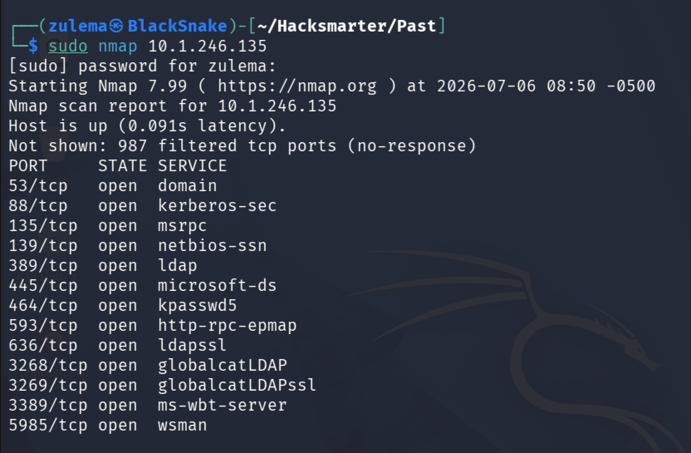

The output reveals common ports of a domain controller.

Trying **RPCENUMERATION**:

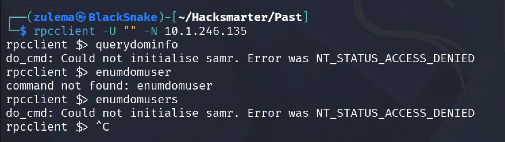

Access Denied.

**SMB Enumeration as Guest **

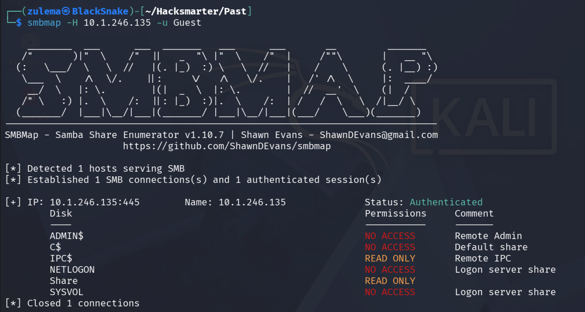

As Guest, we can read IPC$ and Share shares.

**SMB Anonymous Login** :

Using impact-smbclient :

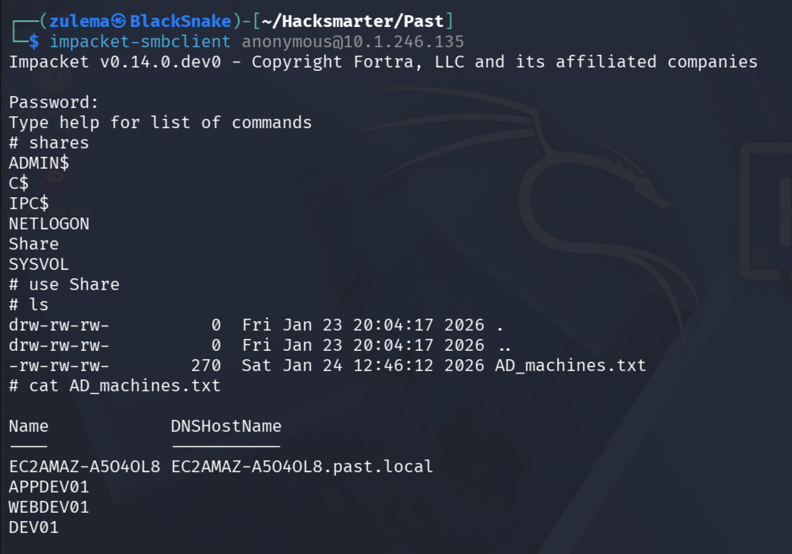

In the /Share folder, we find AD_machines.txt which contains the machines related to the current AD.

## AD methodology NO CREDS:

Since we do not have any kind of leaked credentials, and we don’t know how to move further, we will follow the Orange-cyberdefense methodology which is specifically for AD with no Creds.

https://orange-cyberdefense.github.io/ocd-mindmaps/img/mindmap_ad_dark_classic_2025.03.excalidraw.svg

1. First of all we use **nxc smb** to **generate a host file**

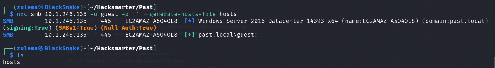

And adding it to /etc/hosts

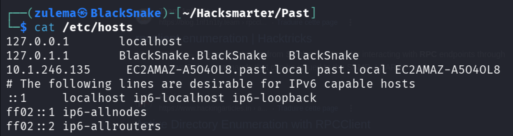

We have then tried different other methodology commands but with no success.

## TIMEROASTING :

The one that has success was **timeroast**, using **timeroast.py**

**_`Timeroast`_**_` is an Active Directory attack that exploits predictable timestamps in the Windows Time (NTP/SNTP) service to obtain password hashes of machine accounts. An attacker sends specially crafted time requests, extracts the returned cryptographic material, and attempts to crack the machine account password offline.`_

- Running timeroast.py with the output log

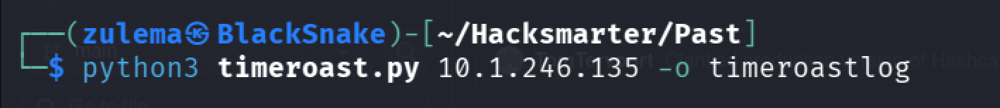

- We succeeded to retrieve some hashes with their corresponding RID at the beginning!

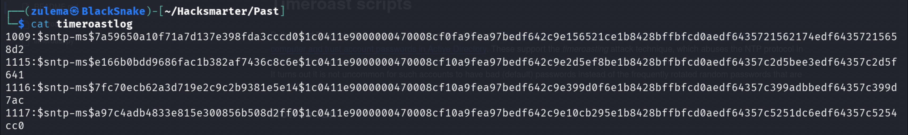

**CRACKING SNTP HASHES WITH HASHCAT **

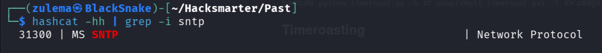

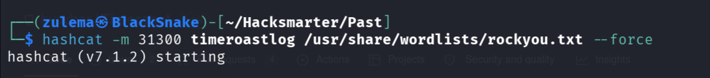

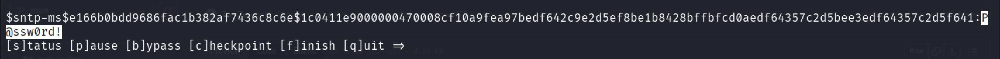

The output reveals that we have finally cracked one of the hashed password.

## CHECKING THE RIDs :

To check which machine/user’s password we have cracked, we use nxc smb with --rid flag, which will list the RIDs of the domain.

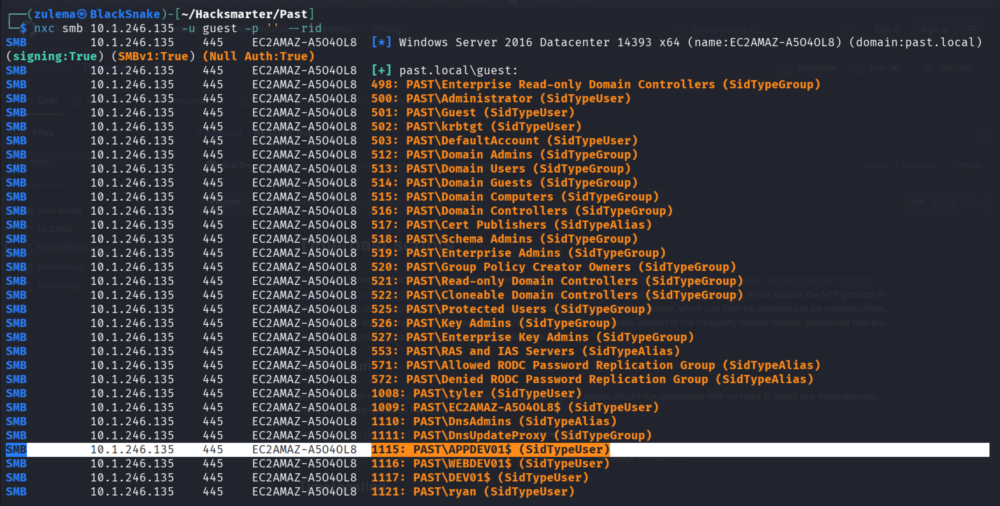

Since the password we have cracked was associated to the **RID 1115**, we now know that **we have cracked the APPDEV01$ password**.

- Checking if we are right, using crackmapexec :

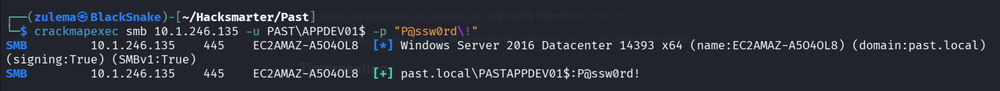

… and listing accessible shares :

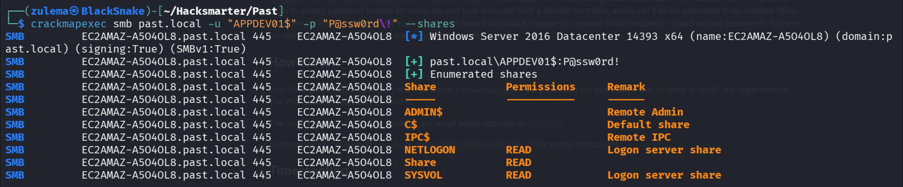

- We can now login to SMB with user APPDEV01$ , to read SYSVOL share :

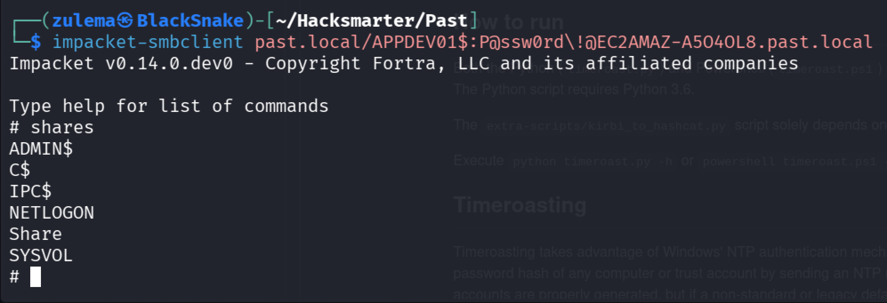

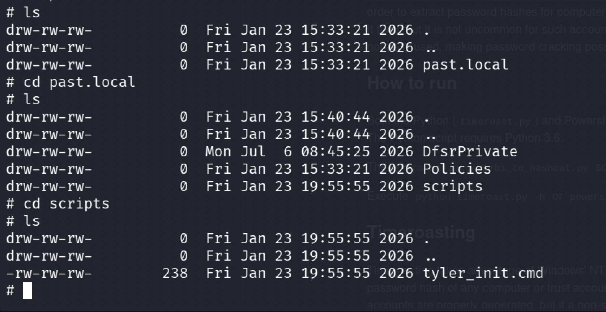

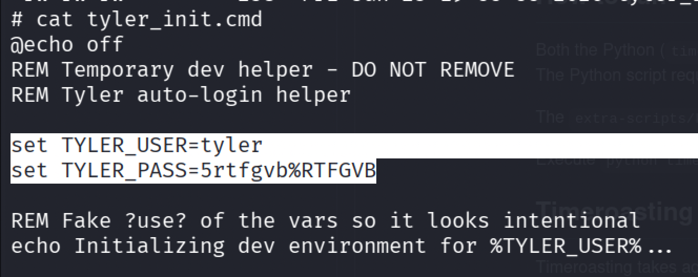

In the /past.local/scripts we finally found **tyler_init.cmd** which contains Tyler’s password.

# AUTHENTICATING AS “TYLER”

Trying to Auth as Tyler using crackmapexec, we face the “ACCOUNT_RESTRICTION” error.

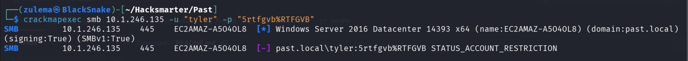

To work around this, Kerberos authentication can be used instead.

By requesting a Ticket Granting Ticket (TGT), we authenticate via Kerberos, which does not enforce the same logon restrictions.

**REQUESTING A TGT :**

- Using impacket-getTGT

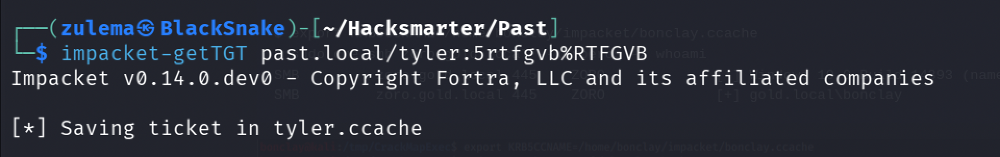

- Now that the ticket has been forged, we export it :

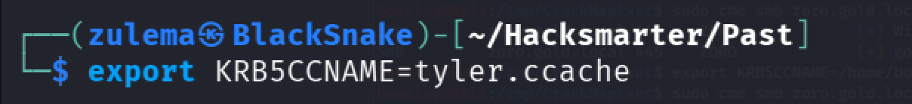

- And we try again to auth as Tyler but this time with Kerberos using kcache

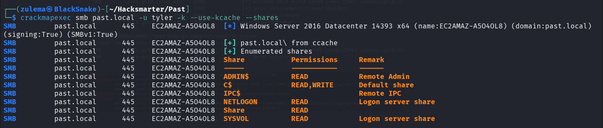

**
# BloodHound Enumeration**

Since we have now a user account with credentials and Kerberos TGT, we can proceed to run **_Bloodhound-ce-python_** which will work from our local host.

We will use :

- -k = for kerberos

- -d = domain

- -dc = domain controller

- -ns = nameserver

- -c = Collectionmethods

- --zip = to obtain a zip file.

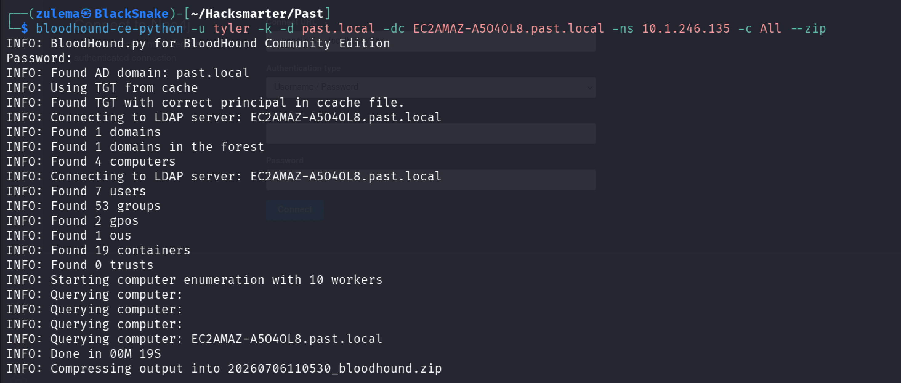

- Once set Bloodhound up and uploaded the .json files, inspecting it, we found that **TYLER HAS GENERIC ALL PERMISSION over the DOMAIN CONTROLLER.**

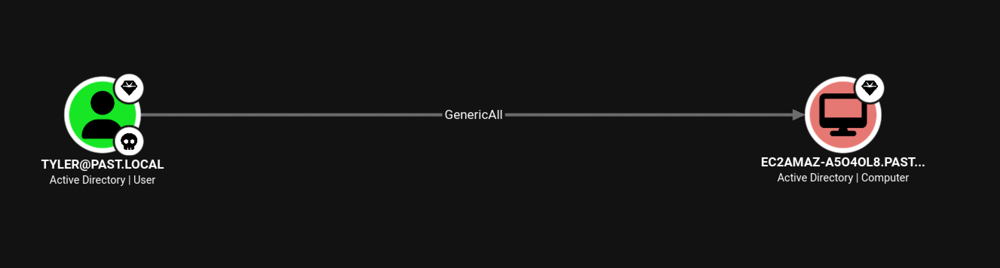

This allows us to perform a **_Resource-Based Constrained Delegation attack_**:

`add a computer, configure delegation, and impersonate a privileged user.`

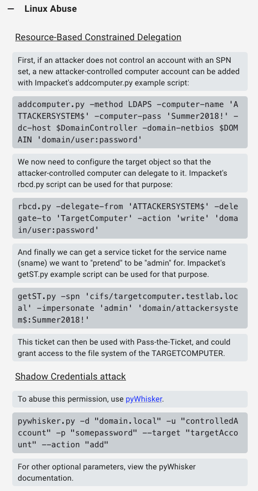

# RESOURCE-BASED CONSTRAINED DELEGATION ATTACK

We could use the above exploit methodology explained in BloodHound, but this time we will use

## BloodyAD

1. **Create a Computer Account** :

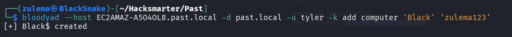

1. **Add Resource Based Constrained Delegation**

Next, we configure Resource-Based Constrained Delegation, granting our machine account BLACK$ the ability to delegate to (and thus impersonate users on) the domain controller EC2AMAZ-A5O4OL8$

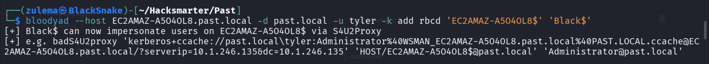

1. Unset the KRB5CCNAME :

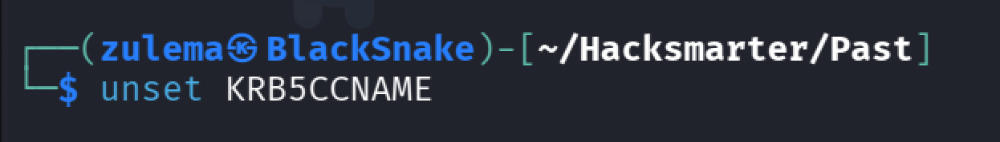

1. **Requesting a Service Ticket ST**

Using :

- Impacket-getST

Request a ST for the cifs/EC2AMAZ-A5O4OL8.past.local SPN while impersonating the Administrator's account, leveraging the delegation rights of our controlled machine account BLACK$ to obtain a usable ticket as the domain admin.

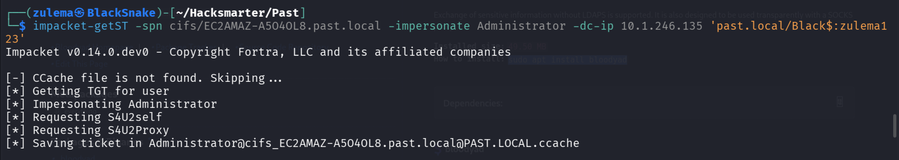

1. Exporting the Ticket :

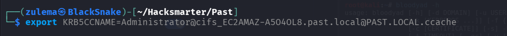

1. Trying to auth as Administrator with nxc , using kerberos Auth (-k) and kcache

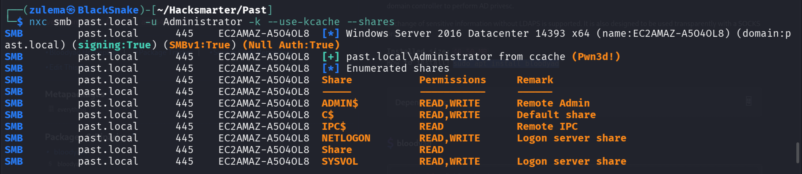

We did it!

# DUMPING SECRETS AND LOGGING AS ADMIN :

Now that we have a usable ST as Admin,

We can dump secrets using impacket-secretsdump with Kerberos Authentication

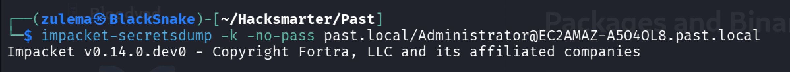

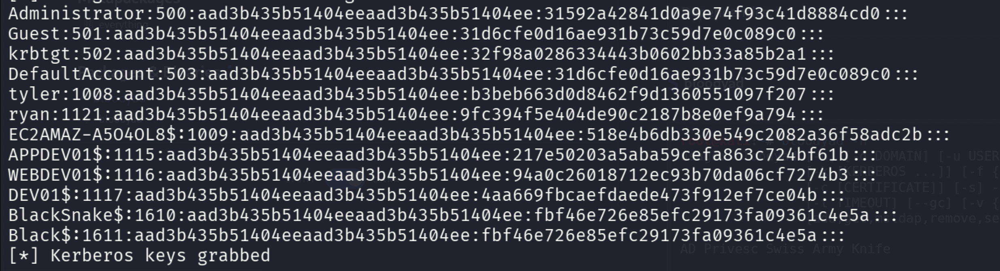

- With the hashes obtained, we could log in winrm as Administrator through **evil-winrm** :

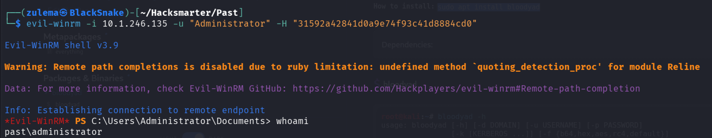

We’re in.

- To search for Ryan’s password, we checked the **History.txt** :

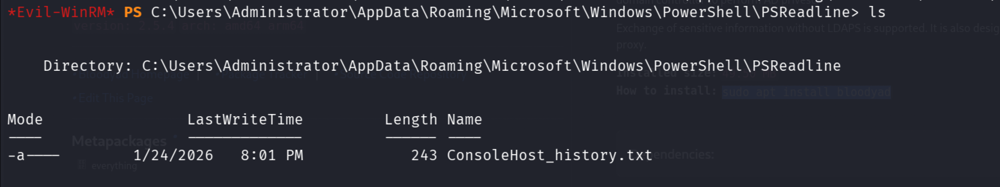

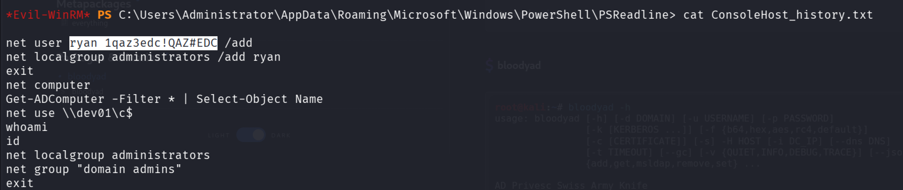

… and we obtained it.

# PAWNED !
