# Share The Pain — (NTLM Theft — xp_cmdshell — Impersonate)

# ENUMERATION :

- Nmap :

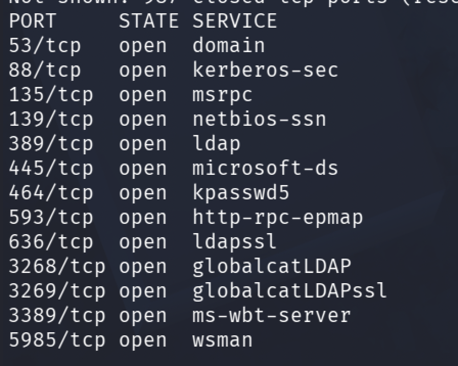

Common DC ports.

We do not have an HTTP open.

Since we do not have any credentials, we should check :

- SMB

- RPC

We first run Enum4Linux-ng to see if there’s something juicy

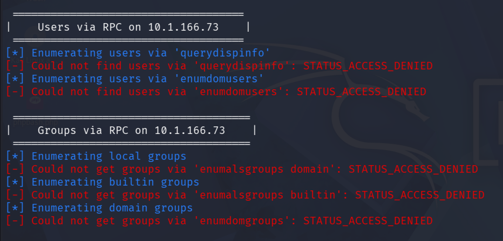

- Enum4linux dumped some shares that we will check manually with SMBMap to check permissions.

- RPC access is apparently denied. 
But we will check it manually btw.

- SMBMap :

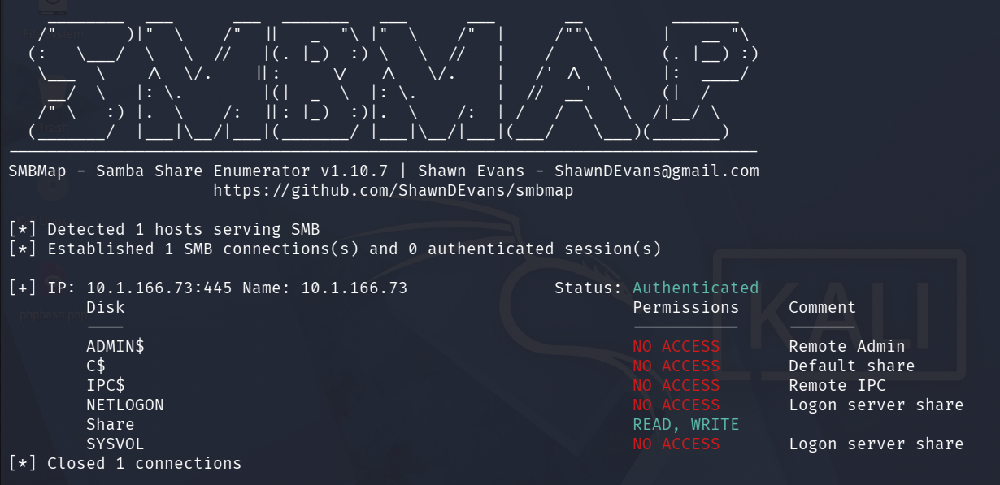

We have **R/W permissions** just in “Share”

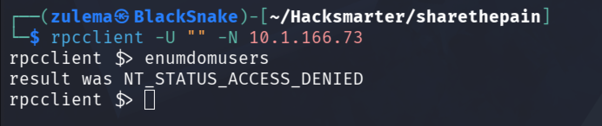

As stated before, no access to RPC.

## SMBENUM :

- Let’s access “Share” share, to see if we can find something inside. 
We’ll use as usual impacket-smbclient

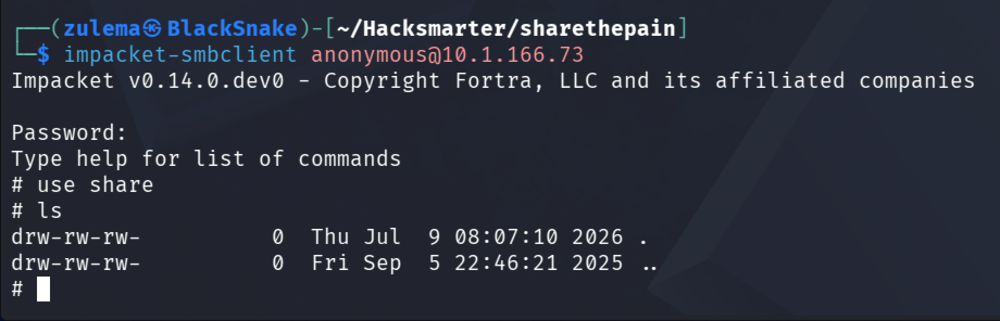

Nothing inside.

What’s particularly interesting is the fact that we have write permissions.

Maybe, if there is some HTTP port open, it could be linked to the share, meaning that if we can put a shell on it, we could open it via HTTP ?

From our scan, no HTTP open.

Or maybe, is there 161 UDP open? 
From this, we could enumerate users.

- Let’s scan all TCP ports w/ NMAP and UDP 161.

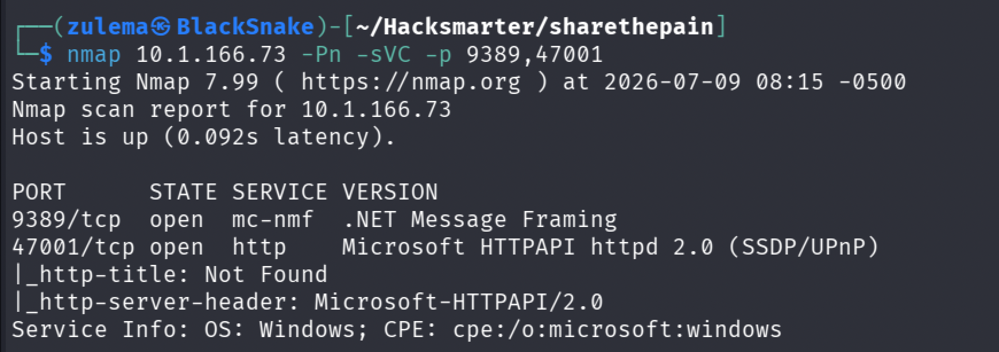

I found 2 more TCP ports, but nothing interesting.

- Let’s check now 161 UDP :

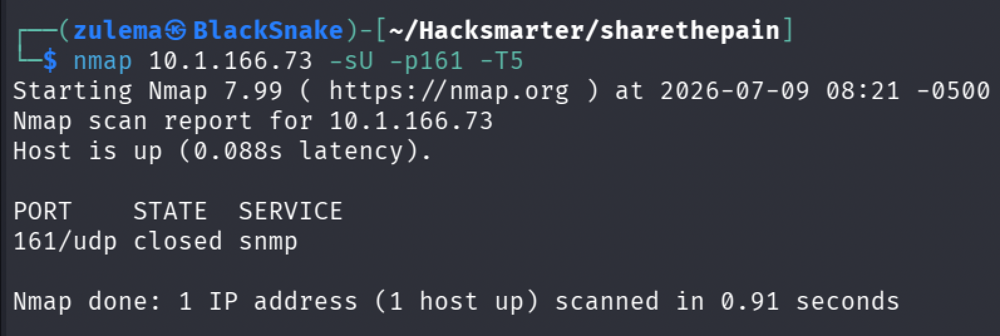

Ok we have to change strategy.

Let’s see if we can find something running Script Scan w Nmap :

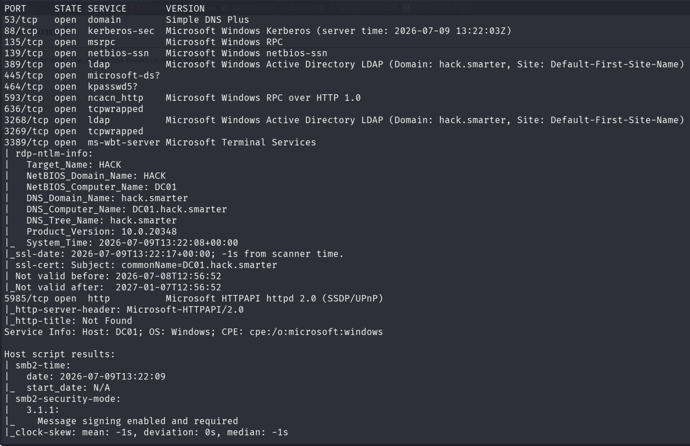

Nothing.

So we have no clues.

I remember I pwned a machine in Offsec which was pretty the same situation.

What I used there was

**NTLM Theft. **

That’s the article where I Got it :

https://github.com/Greenwolf/ntlm_theft

`It can be used for phishing when either the target allows smb traffic outside their network, or if you are already inside the internal network.`

Let’s try it .

# NTLM THEFT — GAINING BOB CREDS.

So according to the repository,

- we clone it first :

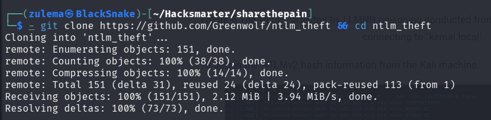

- We install xlswriter with pipx, which is needed.

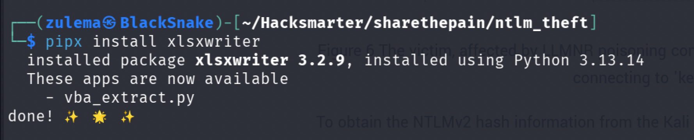

- We run a responder in another terminal

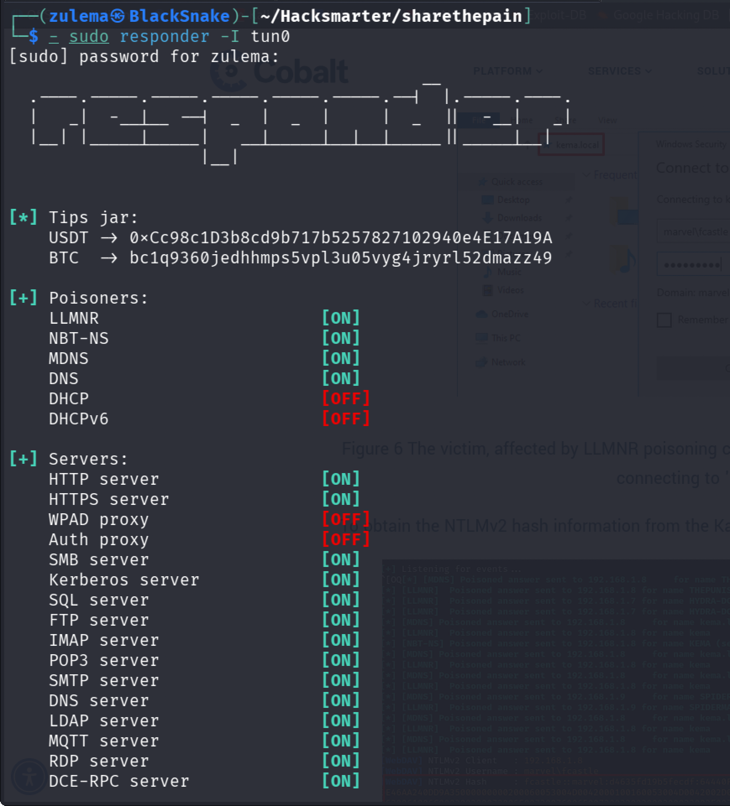

- We run the script ntlm_theft.py to generate the files. ( -s is the attacker ip)

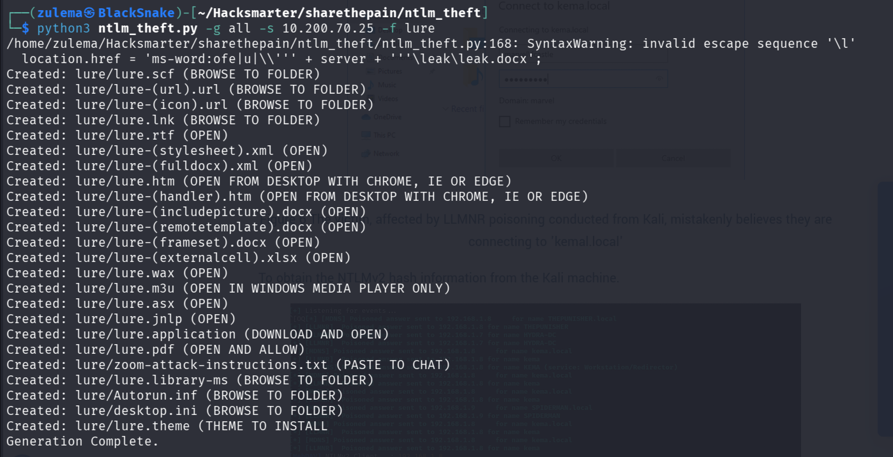

We can see that it generates many kinds of files. 
We’r gonna use the ones with “BROWSE TO FOLDER” statement, which do not require opening the file.

It is enough that Windows visualizes the folder.

- Since I didn’t know which one to put, I uploaded the two :

- lure.lnk

- desktop.ini

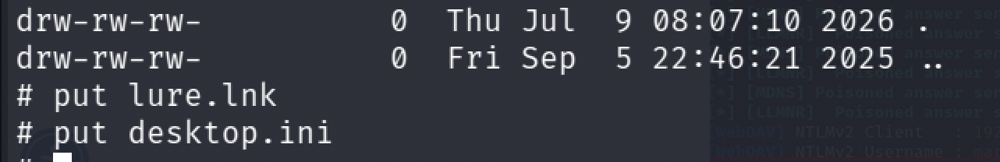

- And on our responder :

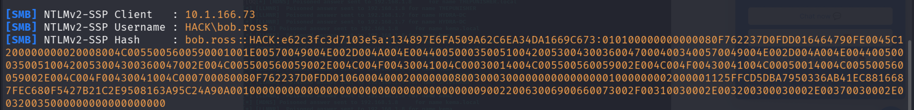

## We got the NTLMv2 of user bob.ross !

We need first to crack it using Hashcat :

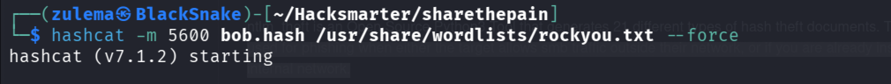

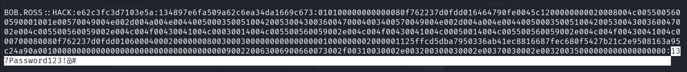

The password is :

`137Password123!@#`

Now that we have credentials, we can check :

- Permissions on shares with crackmapexec

- RDP access

- Winrm access

- RPCEnum

## SMBENUM

- Shares permissions with Crackmapexec:

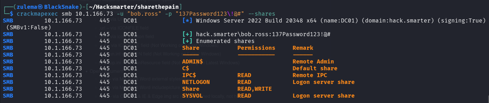

We keep in mind that we have READ permissions on SYSVOL.

- Checking SYSVOL :

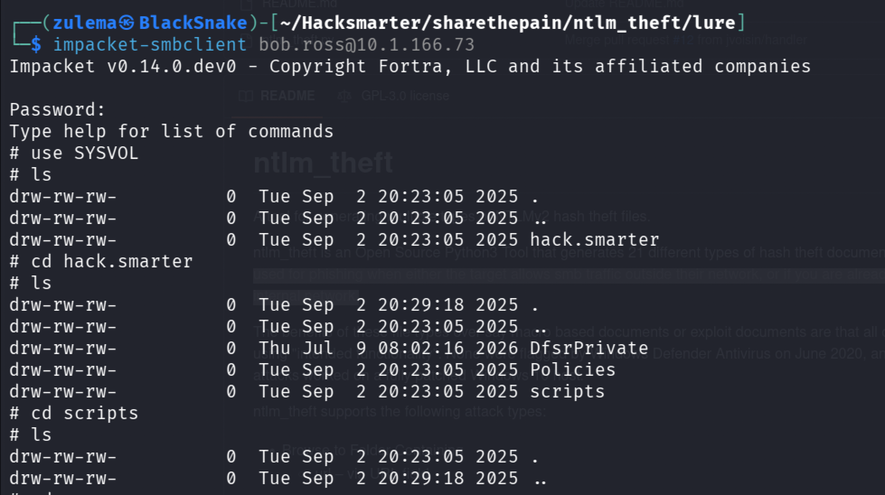

Nothing.

- RDP : failed

- WINRM : failed

- RPC Enum

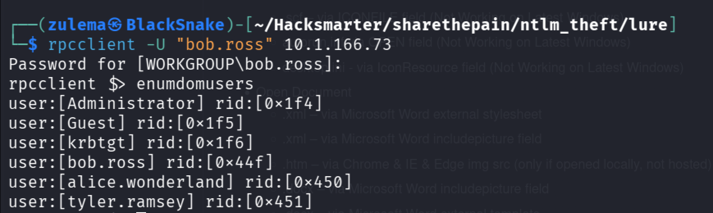

We got users.

- We could query users with “queryuser”  to see if there are info leaks :

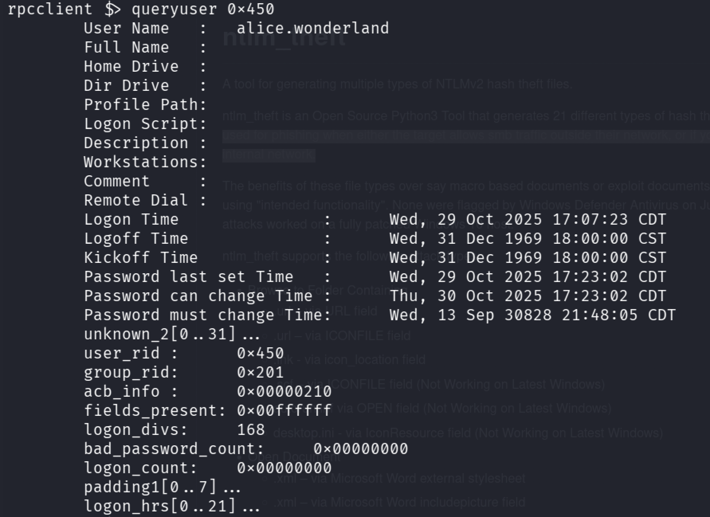

No leaks.

We write down users btw.

We’re gonna need them later.

What should we do now? 

We got a user and its credentials. But no access.

We could try to :

- Run bloodhound-ce-python

- Kerberoast some users

## KERBEROASTING

Let’s start with kerberoasting.

We’re gonna use : impacket-getUserSPNs

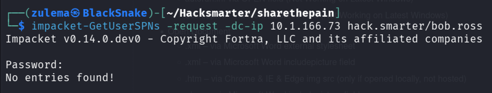

Nothing.

## BLOODHOUND

- Running Bloodhound-ce-python :

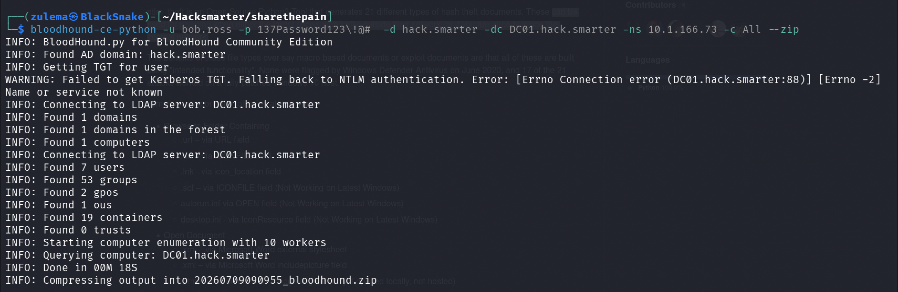

We got the zip file.

- Let’s analyze it on Bloodhound so that we can first check what kind of OUTBOUND OBJECT CONTROLS are assigned to bob.ross

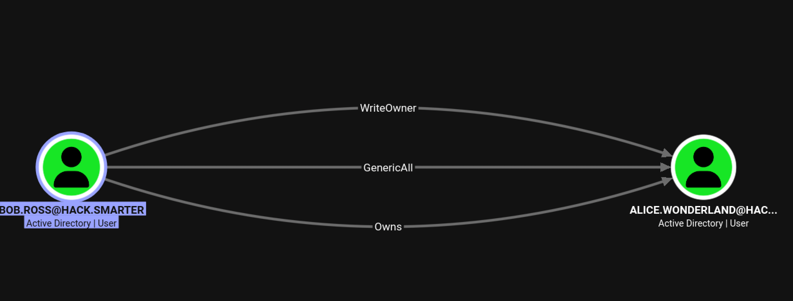

Bingo.

We can see that bob.ross has “**GenericALL**” on Alice.Wonderland.

## With this ACL set, we can change Alice’s password directly from our system.

Reading the Linux Abuse on Bloodhound we can see the commands to run :

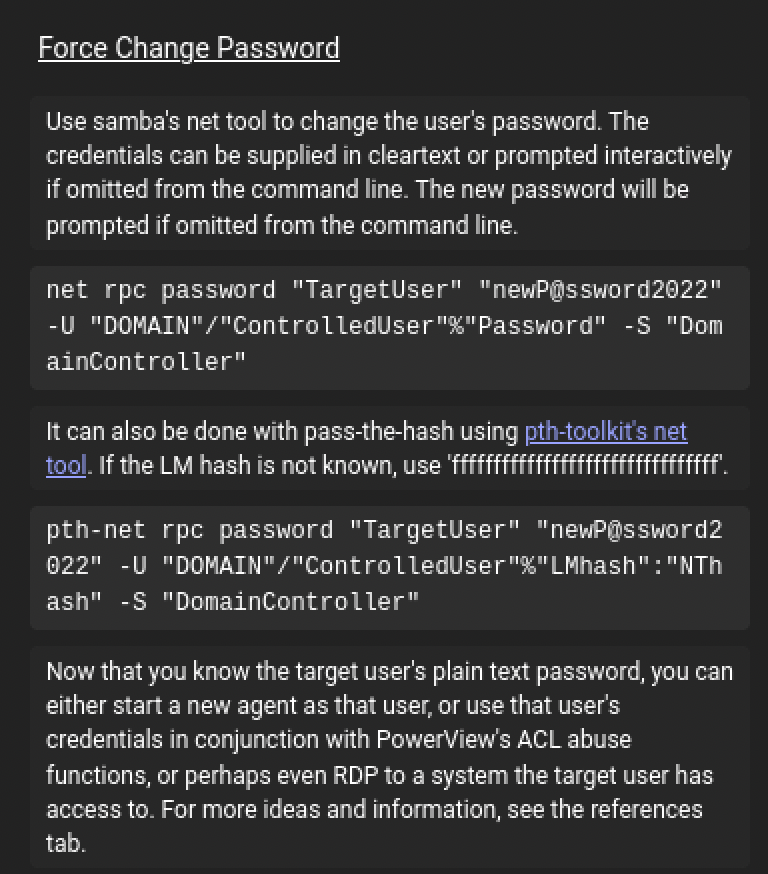

# FORCE CHANGE PASSWORD

1. We first need to generate and add the hosts file to the /etc/hosts file.

- Generate it with nxc smb :

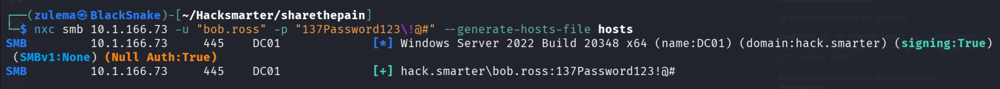

- Add it to /etc/hosts

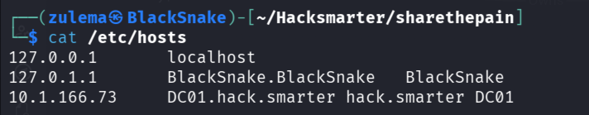

1. Now try to change the password using “net rpc password”

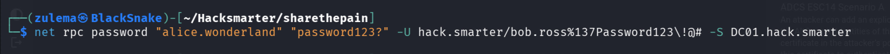

No output means “Success”.

# ACCESS AS ALICE.WONDERLAND

Now we start enum again, trying :

- Check SMB permissions and if password has successfully changed with crackmapexec

- RDP

- WINRM

- Crackmapexec

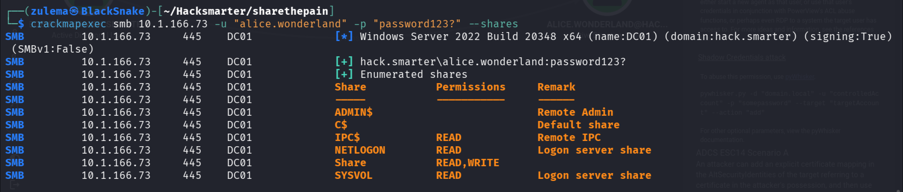

Password has successfully changed.

- RDP = failed

- WINRM  w/ evil-winrm

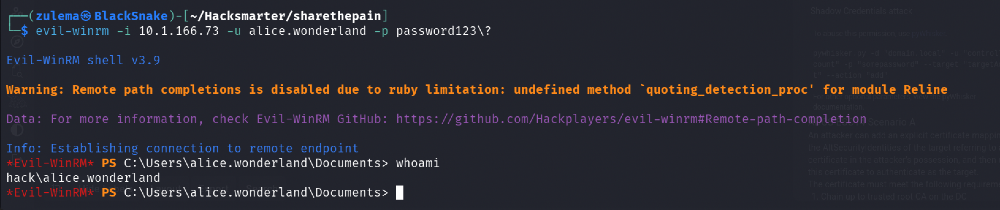

We’re in.

We now have to Enumerate Alice.wonderland to see how we’r gonna elevate our privs.

But first, we can maybe check on Bloodhound marking the users as owned to see if there is a shortest path from owned objects.

Nothing from here.

Alice seems to have NO OUTBOUND OBJECTS CONTROL

# ALICE ENUMERATION :

- Let’s enumerate Alice and DC01 from win-rm whoami /all

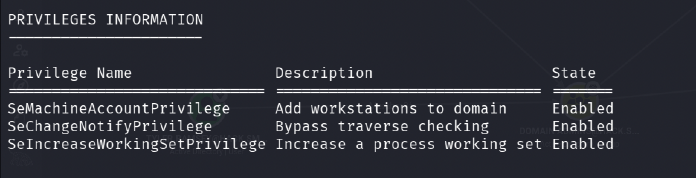

No interesting privileges

- Checking dirs :

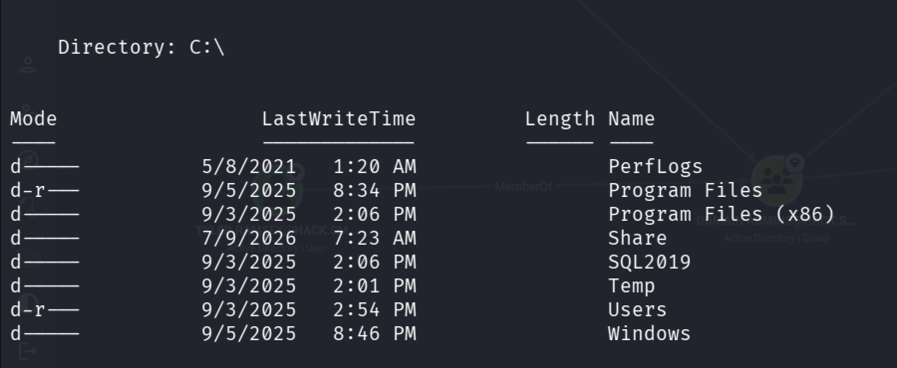

Something interesting in SQL2019??

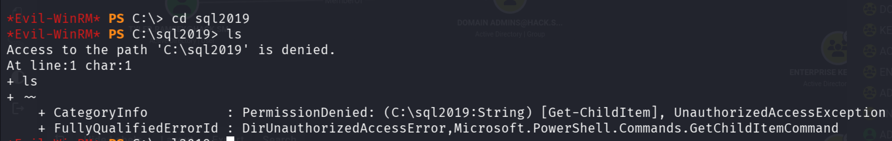

Denied.

- Something interesting in Powershell history?

-
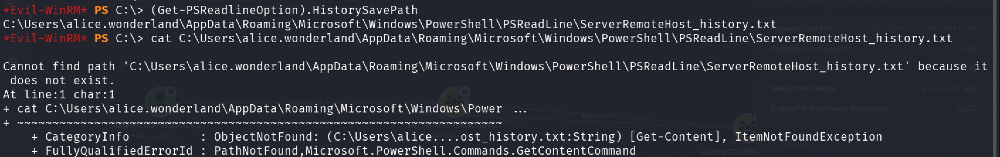

Even checking manually there is no Powershell folder apparently.

- Let’s check the Desktop to see if we can find something :

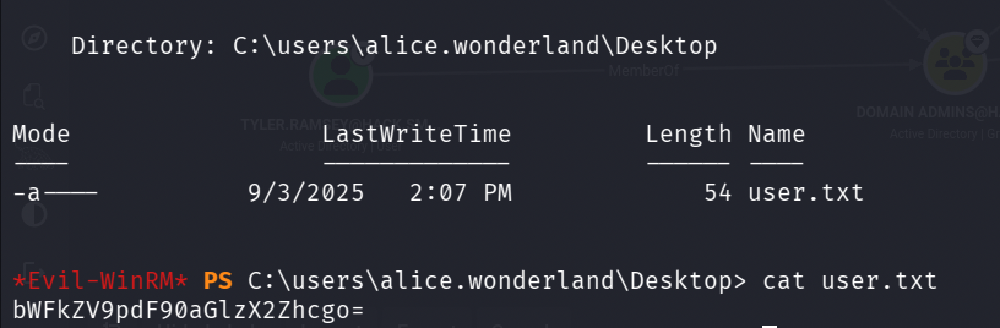

We found something encoded in base64.

Credentials??

Let’s decode it :

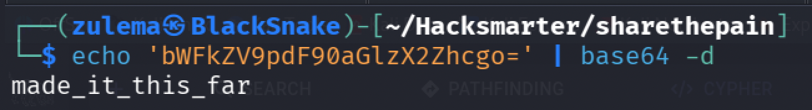

Is it a password?

- Let’s check if it’s tyler.ramsey password :

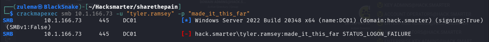

Nope.

So it’s just the **FUCKING** user flag for the lab.

- Let’s run winpeas :
Nothing interesting found.

## What is the path?

- I could try to run Invoke-AllChecks to see if there is some possibilities of hijacking? (PowerUp.ps1)

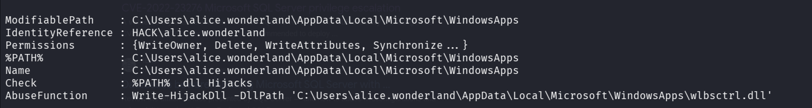

Nothing.

## Maybe there is some internal port that I could access?

Let’s try to list again all TCP ports, probably I missed something:

- use : netstat -ant -p tcp

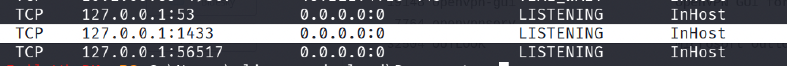

That’s the **MSSQL port 1433**.

What we should do now is to pivot the port with ligolo, then try to access it from our kali

# PORT FORWARDING

- Start ligolo proxy on kali :

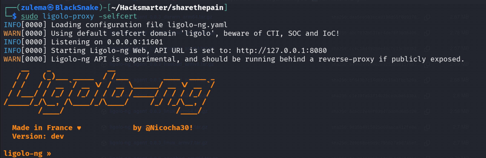

- Download the ligolo-agent.exe for windows and transfer it to the target

Once transferred :

- Connect with -ignore-cert flag

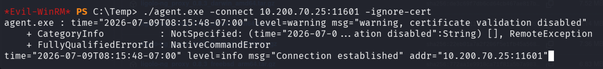

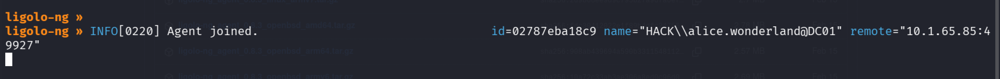

- Now we can forward the port 1433

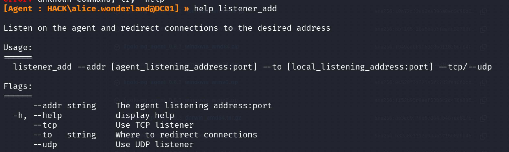

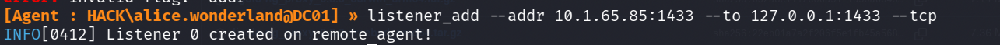

- Checking with NC :

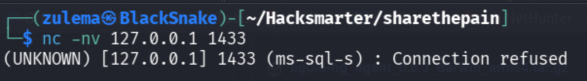

Now we can try to login :

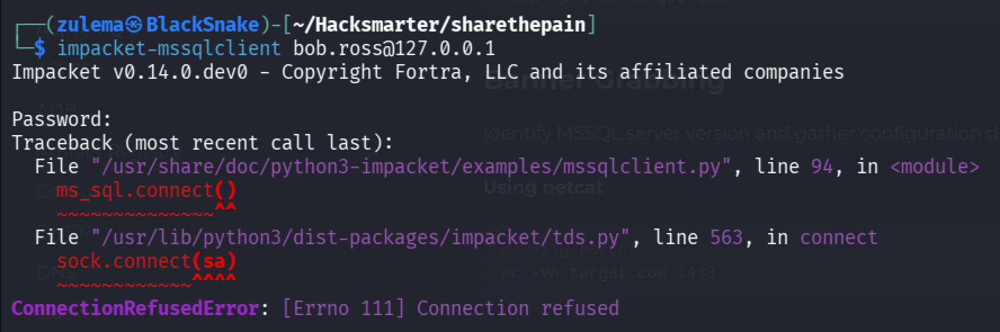

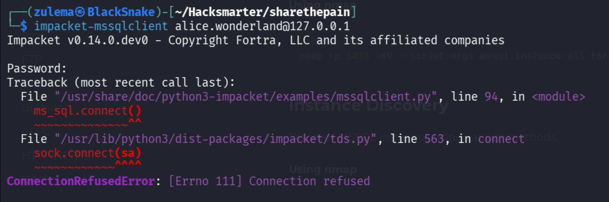

## Of course putain

I got stucked as fuck

What’s next?

I suppose I have to move laterally to tyler_ramsey?

But how?

I need creds for SQL but no config files…

At this point I really don’t know what to do

## Maybe changing tool for forwarding?

# ACCESS MSSQL :

Let’s try with chisel :

- After having downloaded and transferred it :

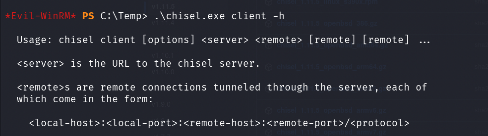

- On kali, start chisel server

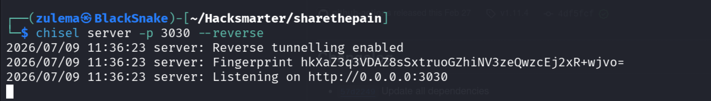

- On windows, chisel client :

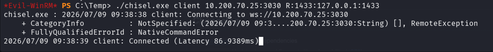

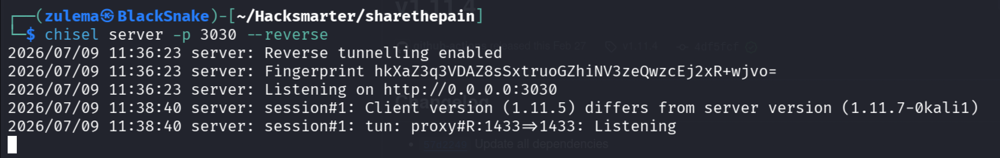

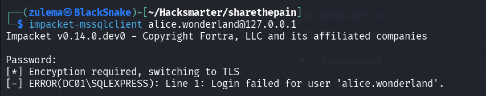

## Maybe we should try to request a ticket and enter with kerberos auth?

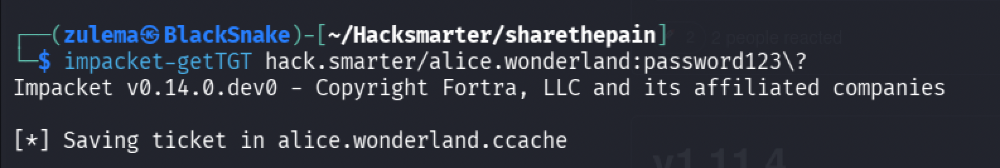

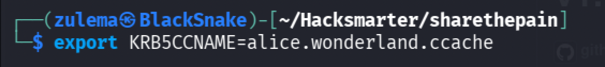

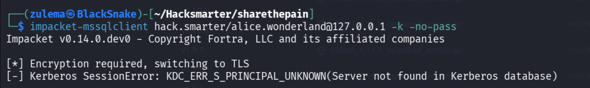

## So maybe it’s just a matter of -windows-auth flag !

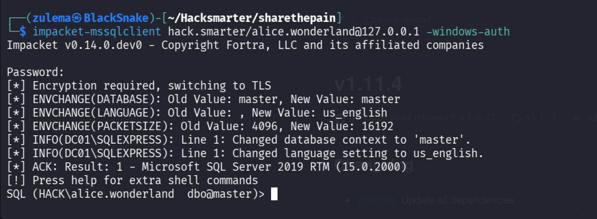

Fuck!!!!!!

Why am I so stupid?

We’re in.

# ACCESS AS SERVICE\MSSQL

-  enumerate the db and see if we can gain a shell

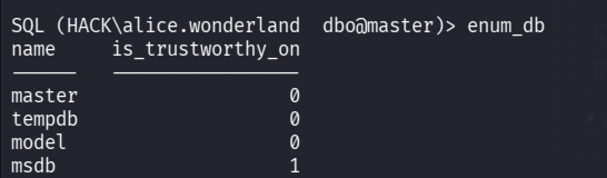

Nothing

- Can we impersonate?

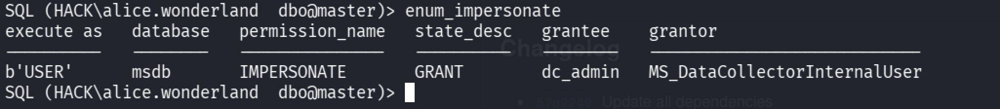

- Can we enable xp_cmdshell?

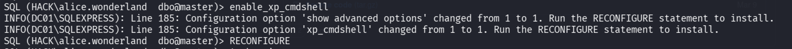

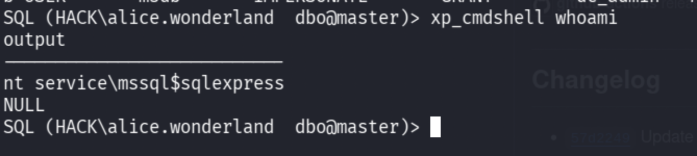

It works.

## We have now to spawn a reverse shell with a powershell one-liner :

- Encode the Powershell one-liner in base64

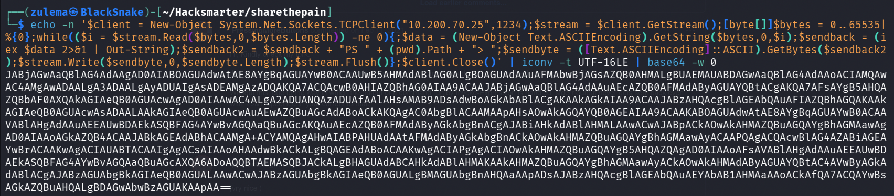

- Set up a listener w/ Penelope

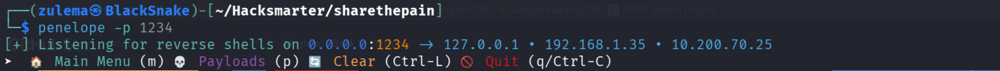

- Run the payload with xp_cmdshell

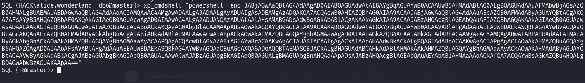

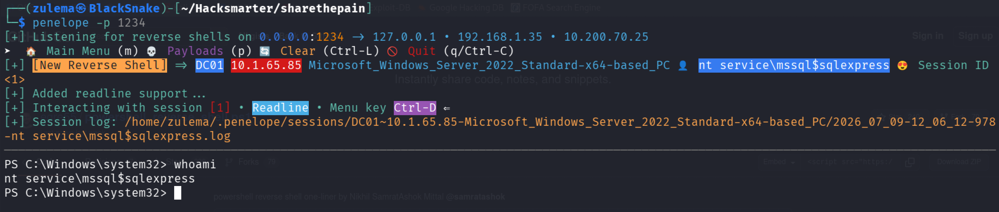

We’re in again.

# PRIVILEGE ESCALATION

- Enumerating privs of the service :

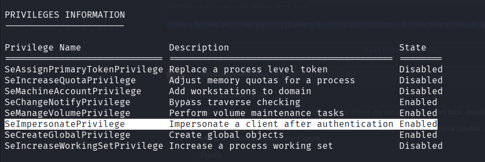

Let’s impersonate privs with Potatos or PrintSpoofer :

- With Printspoofer (after having transferred netcat) :

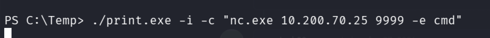

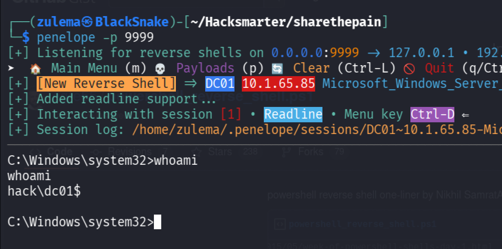

# PAWNED
