# Slayer

**Category:** Active Directory  
**Techniques:** RDP access, host enumeration, credential dumping attempts

## TL;DR

Starting from known credentials (`tyler.ramsey`), RDP access to the target was straightforward. From there, several post-exploitation avenues were tried: hunting for interesting files and a possible database, checking running processes for a credential dump, attempting `edgesnapper.exe`, and enumerating RPC and SMB with `enum4linux-ng`. None of them turned up a clear escalation path on this pass. This walkthrough documents the enumeration performed and the dead ends hit; it is left as a work in progress rather than a completed compromise.

## Full Walkthrough

### Initial Access

Credentials were already available for this target:

```
tyler.ramsey:P@ssw0rd!
```

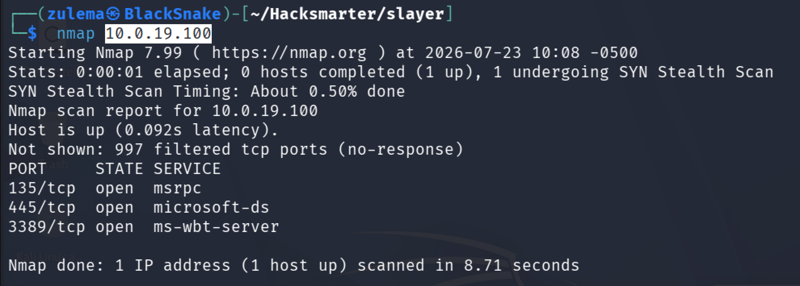

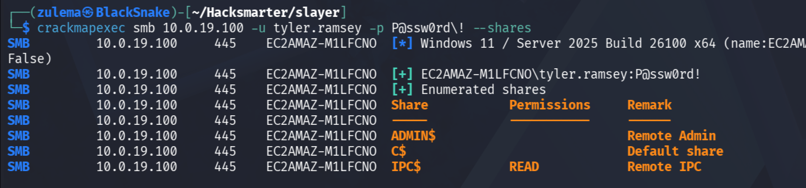

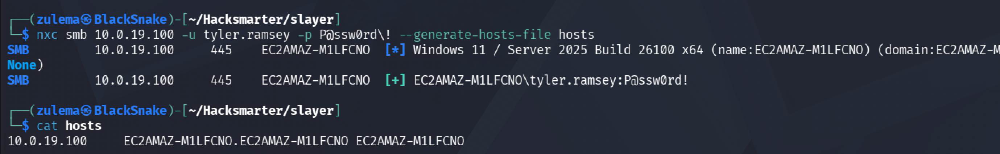

Connecting over RDP:

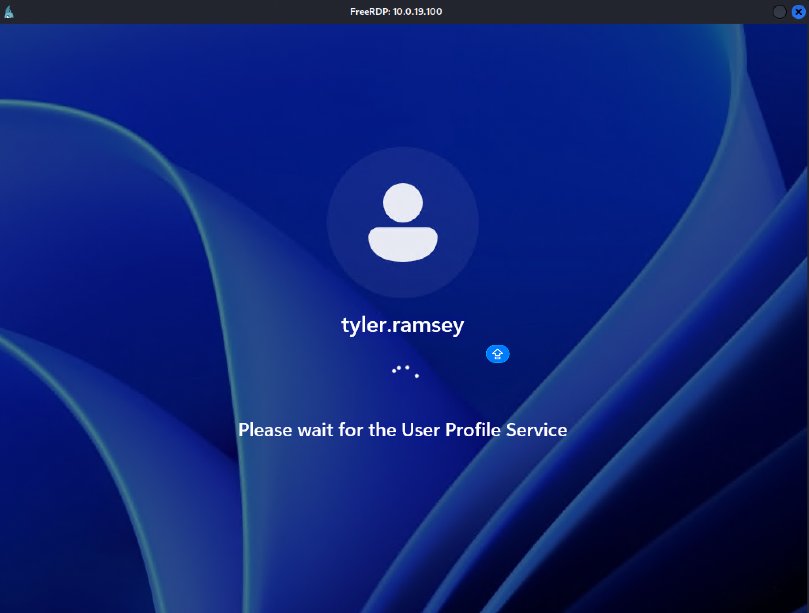

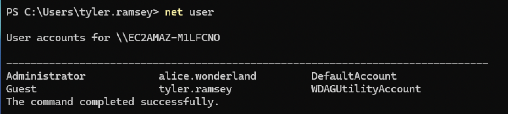

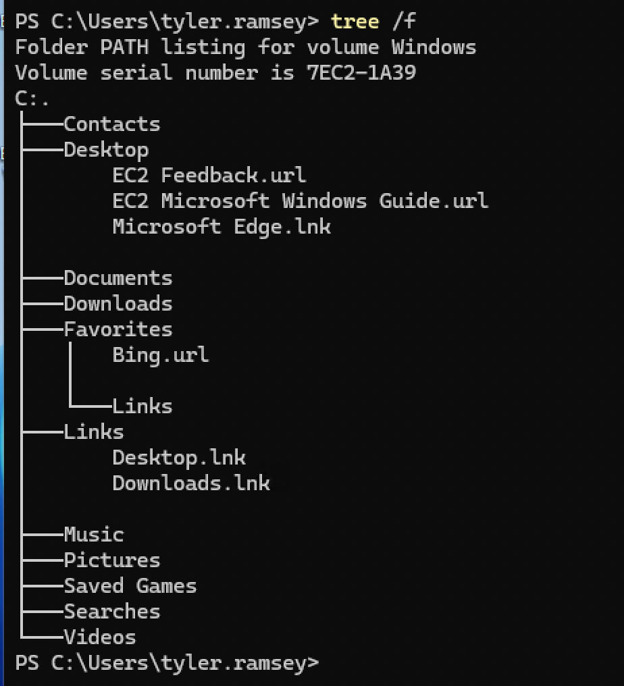

Nothing immediately interesting on first look around the desktop.

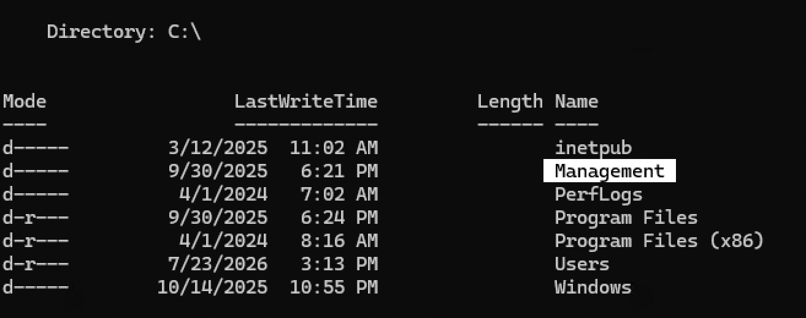

### Filesystem and Process Enumeration

One folder stands out and is worth a closer look:

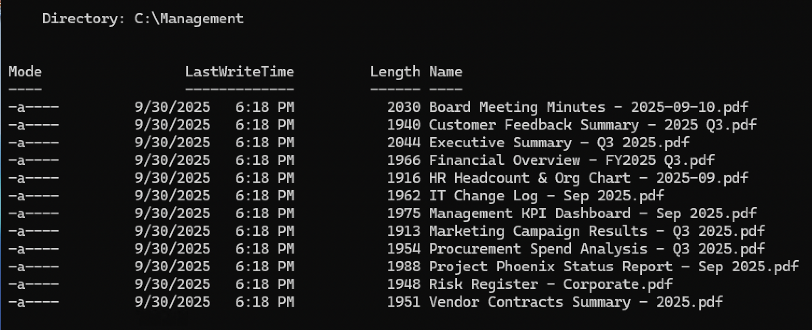

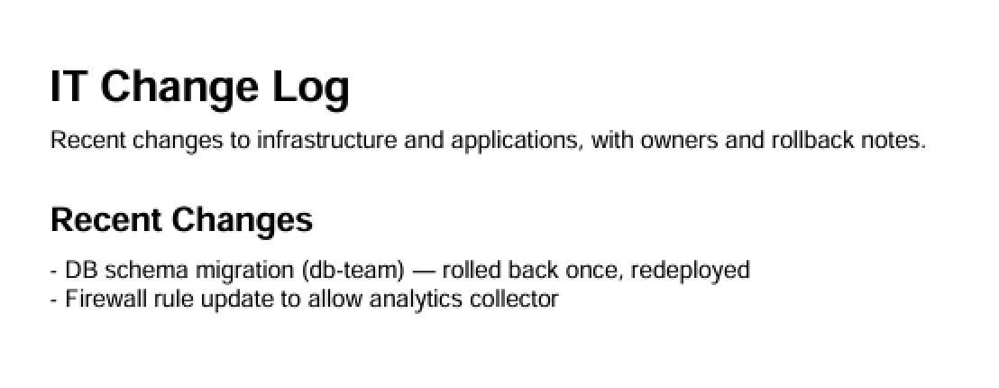

Checking whether a database is present, and reviewing running processes for anything that could be dumped for credentials:

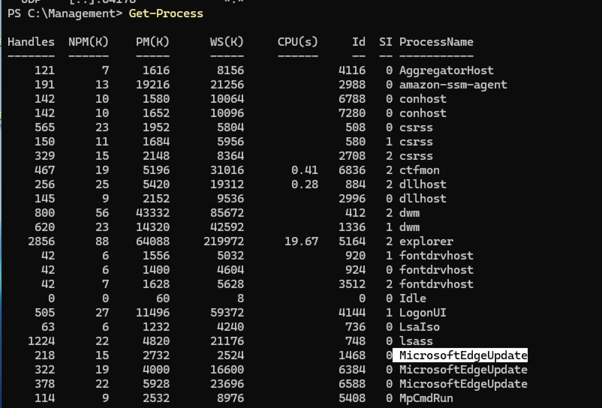

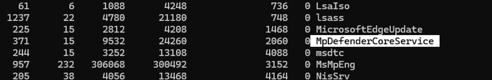

Microsoft Defender is active on the host, which limits what can be done here without triggering detection.

### Further Enumeration Attempts

Trying to run `edgesnapper.exe` doesn't lead anywhere conclusive:

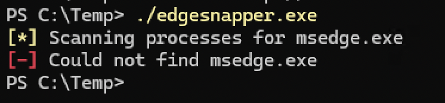

Enumerating RPC for a possible information leak:

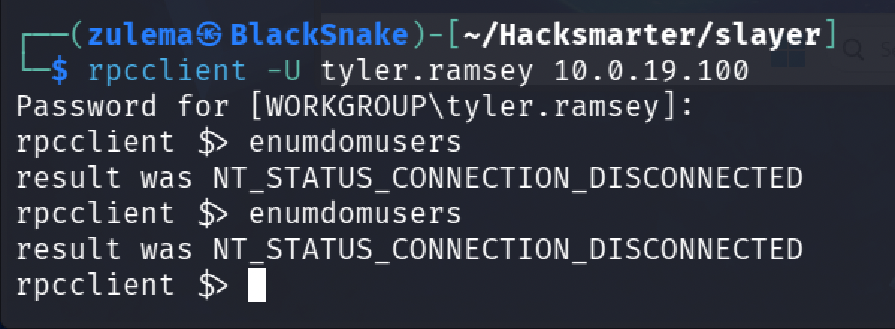

No usable output. Trying `enum4linux-ng` as a final pass:

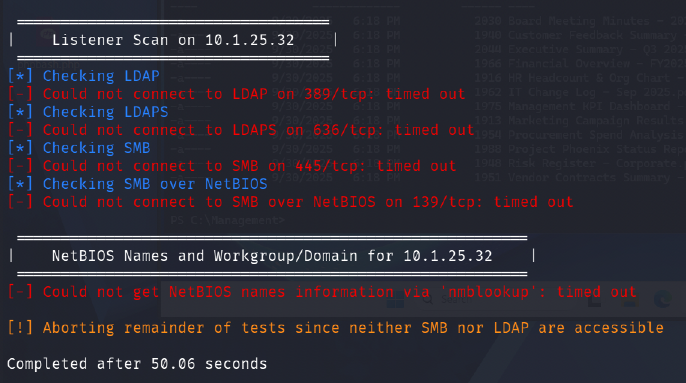

Also inconclusive. This lab is left here as an open enumeration exercise rather than a full compromise.

---

*Educational write-up from an authorized lab environment (HackSmarter). Not a guide for unauthorized access.*
