# Welcome

**Category:** Active Directory Certificate Services (AD CS)  
**Techniques:** PDF password cracking, RPC user enumeration, password spraying, BloodHound ACL abuse (GenericAll), ESC1 certificate template abuse

## TL;DR

Starting from one known credential, SMB enumeration led to a password-protected PDF cracked with `pdf2john` and John, revealing a default password pattern for new users. RPC enumeration plus a password spray against that pattern turned up valid credentials for `a.harris`. From there, a BloodHound-mapped `GenericAll` chain was walked twice: `a.harris` (via HR group membership) reset `i.park`'s password, and `i.park` (via Helpdesk group membership) reset both `svc_ca` and `svc_web`. Neither service account allowed WinRM or RDP, but `svc_ca` pointed toward AD CS. Running Certipy against the CA turned up an **ESC1** misconfiguration: a low-privileged account could request a certificate impersonating any identity, including Administrator. Requesting that certificate and authenticating with it yielded the Administrator hash and full domain compromise.

## Full Walkthrough

### Starting Credentials

```
e.hills:Il0vemyj0b2025!
```

### Enumeration

Nmap:

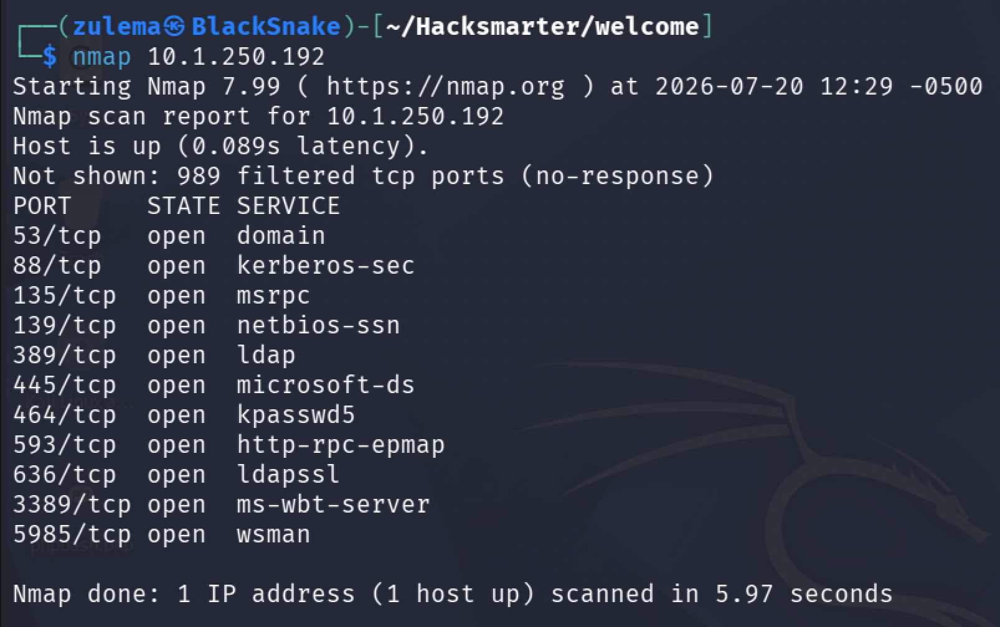

### SMB Enumeration

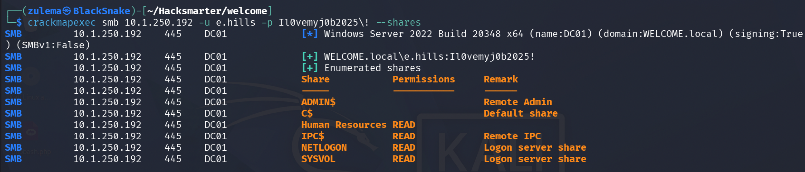

A "Human Resources" share stands out. First, updating `/etc/hosts`:

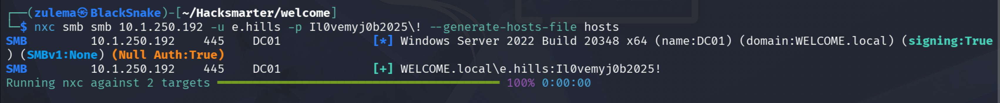

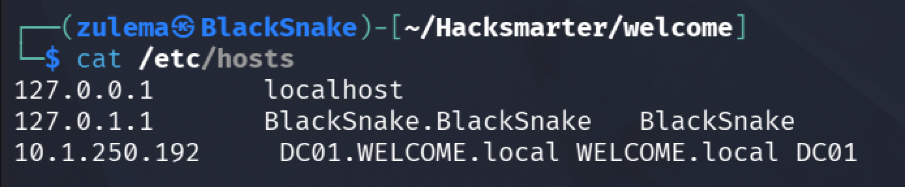

Logging into SMB with `impacket-smbclient`:

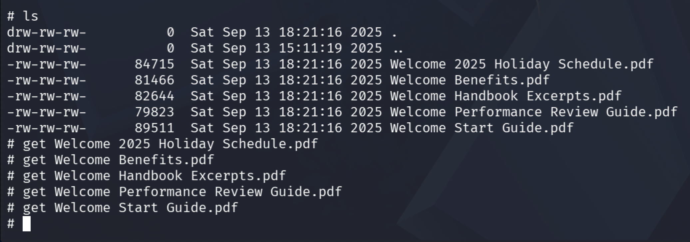

### Initial Access as a.harris

Attempting to open `StartGuide.pdf`:

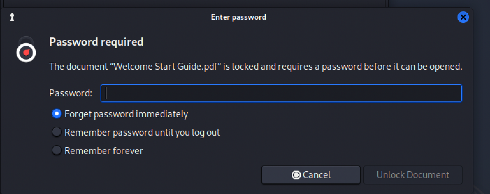

The known password doesn't open it, so the hash is extracted with `pdf2john` and cracked:


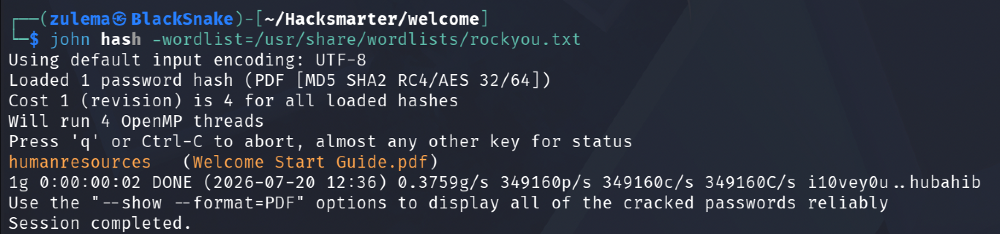

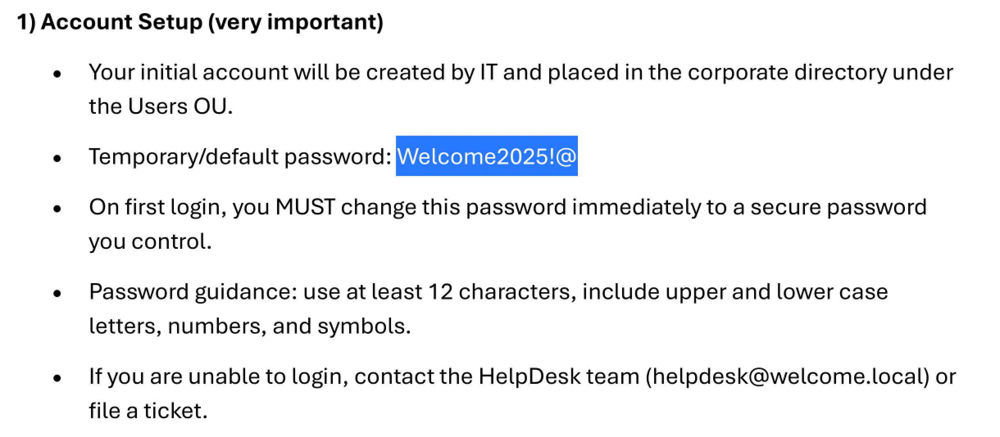

The cracked password turns out to be a default assigned to new users, a good candidate for spraying.

**RPC user enumeration:**

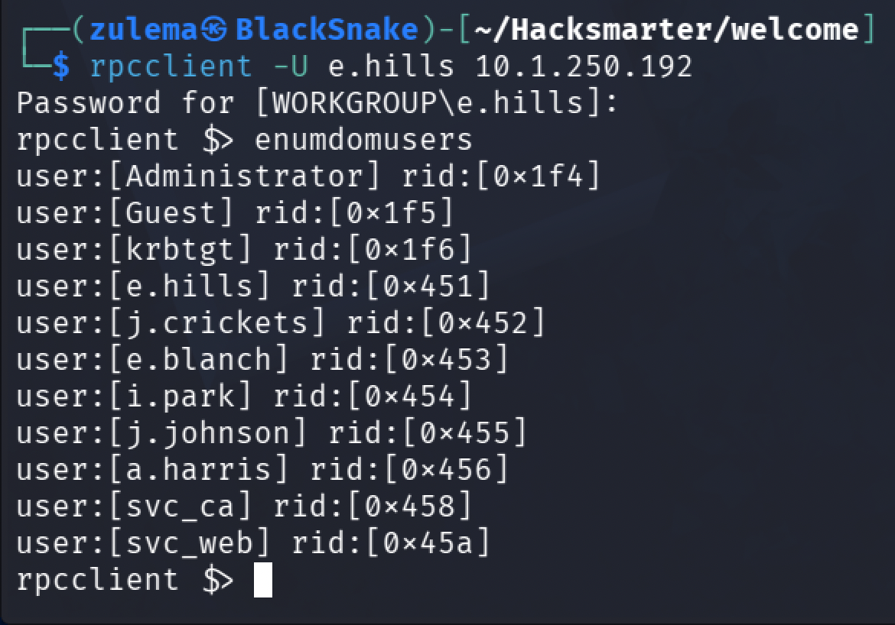

**Password spray:** building a user list and spraying the default password with CrackMapExec:

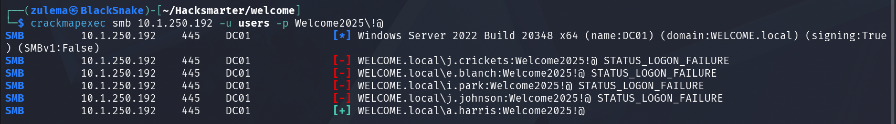

Valid credentials come back:

```
a.harris:Welcome2025!@
```

Testing WinRM with them:

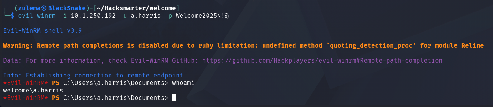

Initial access confirmed as `a.harris`.

### Access as i.park

Running `bloodhound-ce-python` to map lateral movement options:

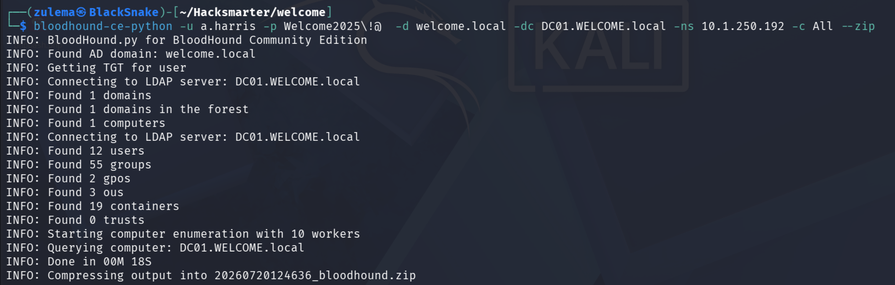

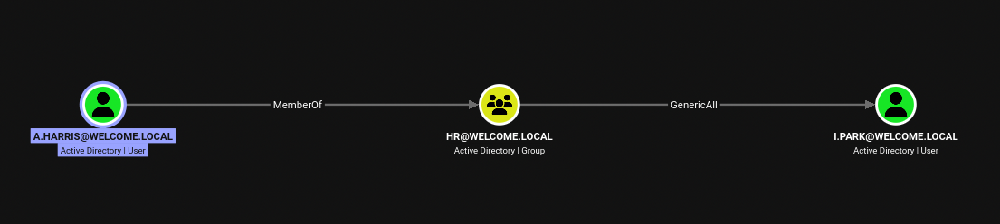

`a.harris` is a member of the HR group, which holds `GenericAll` over `i.park`. Abusing it by resetting the password:

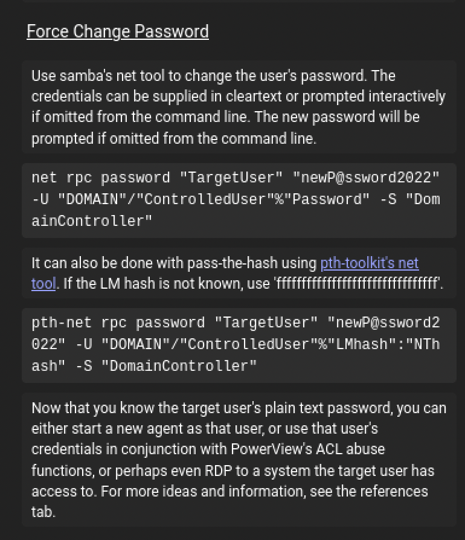

```
net rpc password "TargetUser" "newP@ssword2022" -U "DOMAIN"/"ControlledUser"%"Password" -S "DomainController"
```

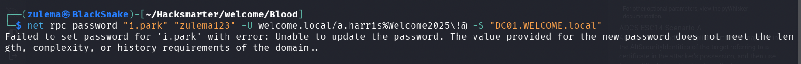

A password policy blocks the first attempt. Using a more complex password instead:

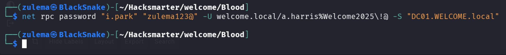

Confirming the change:

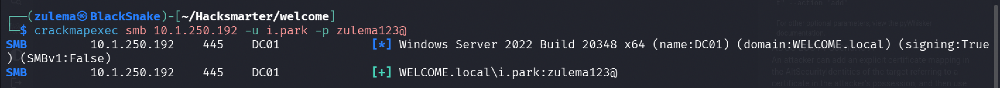

`i.park`'s password is successfully reset.

### Access as svc_ca and svc_web

Checking what `i.park` can reach:

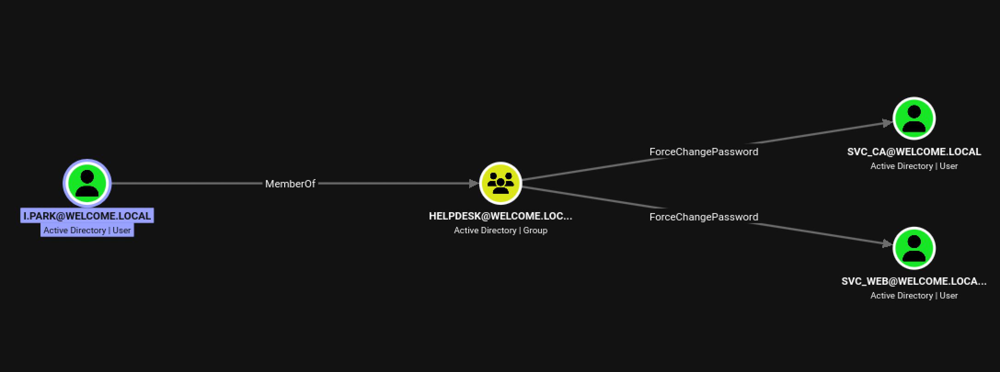

`i.park` is a member of the Helpdesk group, which can reset the password of both service accounts. Abusing both the same way:

```
net rpc password "TargetUser" "newP@ssword2022" -U "DOMAIN"/"ControlledUser"%"Password" -S "DomainController"
```

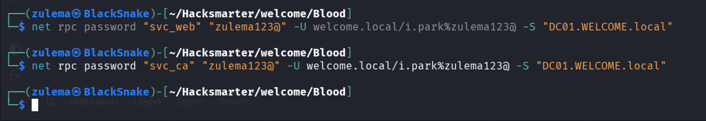

Neither account allows WinRM or RDP. The name `svc_ca` is the more interesting lead: it points at Certificate Services rather than a general-purpose account.

### Access as Administrator

With that in mind, the next step is checking the CA itself for vulnerable certificate templates, using [Certipy](https://github.com/ly4k/Certipy):

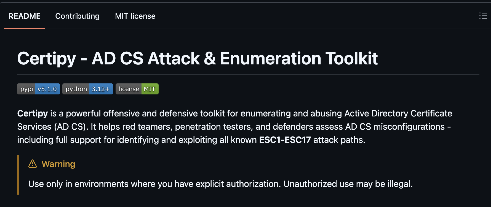

Following the [installation guide](https://github.com/ly4k/Certipy/wiki/04-%E2%80%90-Installation):

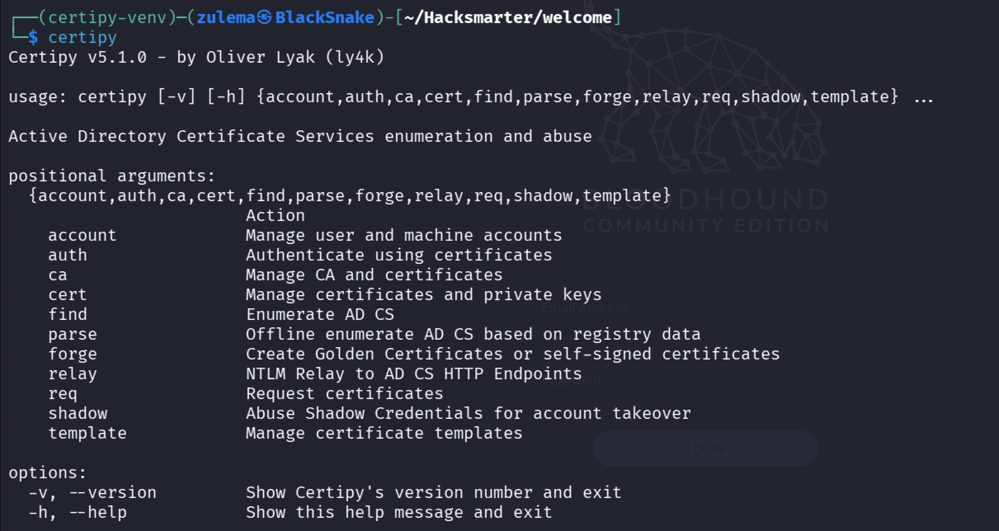

Running `certipy find -vulnerable` to surface only vulnerable templates:

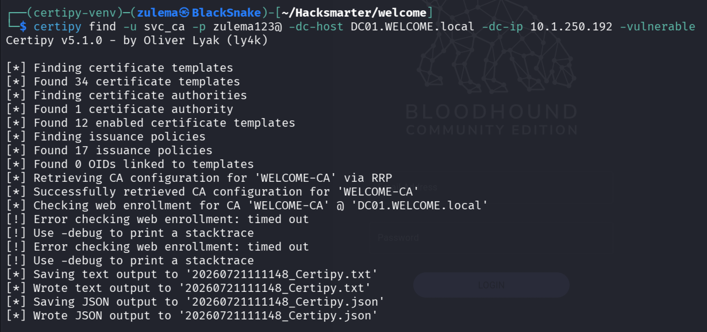

The resulting JSON report:

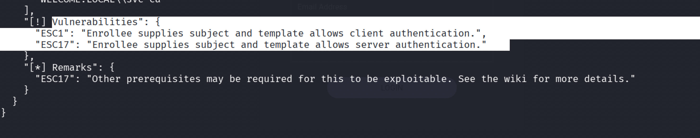

Two findings stand out: **ESC1** and **ESC17**.

**ESC1** is an AD CS misconfiguration where a low-privileged user can request a certificate for any identity, including Domain Administrator. This lets an attacker authenticate as that privileged user without ever knowing their password, leading to privilege escalation and potentially full domain compromise.

**ESC17** is an AD CS misconfiguration where a certificate template allows a low-privileged user to request a Server Authentication certificate for an arbitrary internal hostname, via a user-controlled SAN. Combined with the ability to manipulate internal DNS records, this can let an attacker impersonate trusted HTTPS services (such as WSUS) and achieve SYSTEM-level code execution on clients.

The JSON report notes ESC17 may need extra prerequisites here, so ESC1 is the path taken.

**Exploiting ESC1:** the plan is to request a certificate on behalf of any specified account, per [Certipy's privilege escalation guide](https://github.com/ly4k/Certipy/wiki/06-%E2%80%90-Privilege-Escalation):

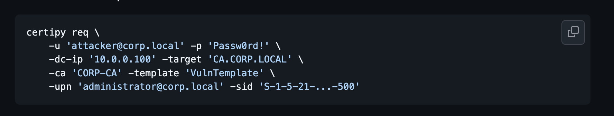

First, adding `WELCOME-CA` to `/etc/hosts` to match the certificate:

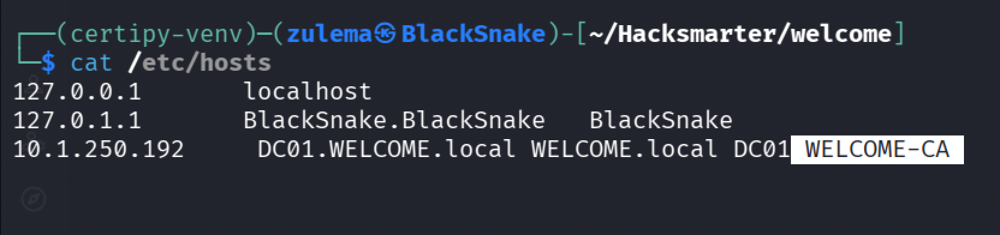

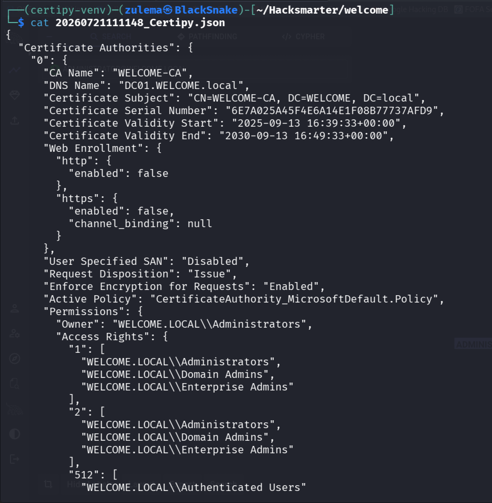

Requesting the certificate with `certipy req`:

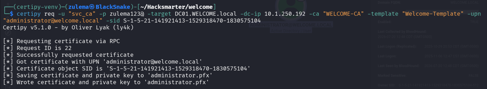

A certificate for Administrator comes back. Authenticating with it using `certipy auth -pfx` against the saved `administrator.pfx`:

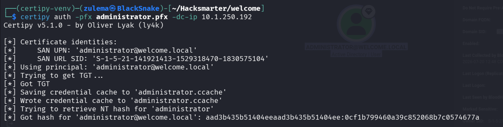

The Administrator hash is recovered. Confirming access over WinRM:

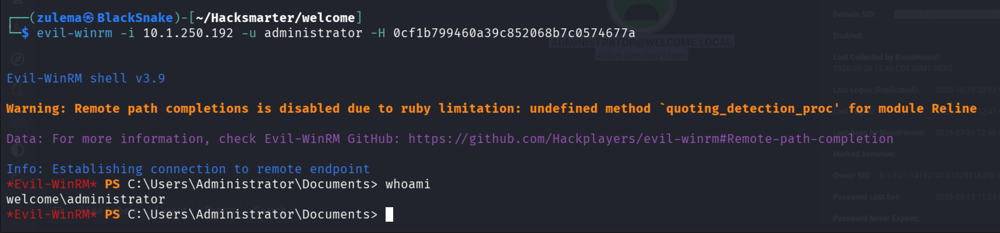

Domain Admin, confirmed.

---

*Educational write-up from an authorized lab environment (HackSmarter). Not a guide for unauthorized access.*
