# BillyBoss

**Category:** Windows, Sonatype Nexus Repository Manager

## Attack Chain

1. HTTP enumeration finds a BaGet NuGet server on port 80 (no clear lead) and a Sonatype Nexus Repository Manager 3.21.0-5 instance on port 8081
2. Default Nexus credentials fail, as does directory brute-forcing
3. The custom credential pair `nexus:nexus` succeeds
4. A public exploit for this Nexus version is identified and adapted with the target's URL, command, and credentials
5. `nc.exe` is transferred to the target through the exploit, then triggered for a reverse shell as `Nathan`
6. `Nathan` holds `SeImpersonatePrivilege`; PrintSpoofer, SigmaPotato, and SweetPotato all fail
7. GodPotato, matched to the installed .NET Framework version (v4), succeeds and spawns `nc.exe` back as SYSTEM

## TL;DR

A Sonatype Nexus Repository Manager instance on port 8081 stood out immediately as the likely entry point, but neither default Nexus credentials nor directory brute-forcing got anywhere. The credential pair that worked, `nexus:nexus`, was a guess based on the product name itself. Nexus 3.21.0-5 has a known public exploit, adapted here to first transfer `nc.exe` to the target and then trigger a reverse shell, landing as user `Nathan`. Nathan held `SeImpersonatePrivilege`, but three of the usual Potato-family tools (PrintSpoofer, SigmaPotato, SweetPotato) all failed against this target. GodPotato, matched to the specific .NET Framework version installed (v4), worked, spawning a SYSTEM-level `nc.exe` callback.

## Full Walkthrough

### Enumeration

Nmap:

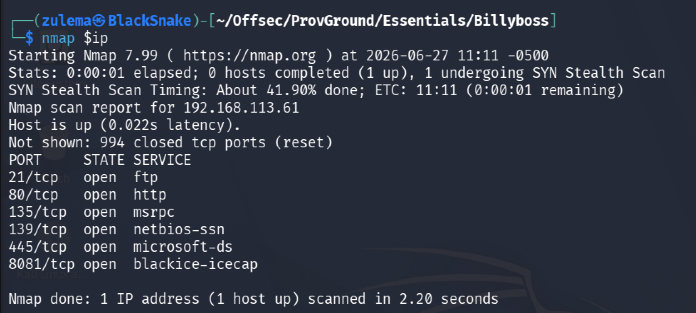

Version/script scan:

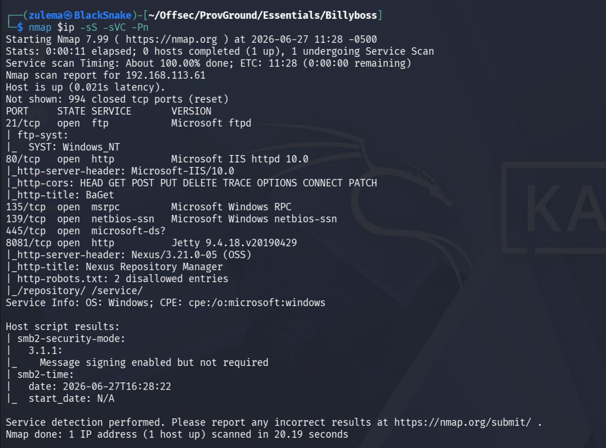

Ports of interest: FTP, 80, 445 (SMB), 8081. SMB enumeration brings no clues, and FTP doesn't allow anonymous access.

**HTTP enumeration, port 80:**

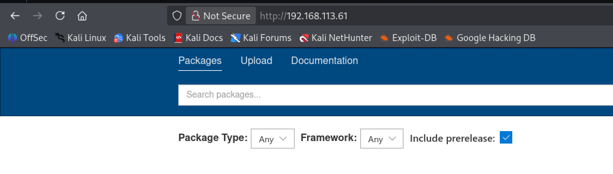

Running BaGet, a lightweight NuGet and symbol server. Checking the "Upload" section:

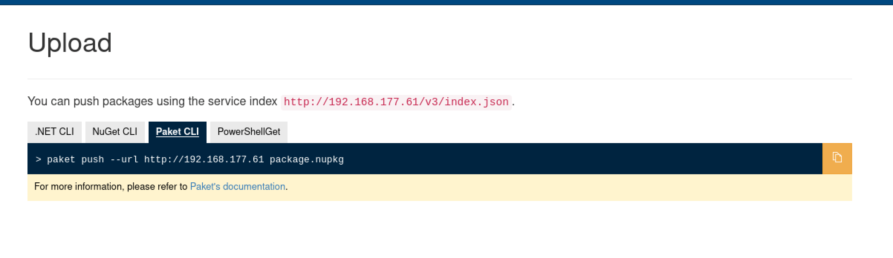

An API endpoint is referenced. Checking it:

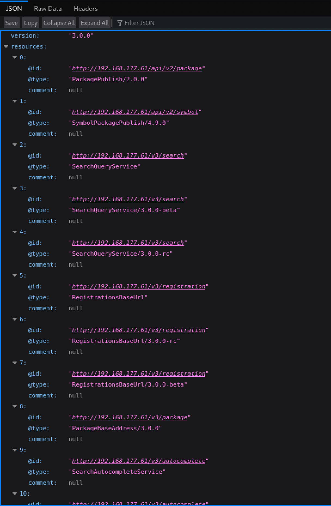

Nothing particularly interesting here.

**Port 8081:**

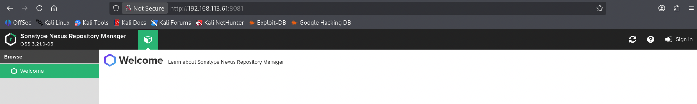

Sonatype Nexus Repository Manager 3.21.0-5, a strong candidate for the entry point.

### Gaining Access to Nexus

Trying to sign in or find accessible directories, starting with default credentials:

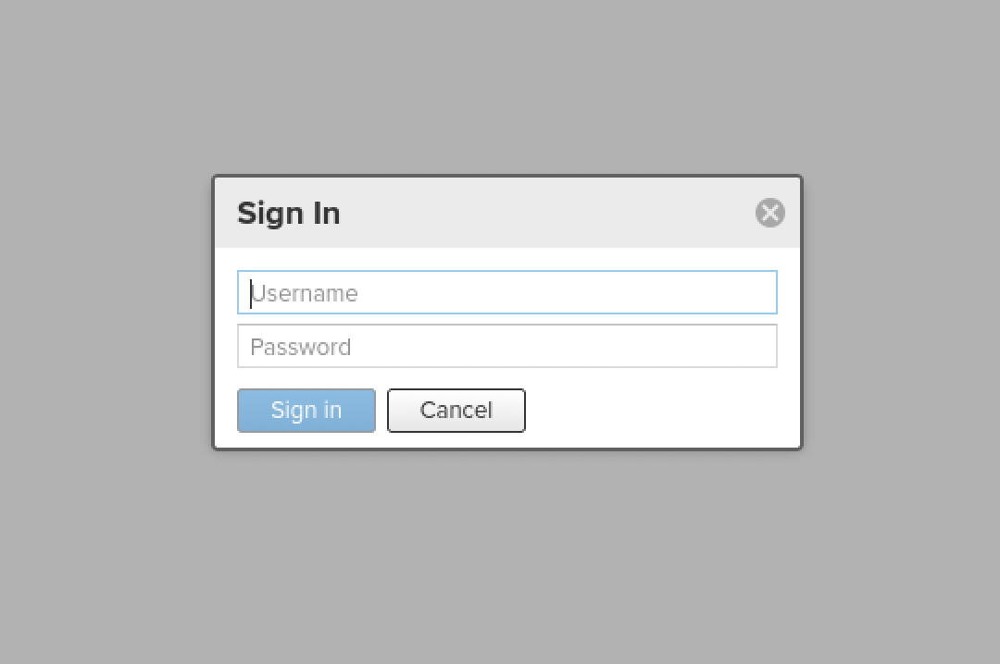

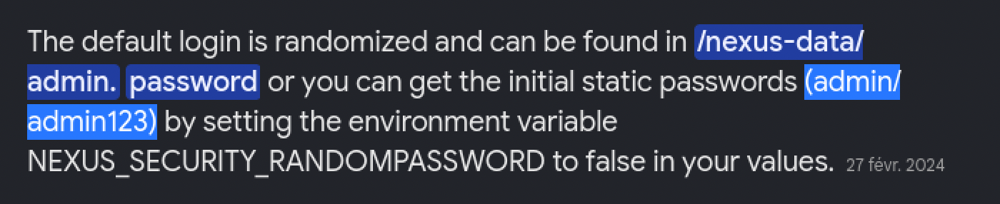

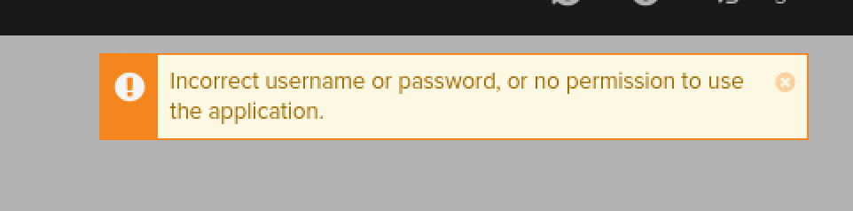

None of the default credential pairs work. Trying directory brute-forcing instead:

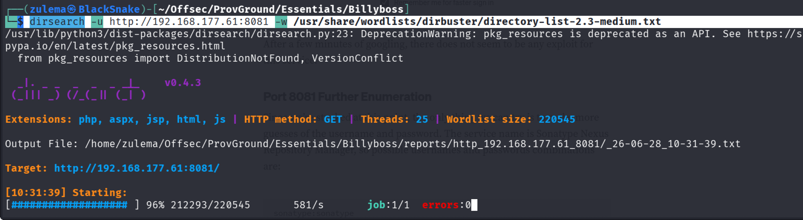

Nothing there either. After a while spent going in circles, a simpler guess pays off: since the product itself is Nexus, why not try `nexus:nexus`?

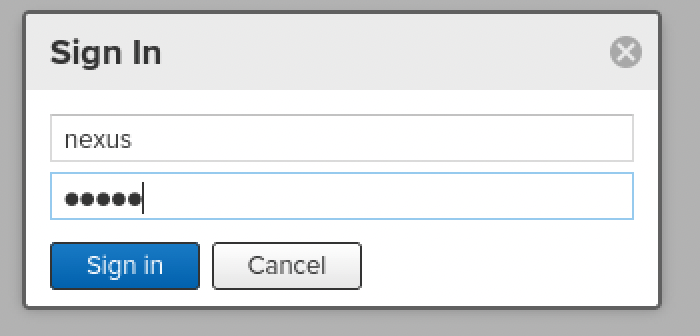

```
nexus:nexus
```

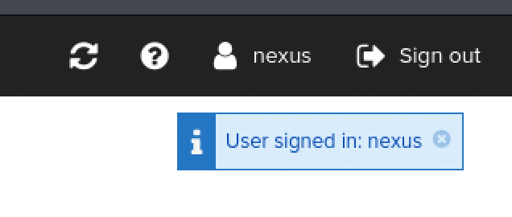

Access confirmed.

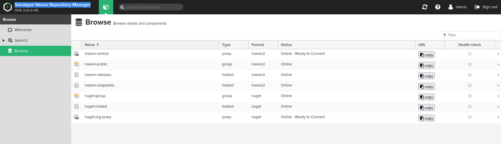

### Initial Access

With authenticated access to the Sonatype server, the next goal is a full interactive reverse shell. Searching for a matching exploit:

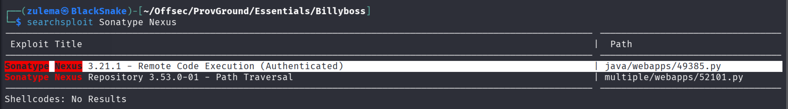

Reviewing what the exploit does:

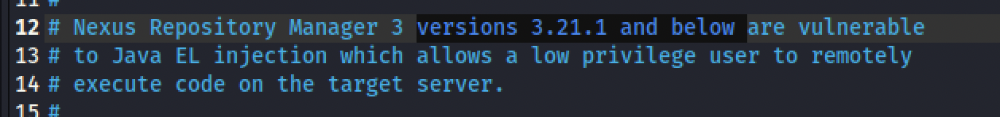

A good match. Adjusting its parameters (target URL, command, username, password):

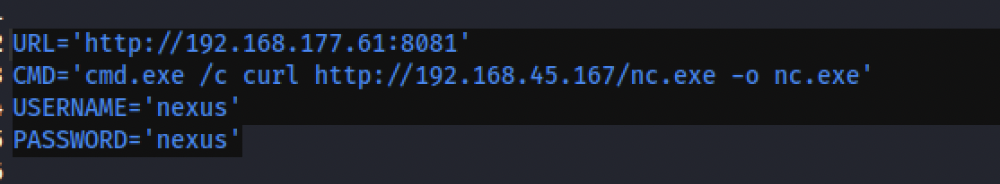

Using it first to transfer `nc.exe` onto the server:

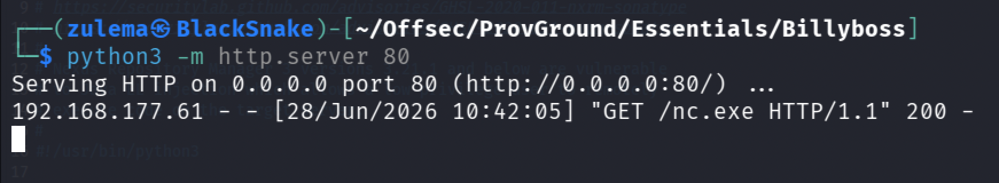

Transfer confirmed. Reconfiguring the exploit's parameters to spawn a reverse shell instead:

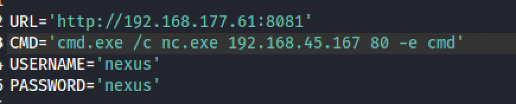

Launching it:

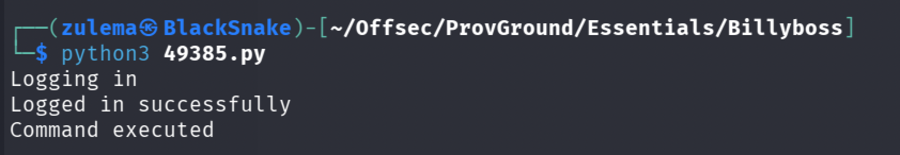

Checking the listener:

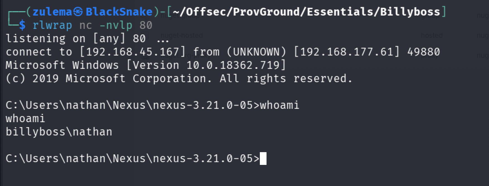

Shell obtained as user `Nathan`.

### Privilege Escalation

Checking Nathan's privileges:

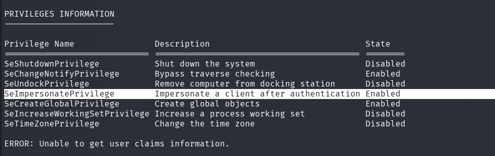

`SeImpersonatePrivilege` is present. Trying PrintSpoofer, SigmaPotato, and SweetPotato in turn, none of them succeed against this target. Researching further turns up a Potato variant not tried yet: GodPotato.

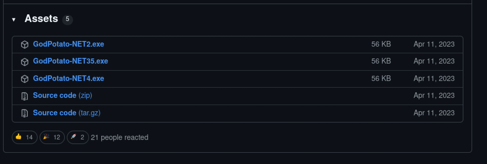

GodPotato ships different releases matched to the .NET Framework version installed on the target, so the right build needs to be identified first. Finding guidance on how to check it:

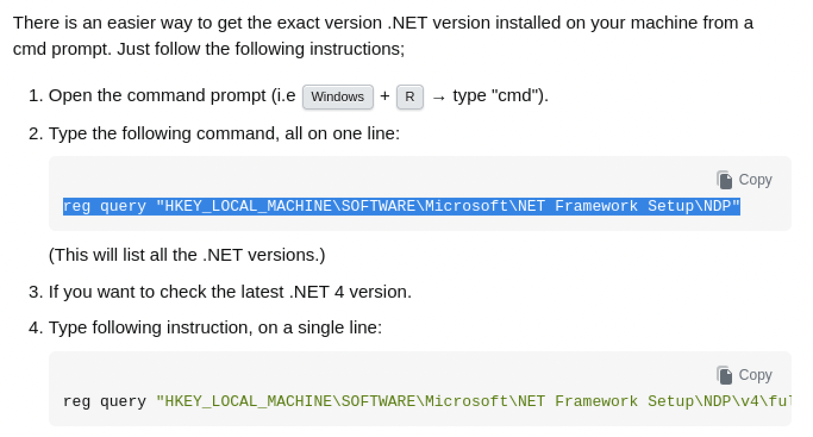

Checking the .NET version:

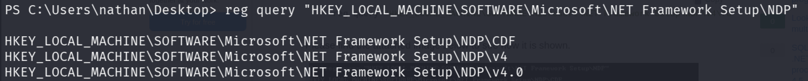

Version 4 is installed. Downloading the matching GodPotato build, transferring it, and running it with no flags to see the usage menu:

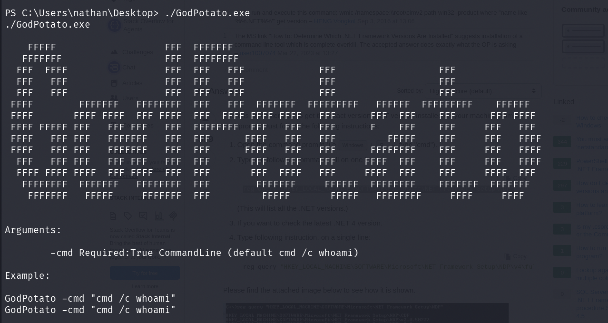

With the syntax confirmed, targeting the already-transferred `nc.exe` on `/Users/Nathan/Desktop` to connect back as SYSTEM:

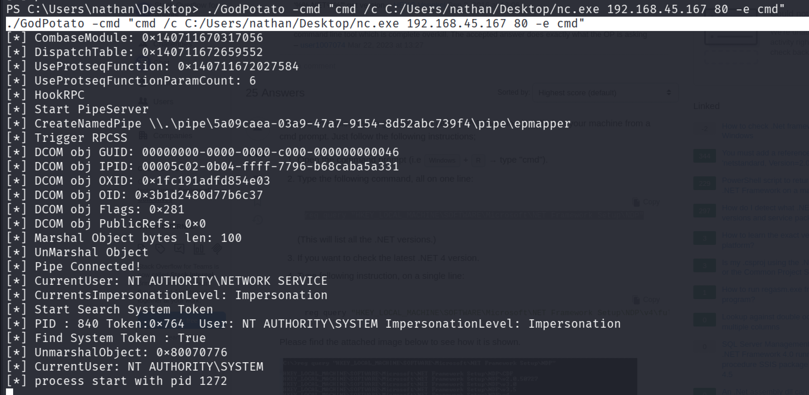

Checking the listener:

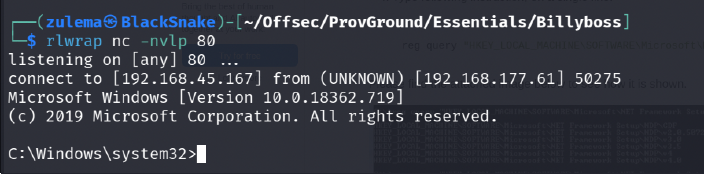

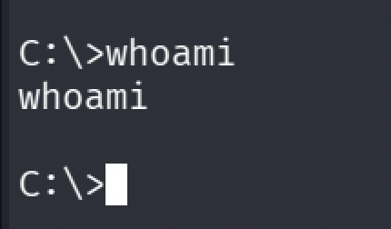

`whoami` doesn't return visible output in this shell, but SYSTEM-level access is confirmed by successfully listing the Administrator's directories:

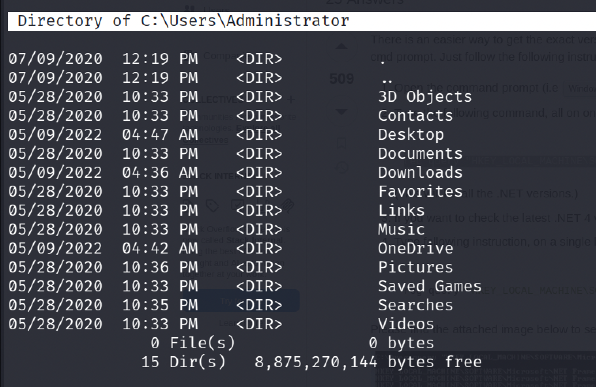

Full system compromise.

---

*Educational write-up from an authorized lab environment (OffSec Proving Grounds). Not a guide for unauthorized access.*
