# Clue

**Difficulty:** Hard  
**Category:** Linux, FreeSwitch, Cassandra Web

## Attack Chain

1. Autorecon finds FreeSwitch (8021), a web app on port 80 that isn't reachable, an SMB `Backup` share readable as guest, and Cassandra Web on port 3000
2. A known Cassandra Web exploit allows arbitrary remote file reads
3. Reading `/proc/self/cmdline` leaks credentials for user `cassie`
4. `cassie`'s credentials don't work over SSH; `/etc/ssh/sshd_config` shows only `root` and `Anthony` are permitted to log in that way
5. Using the same file-read exploit against FreeSwitch's `xml_rpc.conf.xml` doesn't turn up anything
6. Mounting the SMB `Backup` share and grepping its XML files for "password" finds a FreeSwitch `event_socket.conf.xml` with a password, in a path matching the earlier exploit target, but likely stale, since it's a backup copy
7. Reading the live `event_socket.conf.xml` through the file-read exploit confirms the current password
8. A public FreeSwitch Event Socket exploit is adapted with the real password to gain remote code execution
9. A reverse shell is spawned over port 3000 specifically, matching Cassandra Web's port to get past firewall restrictions, landing as `cassie` (matching the earlier leaked credentials)
10. `sudo -l` reveals a runnable entry; running it locally with elevated rights, then reusing the file-read exploit against `/etc/shadow`, extracts the shadow file
11. The same file-read technique retrieves Anthony's `id_rsa`, the next pivot point toward further access

## TL;DR

Cassandra Web on port 3000 had a known arbitrary file-read vulnerability, used first to leak credentials for user `cassie` out of `/proc/self/cmdline`. Those credentials didn't work over SSH, since `sshd_config` only allowed `root` and `Anthony` to authenticate that way. A readable SMB `Backup` share turned out to hold an old copy of FreeSwitch's `event_socket.conf.xml` with a password, and while that backup copy was outdated, its file path matched the live config path targeted by a known FreeSwitch Event Socket exploit, so the same Cassandra Web file-read bug was reused to pull the actual live config and its current password. Feeding that into the FreeSwitch exploit got remote code execution, and a reverse shell (forced onto port 3000 to slip past a restrictive firewall) landed back as `cassie`. From there, a `sudo`-permitted binary combined with the same arbitrary-file-read primitive extracted `/etc/shadow`, and Anthony's SSH private key was pulled the same way, the next pivot point toward full compromise.

## Full Walkthrough

### Enumeration

Running Autorecon:

- Port 8021: FreeSwitch
- Port 80: web app, not directly accessible
- Port 445: SMB, `Backup` share readable
- Port 3000: Cassandra Web

A known Cassandra Web exploit is identified, usable for arbitrary remote file reads:

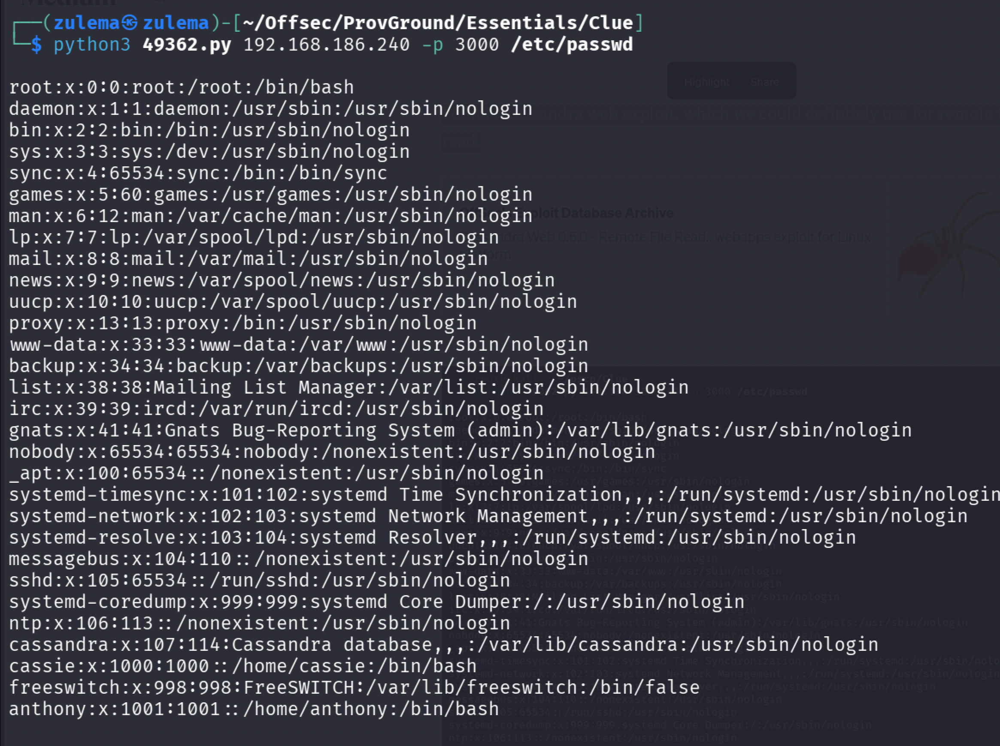

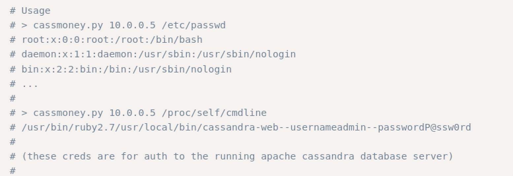

Testing it against `/proc/self/cmdline`:

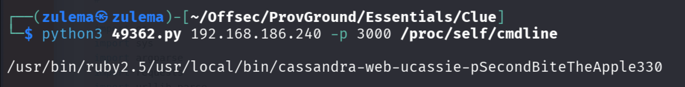

User credentials come back:

```
cassie:SecondBiteTheApple330
```

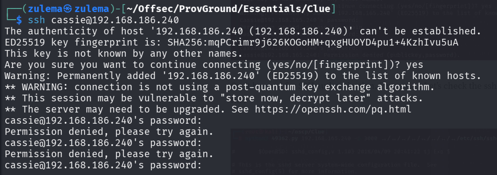

These don't work for SSH. Checking `/etc/ssh/sshd_config`:

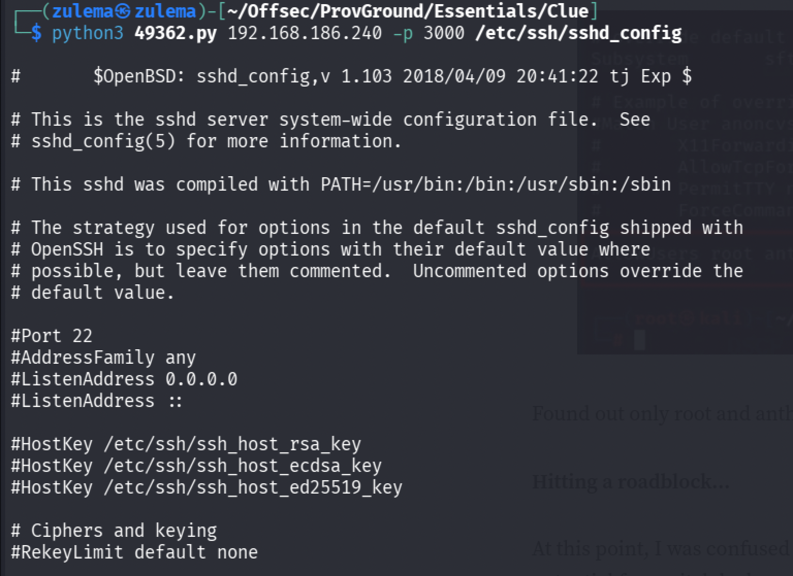

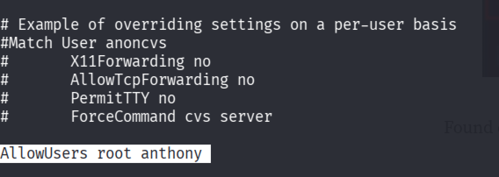

Only `root` and `Anthony` are permitted to authenticate over SSH.

Digging further into the web app:


Trying to read a FreeSwitch config file through the same exploit:

```
/usr/local/freeswitch/conf/autoload_configs/xml_rpc.conf.xml
```

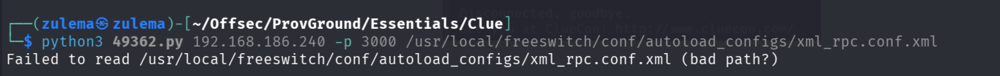

Nothing useful comes back from this particular file.

### Switching to SMB Enumeration

Mounting the SMB share for easier navigation:

```
mount -t cifs //ip/backup backup/ -o guest
```

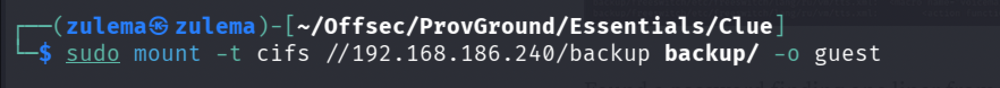

Searching the mounted backup directory for anything password-related:

```
find . -type f -exec grep -i -l "pass" {} /dev/null \;
```

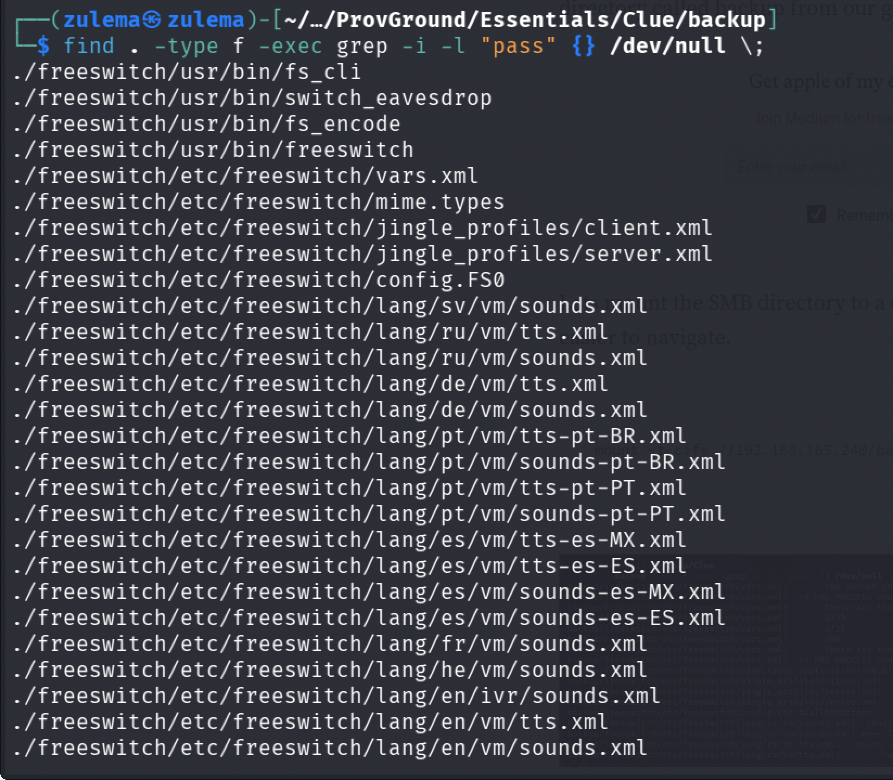

Narrowing to XML files specifically containing "password":

```
find . -type f -name "*.xml" -exec grep -Hni "password" {} \;
```

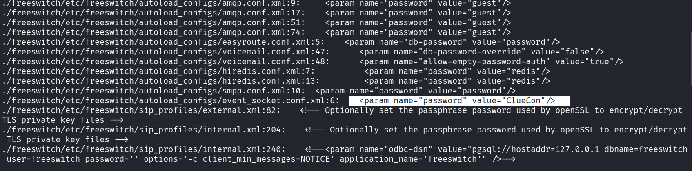

Trying SSH with what's found doesn't work. The path of `event_socket.conf.xml` in this backup matches the path targeted by a known FreeSwitch exploit, but since this is only a backup copy, the actual live password may have changed since. Reading the live version of the file through the Cassandra Web directory traversal exploit instead:

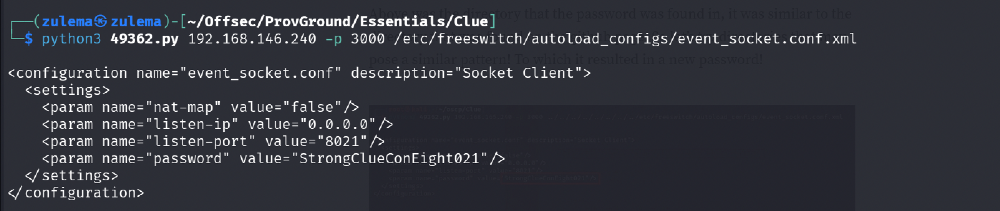

### Exploiting FreeSwitch

A matching FreeSwitch exploit is found on Exploit-DB:

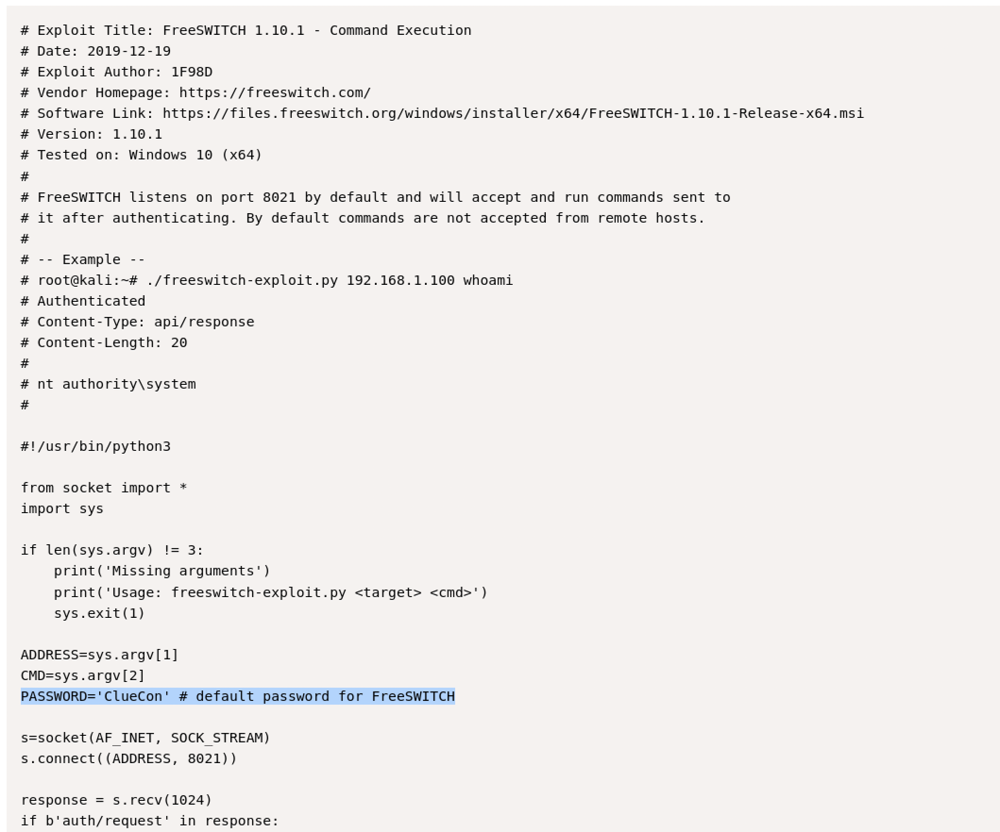

Updating it with the actual current password recovered from the live config:

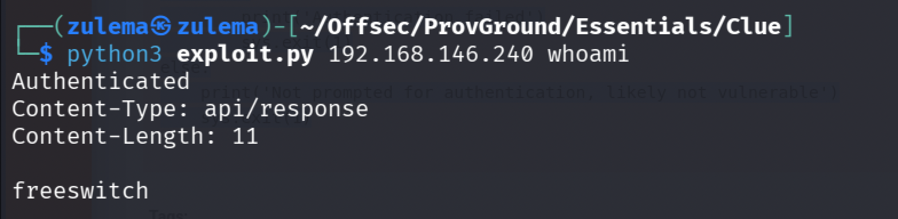

Setting up a reverse shell with netcat, using port 3000 specifically (the same port as Cassandra Web) to get past firewall restrictions:

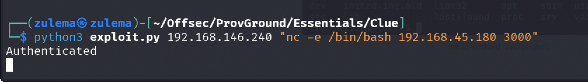

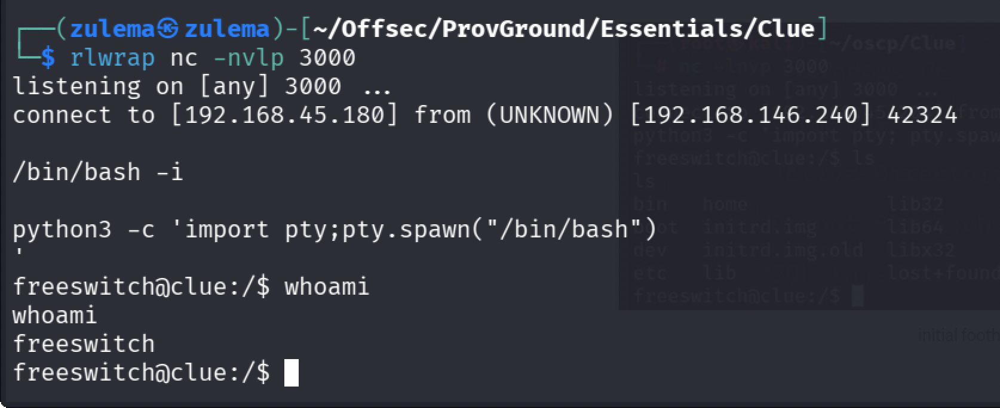

The earlier leaked credentials come into play again:

```
SecondBiteTheApple330
```

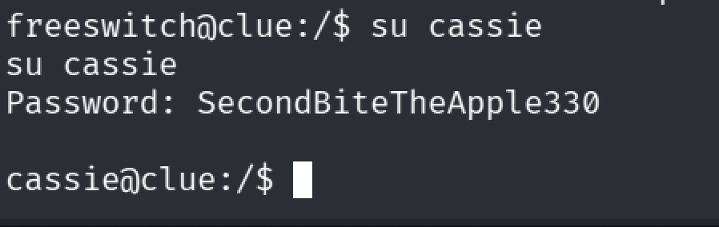

Shell lands as `cassie`.

### Privilege Escalation

Checking `sudo` permissions:

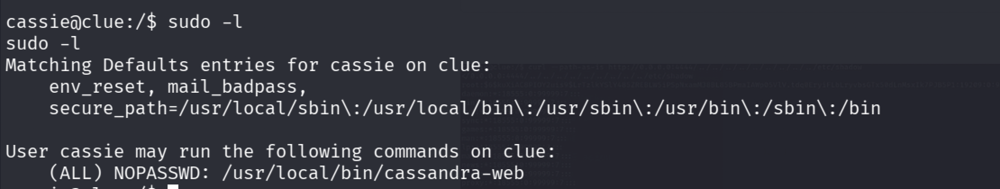

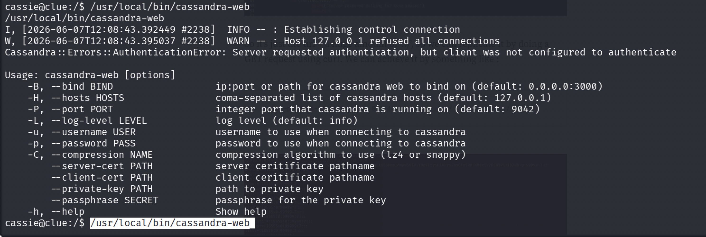

Running the permitted binary locally with `sudo`, then reusing the Cassandra Web path traversal exploit, this time targeting `/etc/shadow`:

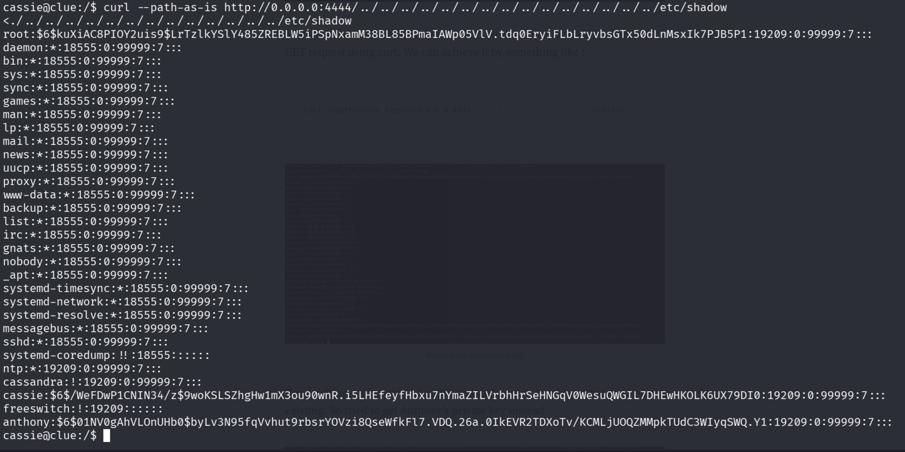

Retrieving Anthony's `id_rsa` the same way:

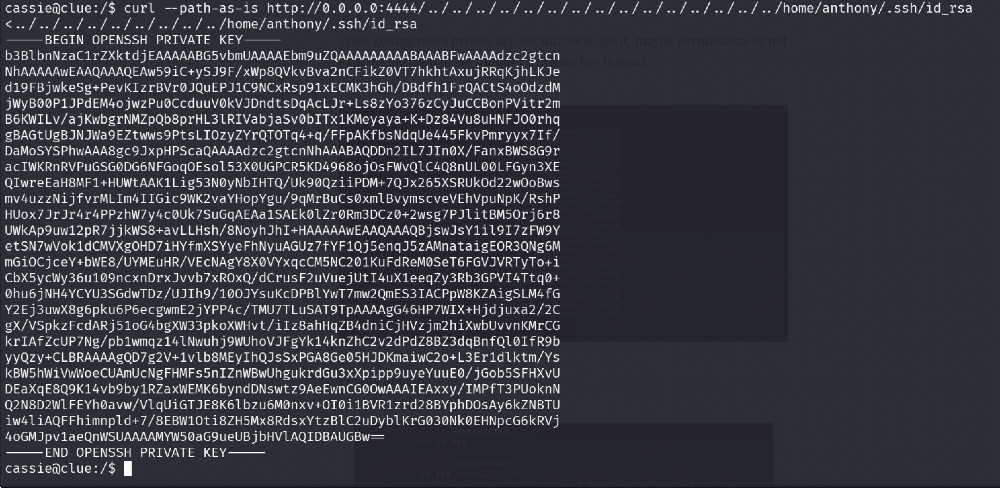

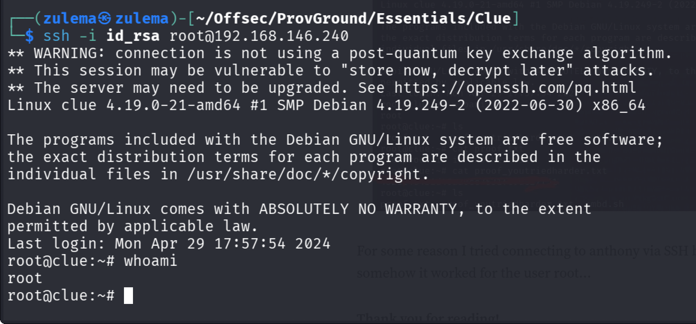

With Anthony's private key in hand, SSH access as one of the two permitted accounts is the next pivot point toward completing the compromise.

---

*Educational write-up from an authorized lab environment (OffSec Proving Grounds). Not a guide for unauthorized access.*
