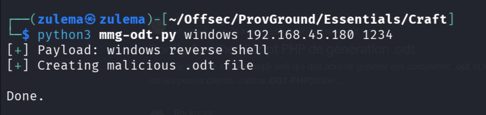
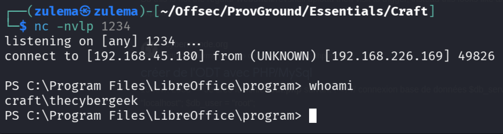
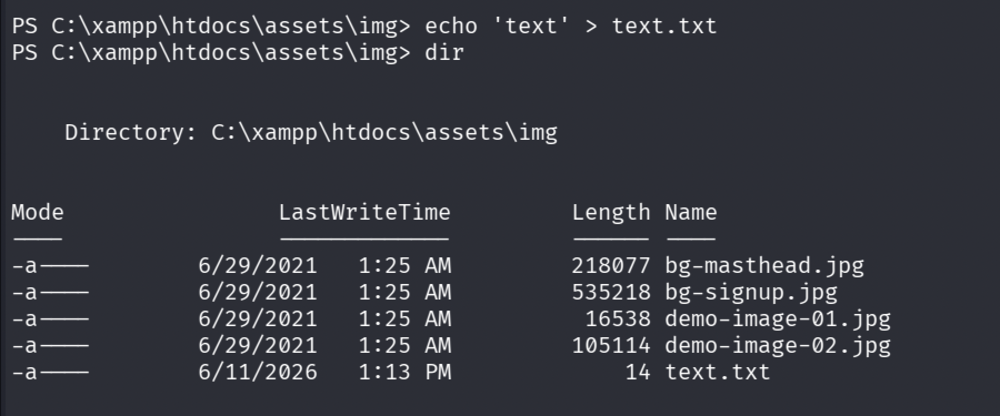
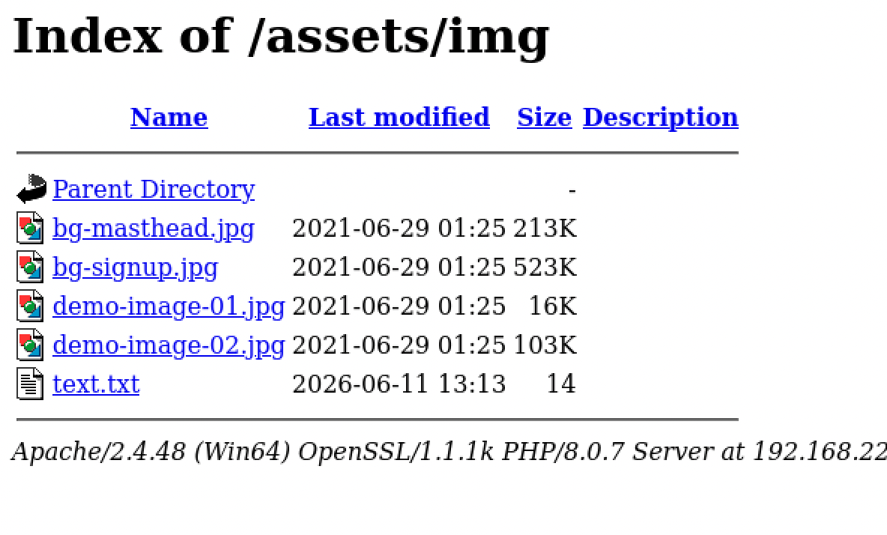
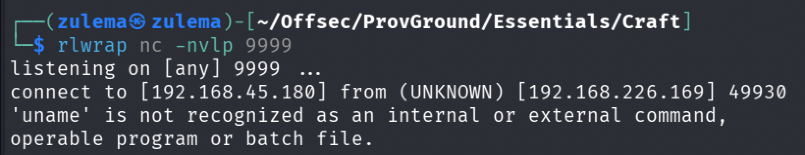
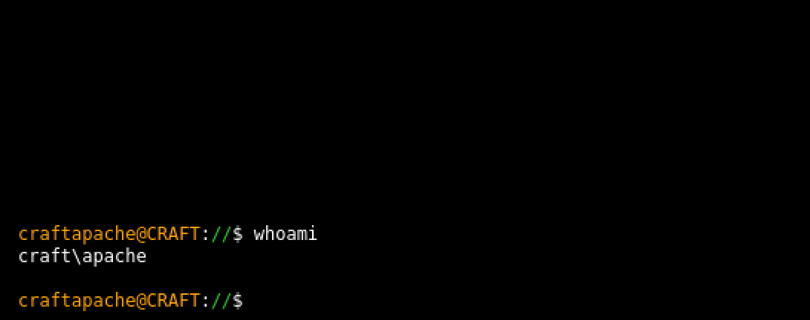
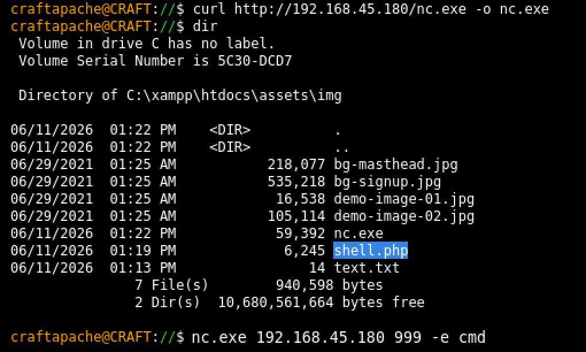
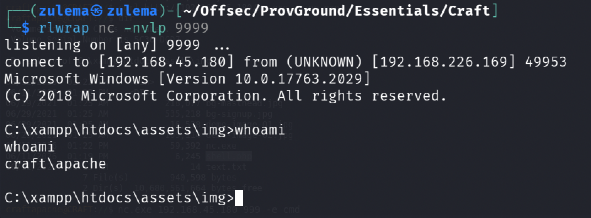
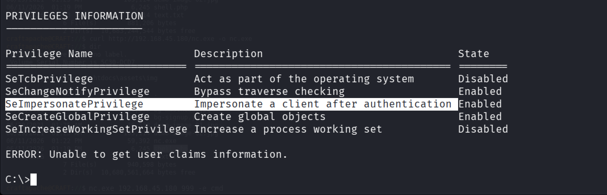
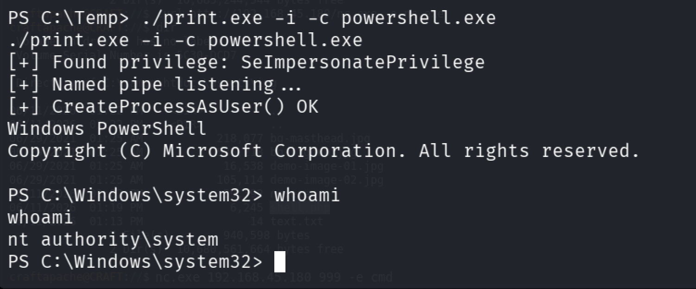

# Craft

**Category:** Windows, LibreOffice Macros (.odt)

## Attack Chain

1. The only open port (80) hosts a site accepting file uploads restricted to `.odt`, pointing toward a macro-based attack
2. A Python tool (`mmg-odt.py`) crafts a malicious `.odt` file embedding LibreOffice macros
3. Uploading the crafted file executes the embedded macro, giving initial access
4. Enumeration finds an XAMPP `htdocs` layout; uploads are blocked in `/uploads` but succeed in `/assets/img`
5. A first PHP webshell connects but fails (likely a Windows-specific incompatibility); a second webshell works
6. `nc.exe` is transferred through the working shell for a full interactive reverse shell as the Apache service account
7. `SeImpersonatePrivilege` is available; PrintSpoofer64 is transferred and run for a SYSTEM shell

## TL;DR

A file upload form accepting only `.odt` files pointed directly at a LibreOffice macro attack: a Python tool crafted a malicious `.odt` embedding a macro, and uploading it triggered execution for initial access. From there, enumeration found the site's XAMPP layout, and while the obvious `/uploads` directory blocked further uploads, `/assets/img` didn't. A first PHP webshell connected but failed to execute properly (likely incompatible with the Windows host), but a second one worked, and `nc.exe` transferred through it upgraded the access into a full interactive shell as the Apache service account. That account held `SeImpersonatePrivilege`, exploited directly with PrintSpoofer64 for a SYSTEM shell.

## Full Walkthrough

### Enumeration

Nmap shows only port 80 open, hosting a site with file uploads that accepts `.odt` files exclusively, a strong hint that the intended exploit path involves LibreOffice macros.

### Initial Access

Researching `.odt` macro generators turns up [mmg-odt.py](https://github.com/0bfxgh0st/MMG-LO/blob/main/mmg-odt.py), a Python script that crafts macros into a target file format, `.odt` in this case:

Uploading the crafted file:

Initial access gained.

### Lateral Movement

Enumerating the filesystem finds a XAMPP install with an `htdocs` subdirectory containing the site's directories. Trying to upload a `.txt` file into `/uploads` fails, but the same upload into `/assets/img` succeeds:

The plan is to upload a PHP webshell there to get access as the Apache user. A first webshell uploads fine, but the connection fails once triggered, likely a compatibility issue with the Windows host:

Trying a [different webshell](https://gist.githubusercontent.com/mrpapercut/9e4f511e74fdf3796d0abcc4de182b65/raw/7ebf35eb6209d25a27ac98393dc38dd6f6056de6/shell.php):

This one works. Transferring `nc.exe` for a full interactive reverse shell:

Shell obtained.

### Privilege Escalation

`SeImpersonatePrivilege` is available, a direct path to SYSTEM:

Transferring and running PrintSpoofer64:

Full system compromise.

---

*Educational write-up from an authorized lab environment (OffSec Proving Grounds). Not a guide for unauthorized access.*
