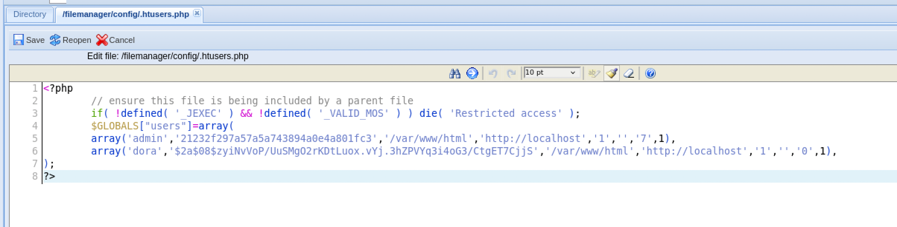
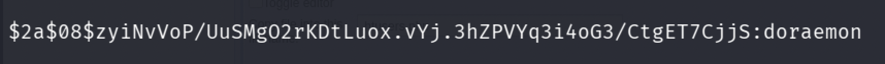
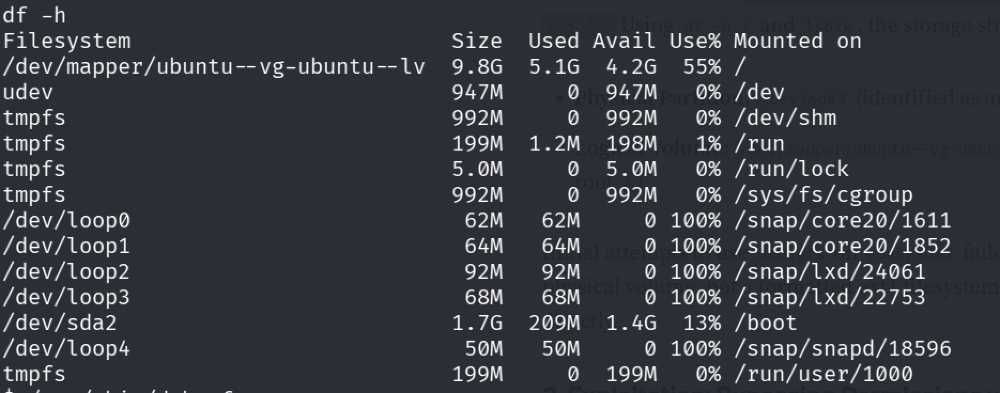
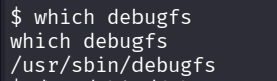
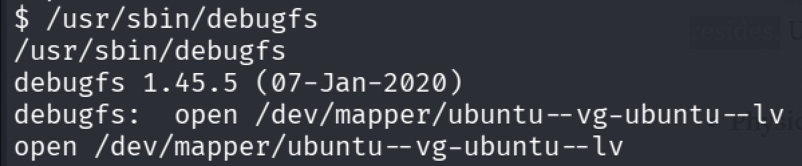
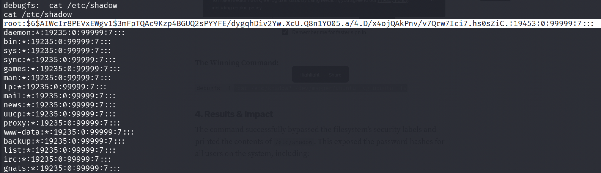
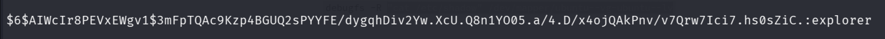
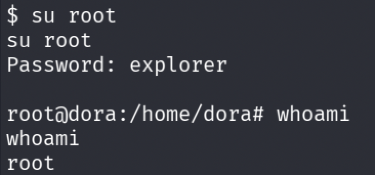

# Extplorer

**Category:** Linux, File Upload, Disk Group Privilege Escalation

## Attack Chain

1. `dirsearch` finds `/filemanager`, an eXtplorer login panel
2. Default credentials (`admin:admin`) work
3. A PHP reverse shell uploaded through eXtplorer gives initial access as `www-data`
4. LinPEAS finds no direct escalation path
5. eXtplorer's own `/config/.htusers.php` file is checked for stored credentials and hashes
6. The hash is identified and cracked with Hashcat, recovering credentials for user `dora`
7. `dora` is a member of the `disk` group, granting raw read/write access to block devices
8. `df -h`/`lsblk` identify the disk holding the root filesystem
9. `debugfs` is used to open that device directly and read `/etc/shadow`, bypassing normal filesystem permissions
10. The extracted root hash is cracked with Hashcat, completing the compromise

## TL;DR

An eXtplorer file manager, found via directory brute-forcing, accepted default credentials (`admin:admin`) and allowed a PHP reverse shell to be uploaded directly, giving a foothold as `www-data`. LinPEAS didn't find a clear escalation path, but eXtplorer's own configuration file, `/config/.htusers.php`, stored a crackable password hash for a local user, `dora`. That account turned out to belong to the `disk` group, which grants raw access to block devices on Linux, bypassing normal filesystem permissions entirely. After identifying which device held the root filesystem, `debugfs` was used to open it directly and read `/etc/shadow` straight off the disk, sidestepping the usual root-only restriction. The extracted root password hash cracked with Hashcat, completing the compromise.

## Full Walkthrough

### Enumeration

Nmap: ports 80 and 22. Running `dirsearch` against the site reveals `/filemanager`, an eXtplorer login panel.

### Initial Access

Trying default credentials for eXtplorer:

```
admin:admin
```

Access confirmed. Uploading a PHP reverse shell into one of the writable directories gives initial access as `www-data`. Running LinPEAS afterward finds nothing to escalate with directly.

### Credential Discovery

Checking where eXtplorer stores its own credentials:

```
/config/.htusers.php
```



Identifying the hash type, then cracking it with Hashcat:



Credentials recovered for user `dora`.

### Privilege Escalation via debugfs

Checking `dora`'s group memberships:


`dora` is a member of the `disk` group (GID 6). On Linux, members of this group have raw read/write access to block devices (`/dev/sda`, `/dev/mapper/...`), dangerous because it allows interacting directly with the underlying disk data, bypassing OS-level file permissions that normally protect files like `/etc/shadow`. (Reference: [Privilege Escalation via Disk Group Membership](https://caramellia.medium.com/privilege-escalation-via-disk-group-membership-daa75a7cd930).)

**Identifying the disk partition:** locating where the root filesystem resides with `df -h` and `lsblk`:



**Bypassing permissions with debugfs:** since `dora` has disk group privileges, `debugfs` can open the logical volume directly, something normally restricted to root.

Locating `debugfs`:



Opening the identified disk partition with it:



The winning command, reading `/etc/shadow` directly off the raw device:

```
cat /etc/shadow /dev/mapper/ubuntu--vg-ubuntu--lv
```



Cracking the extracted hash with Hashcat:





Full system compromise.

---

*Educational write-up from an authorized lab environment (OffSec Proving Grounds). Not a guide for unauthorized access.*
