# Fail

**Category:** Linux, Rsync, Fail2ban Privilege Escalation

Rsync is a utility for transferring and synchronizing files between systems by comparing modification times and sizes, and can preserve filesystem metadata during a copy.

## Attack Chain

1. Rsync (873) and SSH (22) are the only open ports; Nmap's rsync script and manual `nc` enumeration reveal an unauthenticated share named `fox`
2. Listing `/fox` shows it's actually a home directory
3. Since the share accepts uploads without authentication, an SSH key pair is generated and the whole local `.ssh` directory (since none exists remotely) is pushed via `rsync`
4. SSH access follows directly with the planted key, landing as `fox`
5. `fox` is a member of the `fail2ban` group, and its config directory is fully writable
6. `README.fox` and `jail.conf` point to `iptables-multiport` as the ban action; its `.conf` defines an `actionban` command executed whenever an IP gets banned
7. `actionban` is rewritten with a netcat reverse shell one-liner, and a listener is started
8. Deliberately failing SSH logins triggers a ban, executing the rewritten action as root

## TL;DR

An unauthenticated rsync share, `fox`, turned out to be the target's own home directory and accepted uploads without any credentials. Since there was no `.ssh` directory to plant a single key into, the entire local `.ssh` folder was synced over instead, which was enough to get SSH access directly as user `fox`. That account belonged to the `fail2ban` group and had full write access to fail2ban's own configuration directory. Reading through `jail.conf` and the `iptables-multiport` action definition revealed the exact command fail2ban runs, as root, every time it bans an IP. Rewriting that command to a netcat reverse shell and then deliberately failing enough SSH logins to trigger a ban executed the payload with root privileges.

## Full Walkthrough

### Enumeration

Only rsync (873) and SSH (22) are open.

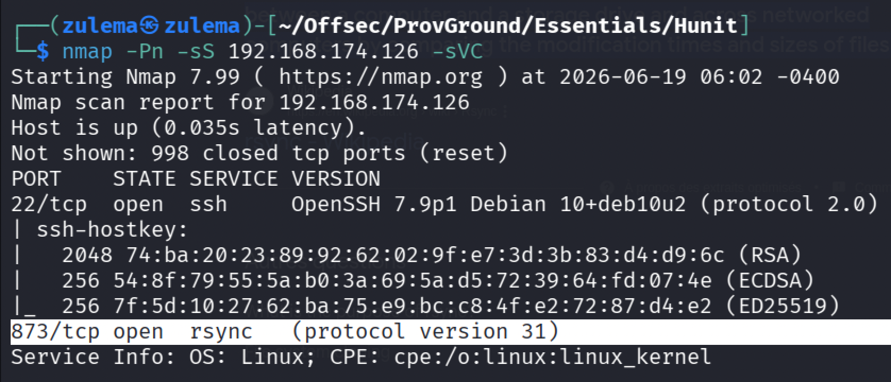

Following [HackTricks' rsync enumeration guidance](https://book.hacktricks.xyz):

Nmap's rsync script:

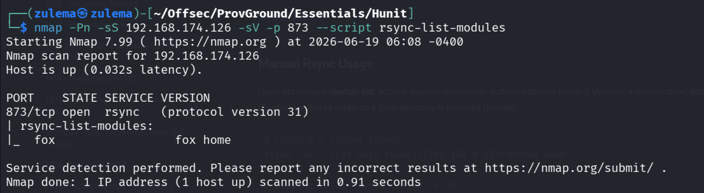

Manual enumeration with `nc`:

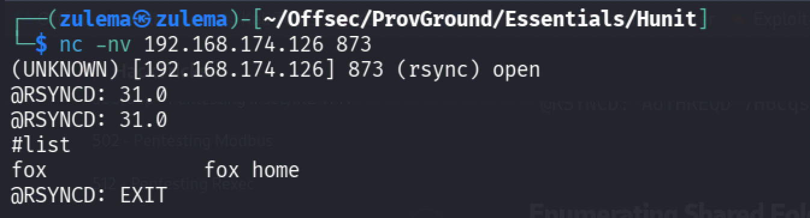

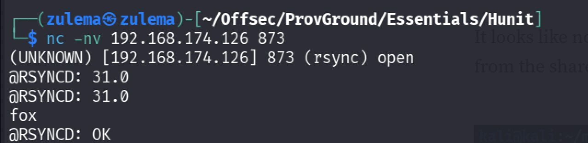

No authentication is required, meaning files can be uploaded directly. A share called `fox` is exposed without any auth prompt.

**Listing the contents of `/fox`:**

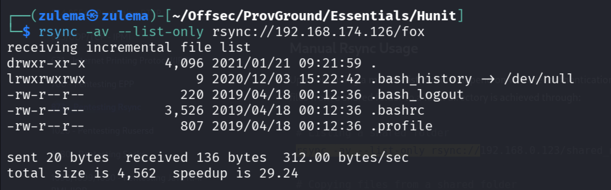

It's actually a home directory.

### Initial Access

Since uploads don't require authentication, an SSH key can simply be planted to get in directly.

Generating a key pair:

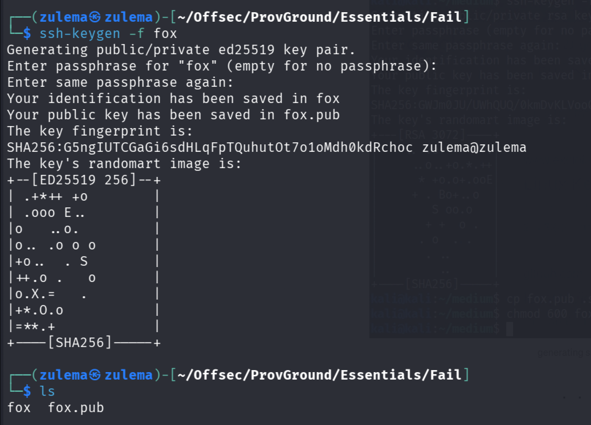

Copying the public key into a local `authorized_keys` file:

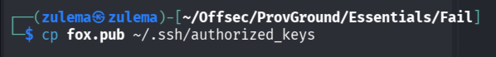

Since there's no existing `.ssh` directory on the `fox` share, the entire local `.ssh` directory needs to be synced over instead of a single file. Importing it with `rsync`:

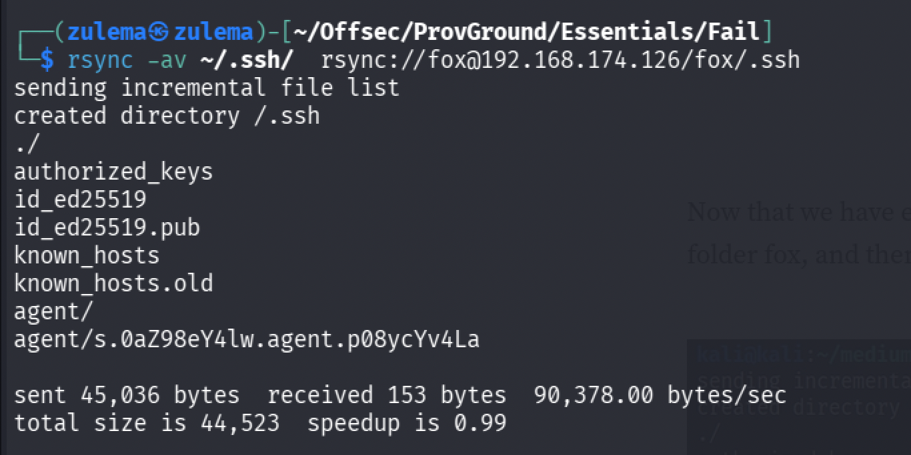

(Remembering to `chmod 600` the private key afterward.) SSH:

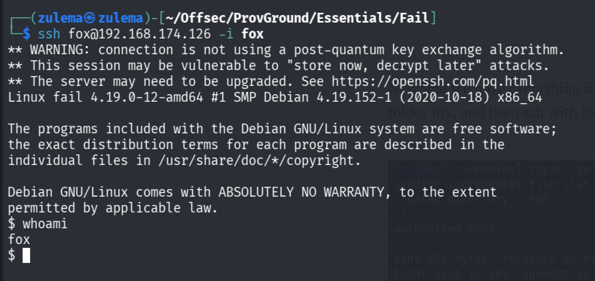

Access confirmed.

### Enumeration

Access is as `fox`. Checking group membership:

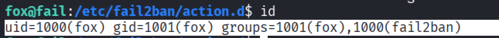

`fox` is part of the `fail2ban` group. Fail2ban is an intrusion prevention framework designed to block brute-force attacks by banning IPs after repeated failed logins.

Checking for writable permissions in its configuration:

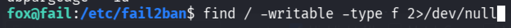

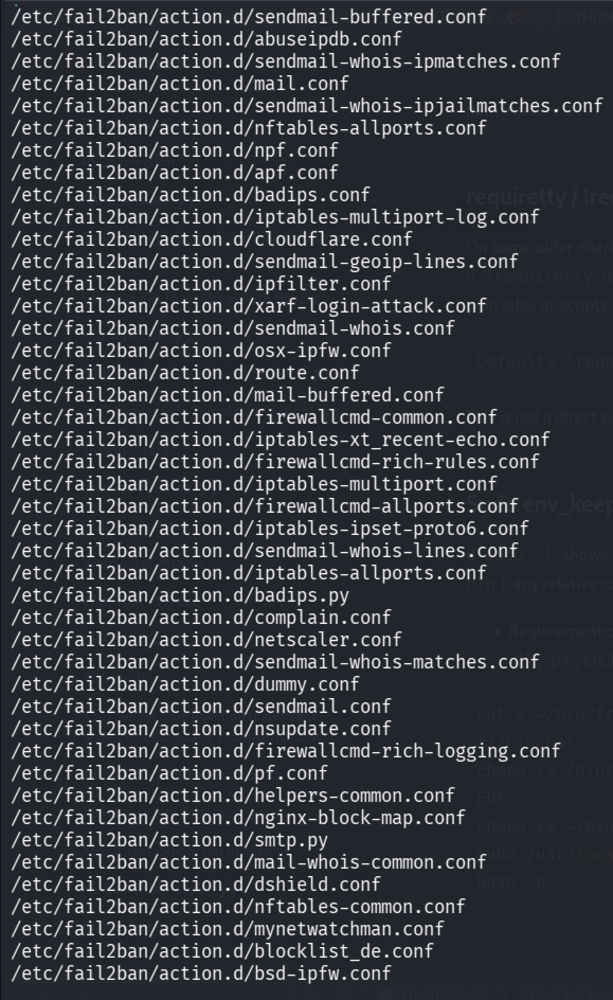

Write access is available essentially everywhere in the directory. Reading `README.fox` in the fail2ban directory:

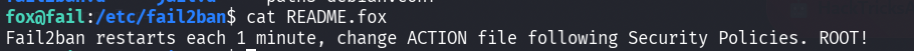

This confirms the path forward. Checking `jail.conf` for the ban action:

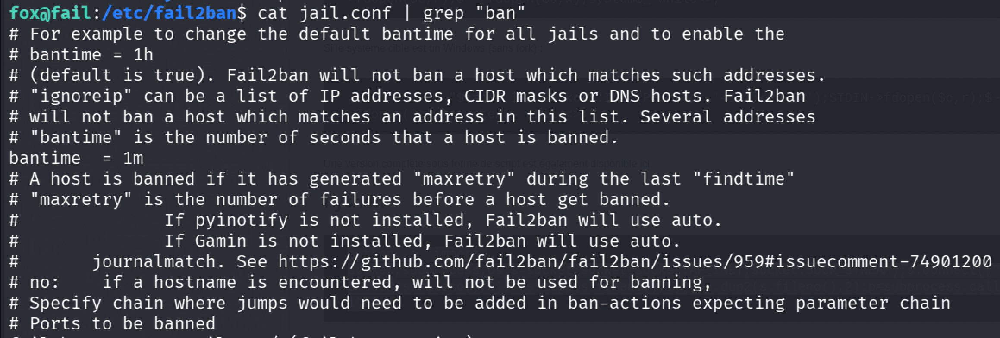

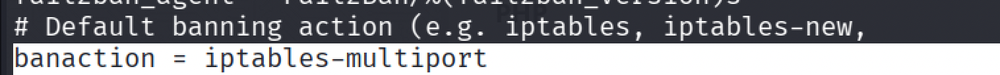

The ban action is handled by `iptables-multiport`, defined under `/action.d`. Inspecting `iptables-multiport.conf`:

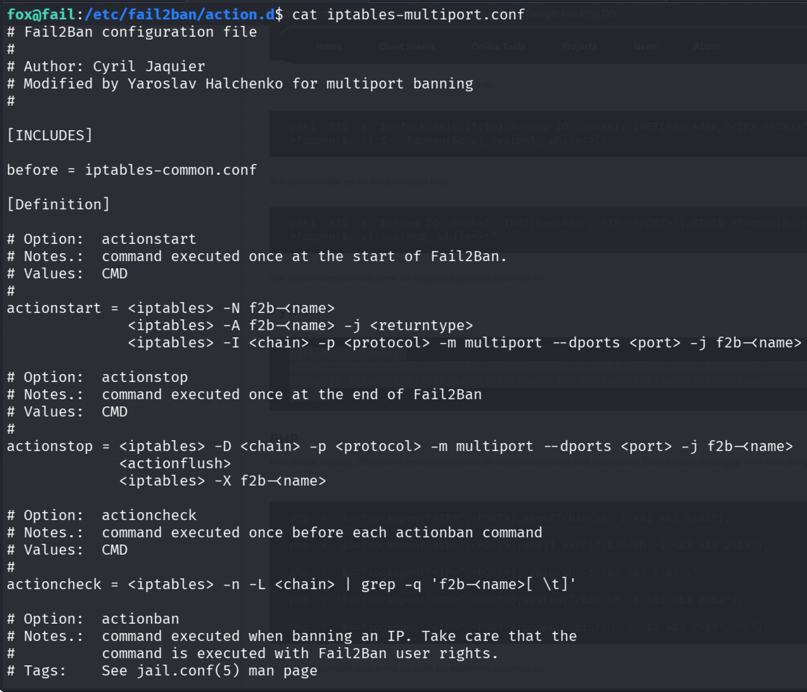

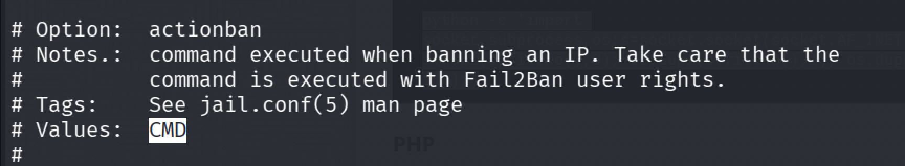

`actionban` is the command executed whenever an IP gets banned, running as whatever privilege level fail2ban itself has (root). The privilege escalation vector is clear.

### Privilege Escalation

Modifying `actionban` to a netcat reverse shell one-liner and starting a listener:

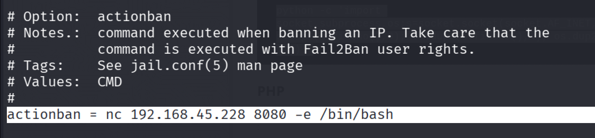

Deliberately failing SSH logins to trigger a ban:

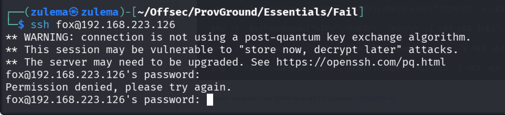

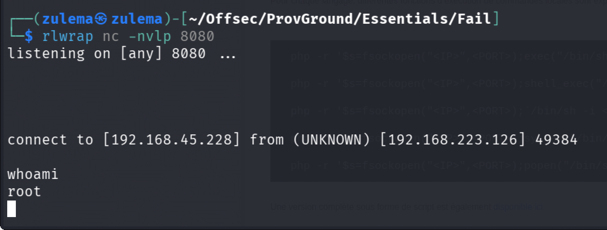

Full system compromise.

---

*Educational write-up from an authorized lab environment (OffSec Proving Grounds). Not a guide for unauthorized access.*
