# Heist

**Difficulty:** Hard  
**Category:** Active Directory, Server-Side Request Forgery (SSRF)

Server-side request forgery is a web security vulnerability that allows an attacker to cause the server-side application to make requests to an unintended location. In a typical SSRF attack, the attacker might cause the server to connect to internal-only services within the organization's infrastructure, or force it to connect to arbitrary external systems, potentially leaking sensitive data such as authorization credentials.

## Attack Chain

1. A Werkzeug/Python web app on port 8080 accepts a URL parameter, a likely SSRF candidate
2. Pointing it at a local Python HTTP server confirms the app fetches and displays external content, SSRF confirmed
3. Pointing it at Responder (listening on `tun0`) instead of a real HTTP server captures an NTLMv2 hash for user `enox`, since the "URL fetch" is really an SMB/HTTP-style connection attempt Responder can intercept
4. The hash is cracked with John, and the resulting password grants WinRM access
5. Manual enumeration goes nowhere; SharpHound shows `enox` is a member of Web Admins, which can read the GMSA password of `svc_apache$`
6. The Linux GMSA-reading path fails; a compiled Windows tool (`GMSAPasswordReader.exe`) succeeds and returns `svc_apache$`'s hash, unlocking WinRM as that account
7. `svc_apache$` holds `SeRestorePrivilege`; the `Invoke-SeRestoreAbuse` PowerShell script is tested and confirmed to work
8. The script is run to spawn a SYSTEM-level reverse shell via a transferred `nc.exe`

## TL;DR

A Flask/Werkzeug app accepting a URL parameter turned out to be a straightforward SSRF: pointing it at a local Python HTTP server showed the app fetching and rendering external content directly. Pointing that same parameter at a local Responder instance instead of a real server turned the SSRF into an NTLM relay opportunity, capturing an NTLMv2 hash for user `enox`, cracked with John. The resulting credentials gave WinRM access, and while manual enumeration didn't lead anywhere, SharpHound showed `enox`'s membership in Web Admins granted rights to read the GMSA password of a service account, `svc_apache$`. The Linux tooling for that particular abuse didn't cooperate, but a precompiled Windows reader tool did, handing over `svc_apache$`'s hash and WinRM access as that account. From there, `SeRestorePrivilege` was the final piece: a public abuse script for that privilege, tested first as a dry run, spawned a SYSTEM-level reverse shell once confirmed working.

## Full Walkthrough

### Enumeration

Nmap shows the open ports of a domain controller, including port 8080:

```
Werkzeug/2.0.1 Python/3.9.0
```

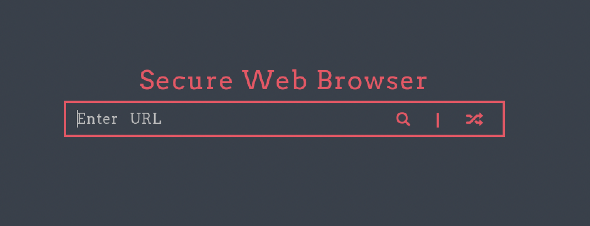

The app accepts a URL input, worth testing for SSRF.

### Checking for SSRF

Setting up a Python HTTP server on port 445 and pointing the app's URL field at the attacking host's IP on that port:

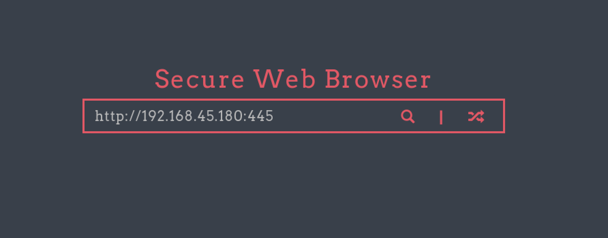

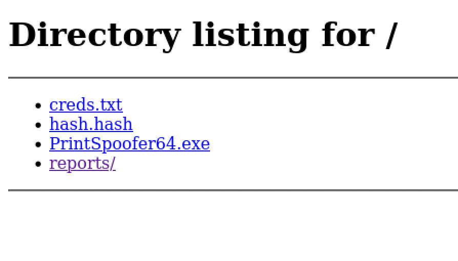

The response displays the contents served by the local HTTP server, confirming the application is vulnerable to SSRF.

### Retrieving an NTLMv2 Hash via Responder

Starting Responder:

```
sudo responder -I tun0 -vv
```

Pointing the vulnerable URL field at a closed port on the attacking machine instead of a real server:

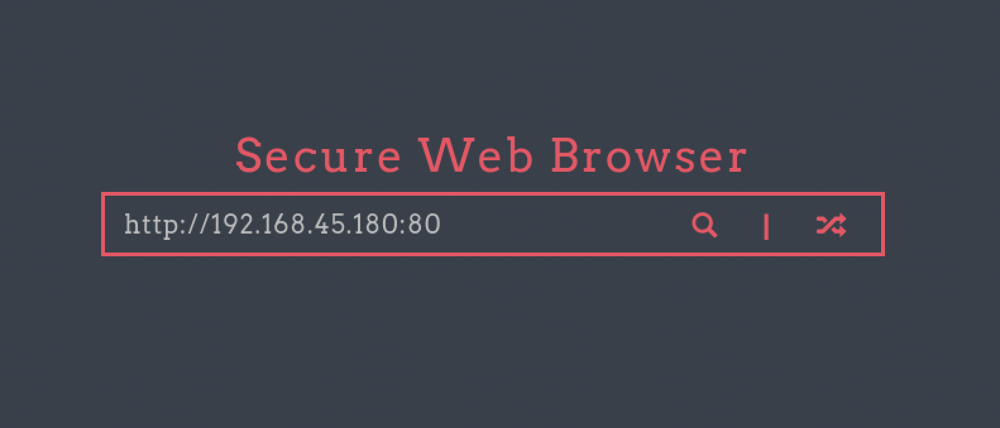

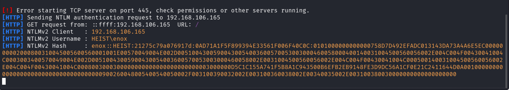

Responder captures a username and NTLMv2 hash for user `enox`.

### Initial Access

Cracking the password with John:

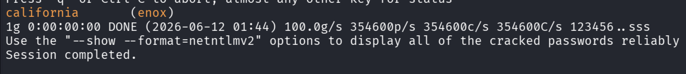

Once cracked, trying WinRM:

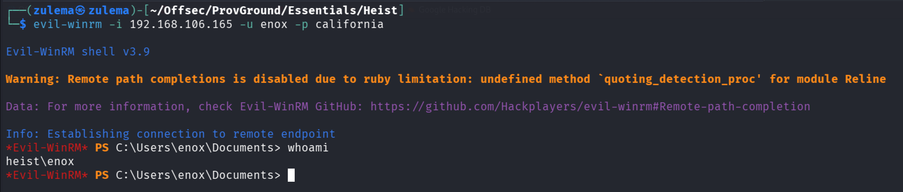

Access confirmed.

### Lateral Movement

Manual enumeration doesn't turn up anything useful, so SharpHound is run against the target instead. It confirms lateral movement should target `svc_apache$`:

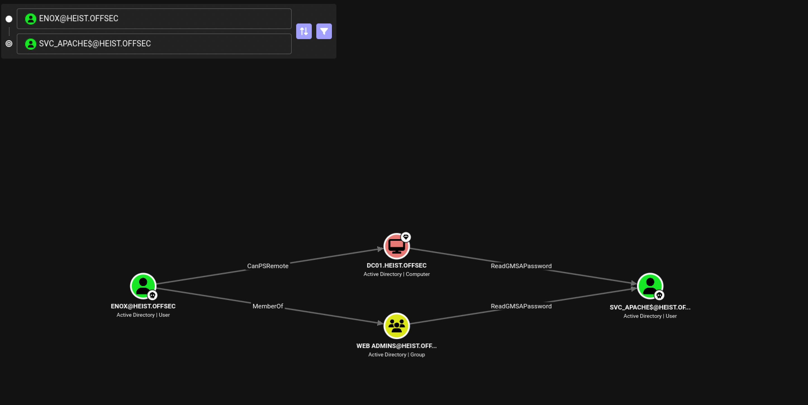

`enox` is a member of the Web Admins group, which grants the ability to read the GMSA password of `svc_apache$`:

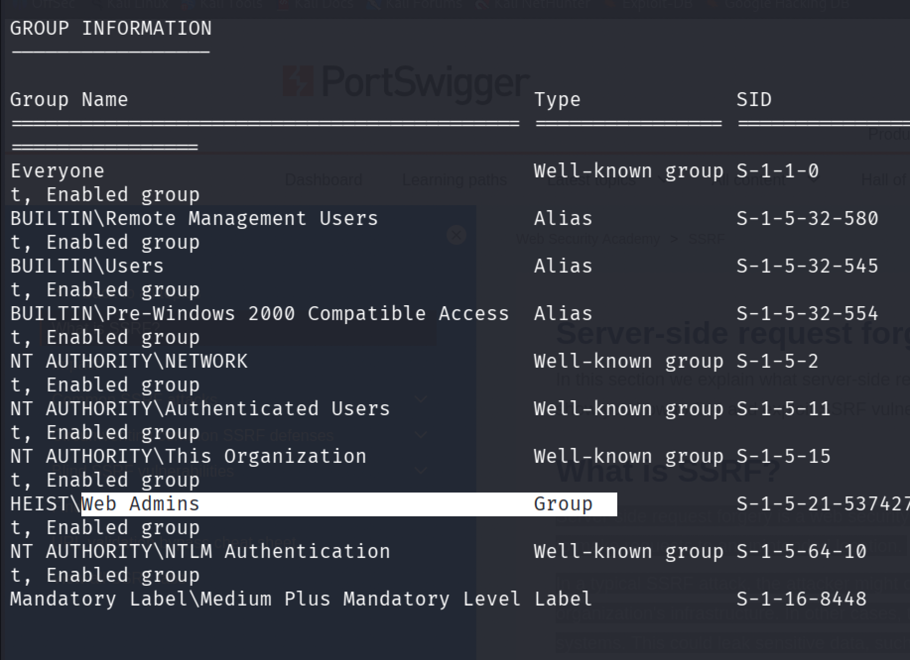

Checking BloodHound's information panel on `ReadGMSAPassword` for exploitation guidance on both Linux and Windows:

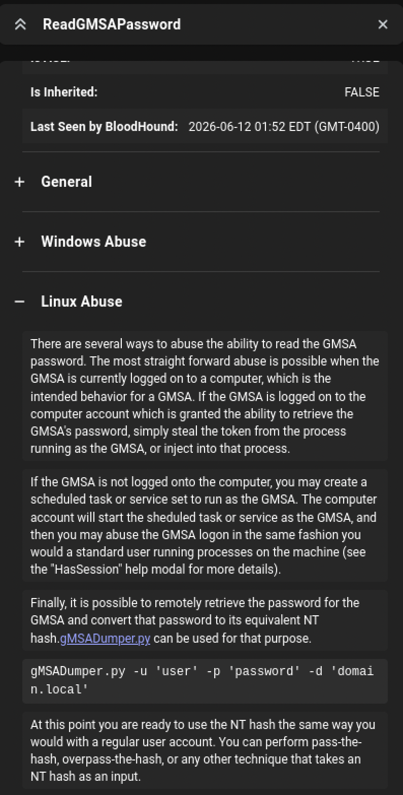

Trying to abuse the GMSA password from Linux doesn't work:

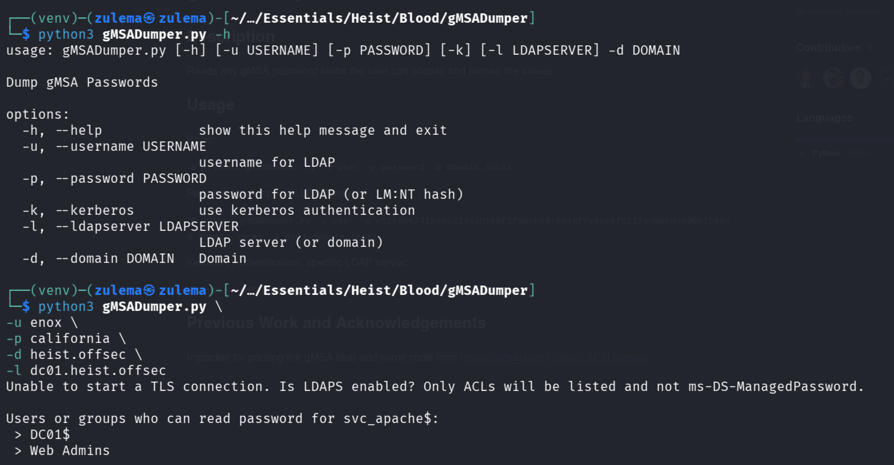

`enox`'s Web Admins membership is confirmed correct, so the Windows-side abuse path is tried instead. Downloading a precompiled [GMSAPasswordReader.exe](https://github.com/expl0itabl3/Toolies), transferring it, and running it:

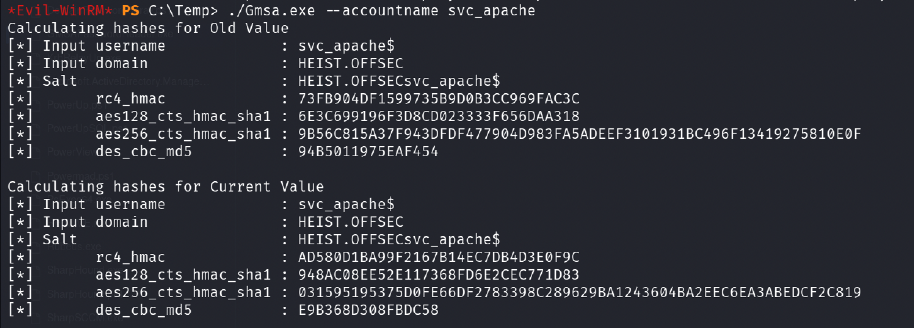

The hash for `svc_apache$` comes back. Trying WinRM with it:

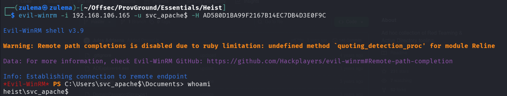

Access confirmed.

### Privilege Escalation

Enumerating `svc_apache$`'s privileges:

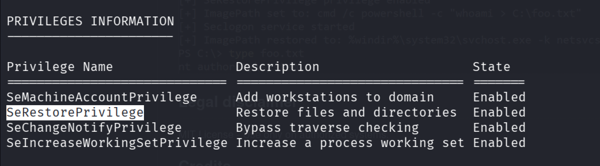

`SeRestorePrivilege` is present. Researching abuse techniques turns up [Invoke-SeRestoreAbuse](https://github.com/0x4D-5A/Invoke-SeRestoreAbuse), a PowerShell script built for exactly this privilege.

Downloading, transferring, and running a test invocation to confirm it works:

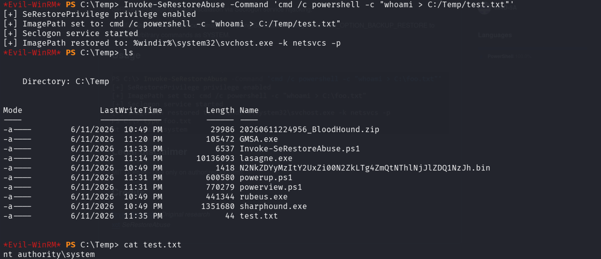

Confirmed working. Spawning a reverse shell with `NT AUTHORITY\SYSTEM` privileges: transferring `nc.exe`, setting up a listener, and running the script with the appropriate command:

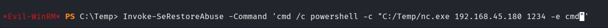

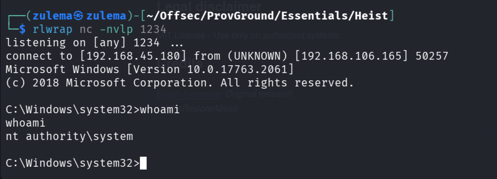

Full system compromise.

---

*Educational write-up from an authorized lab environment (OffSec Proving Grounds). Not a guide for unauthorized access.*
