# Hetemit

**Category:** Linux, Python Code Execution, Systemd Abuse

## Attack Chain

1. A registration page (port 18000) requires an invite code; a separate API on port 50000 exposes `/generate` and `/verify` endpoints
2. `/generate` takes an email and returns a code that turns out to be the SHA-512 hash of that email
3. That code registers a working invite, but the resulting web app doesn't yield anything further (upload/edit attempts fail)
4. The `/verify` endpoint turns out to execute Python code directly; the `os` module is confirmed usable inside it
5. A reachability check, a `/etc/passwd` read, and a transferred `nc` binary confirm a working code execution primitive
6. `nc` is run from `/tmp` to spawn a reverse shell, landing as `cmeeks`
7. `sudo -l` shows access to `reboot`; a writable systemd service file (`pythonapp.service`) is found in `/etc`
8. The service file is rewritten to run a reverse shell as root on startup, then the system is rebooted (via the permitted `sudo reboot`) to trigger it

## TL;DR

An invite-only registration flow was bypassed by discovering that the site's own `/generate` API endpoint computed invite codes as the SHA-512 hash of a submitted email, letting an account be created directly. The web app itself led nowhere further, but a second endpoint on the same API, `/verify`, turned out to execute Python code server-side, and the `os` module was usable inside it. That was enough to confirm outbound connectivity, read `/etc/passwd`, transfer a static `nc` binary, and spawn a reverse shell, landing as user `cmeeks`. From there, `sudo -l` allowed a passwordless `reboot`, and a writable systemd unit file, `pythonapp.service`, was found sitting in `/etc/systemd/system`. Rewriting that unit to launch a root-level reverse shell on startup, then triggering a reboot through the permitted `sudo` command, completed the compromise on the next boot.

## Full Walkthrough

### Initial Enumeration

Nmap:

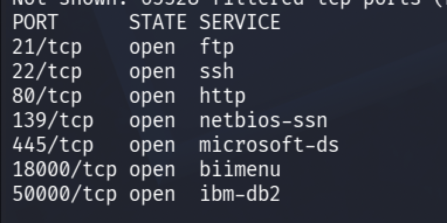

Checking port 18000:


Trying to register:


An invite code is required.

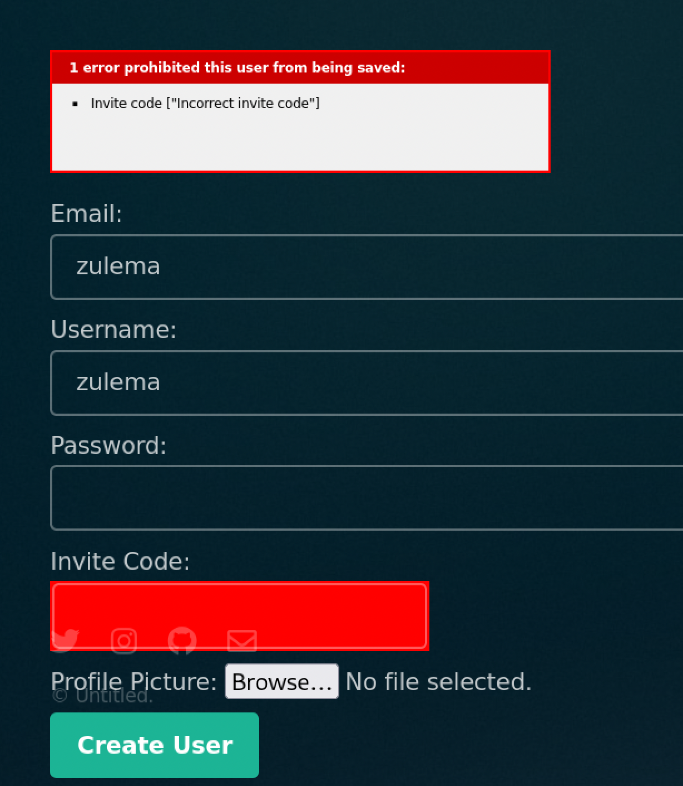

On port 50000, an API exposes `/generate` and `/verify`:

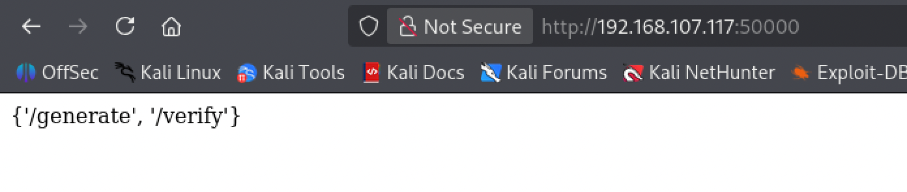

Checking `/generate`:

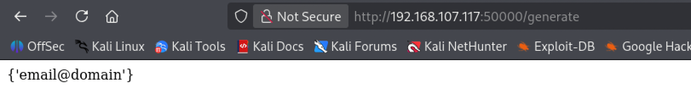

It requires an email address. Submitting one via `curl`:

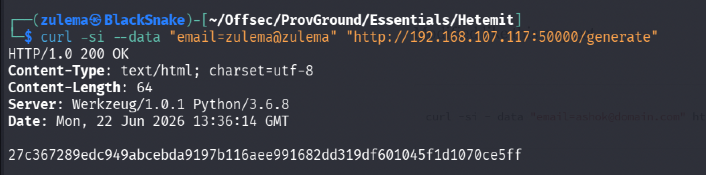

A code comes back, which turns out to be the SHA-512 hash of the email submitted. Using it to register:

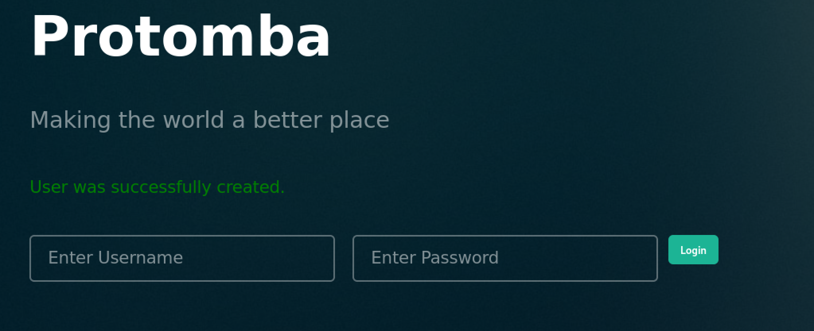

User created. Logging in:

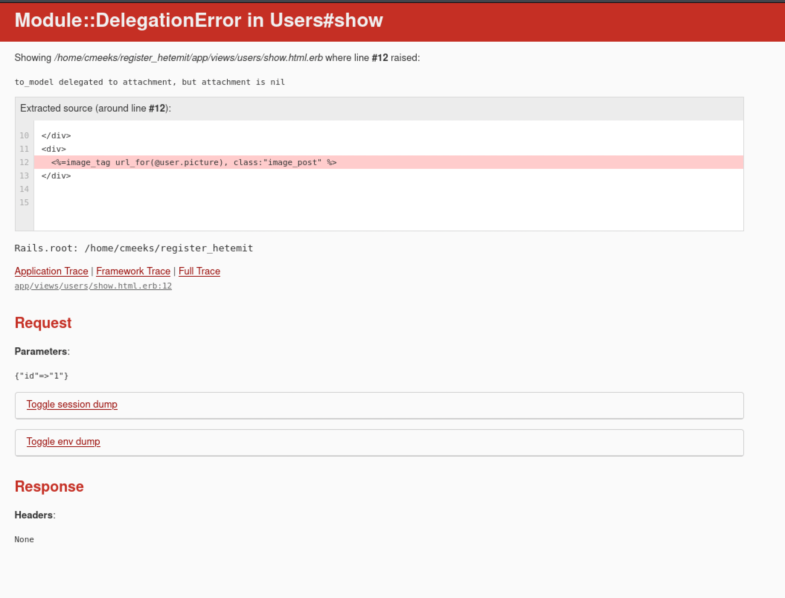

Nothing particularly interesting inside the app itself. Trying to edit the user profile and upload a Ruby shell disguised as an image doesn't work either. Time to look elsewhere.

The `/verify` endpoint turns out to be executing code directly:

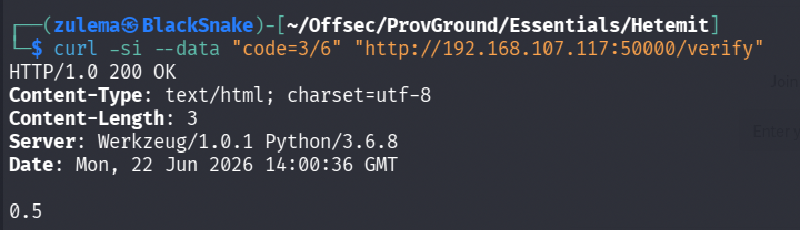

Knowing it's Python-based, trying the `os` module:

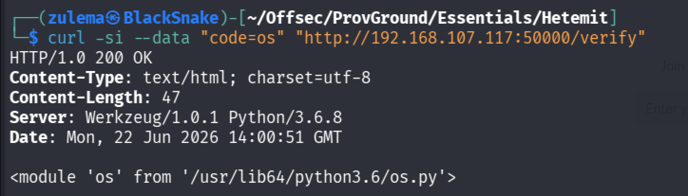

### Initial Access

With `os` module access confirmed, the next step is turning this into a reverse shell. Working from [this Python `os` module cheat sheet](https://medium.com/@gupta.surender.1990/mastering-pythons-os-module-the-only-cheat-sheet-you-ll-ever-need-with-real-world-examples-0ab100052406).

Checking the current directory:

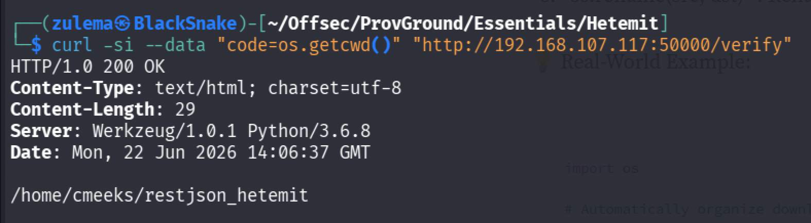

Checking reachability to the attacking host:

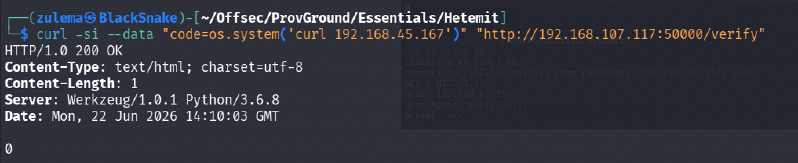

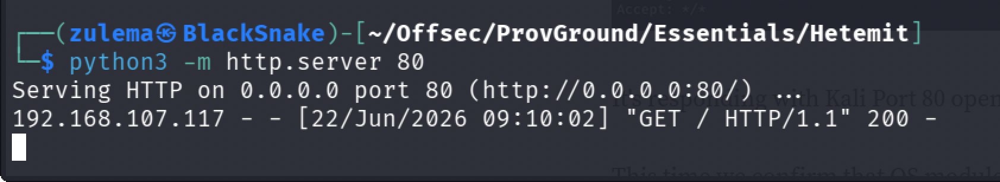

Checking that `/etc/passwd` exists and is readable:

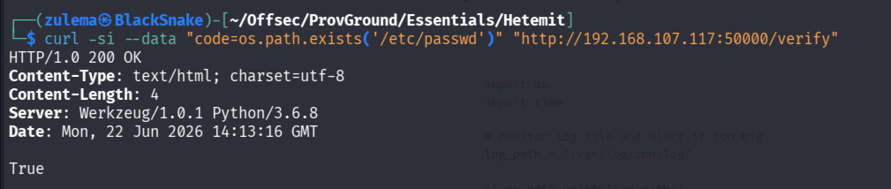

Transferring a static `nc` binary:

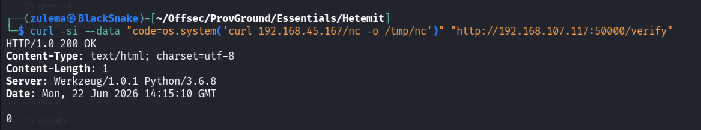

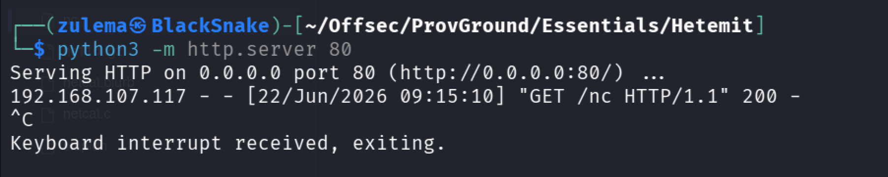

Listing `/tmp` to confirm it landed:

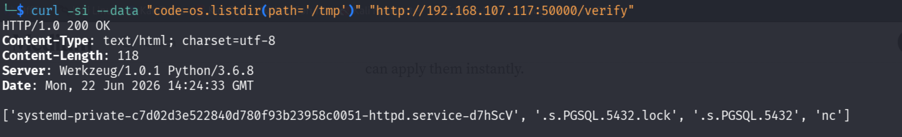

Changing into `/tmp`:

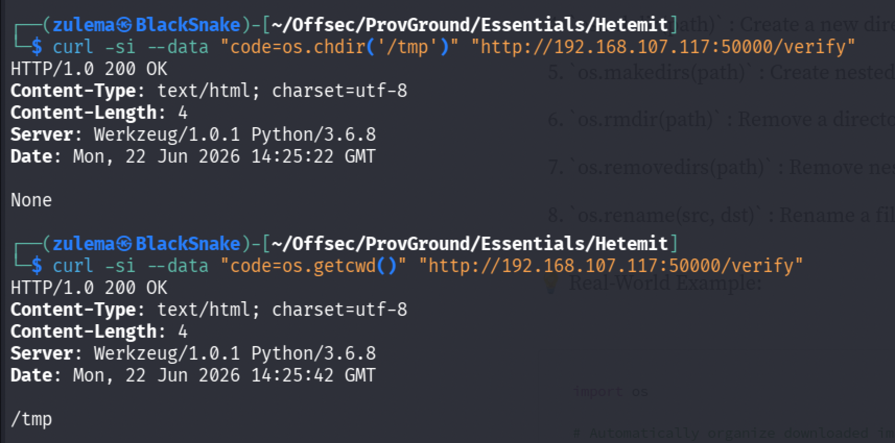

Running `nc` to connect back:

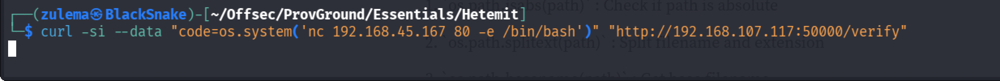

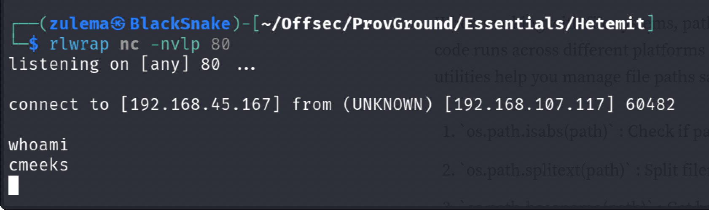

Initial access confirmed as `cmeeks`.

### Enumeration

Checking `sudo` permissions:

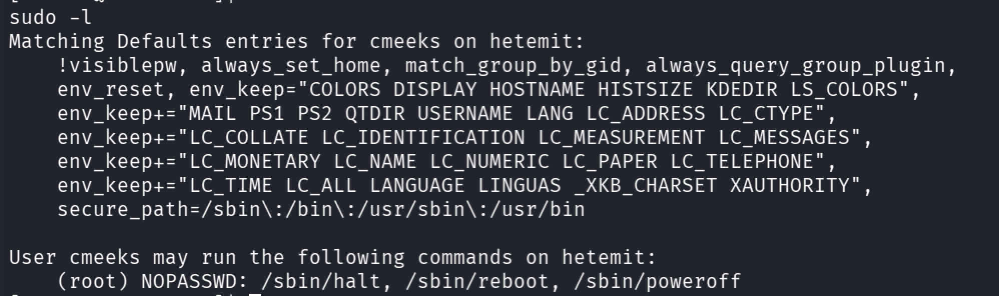

A passwordless `reboot` entry stands out. Checking for writable files in `/etc`:

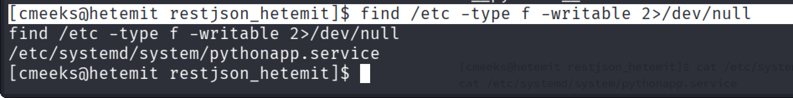

Checking the file:

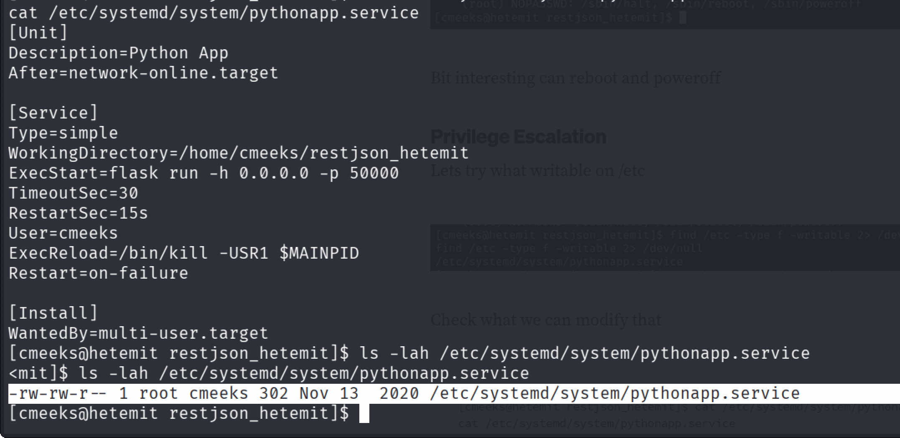

A writable systemd service file, the privilege escalation vector: modify it, then reboot to trigger it.

### Privilege Escalation

Overwriting the service definition:

```
cat <<'EOT'> /etc/systemd/system/pythonapp.service
```

(closing the heredoc with `EOT`)

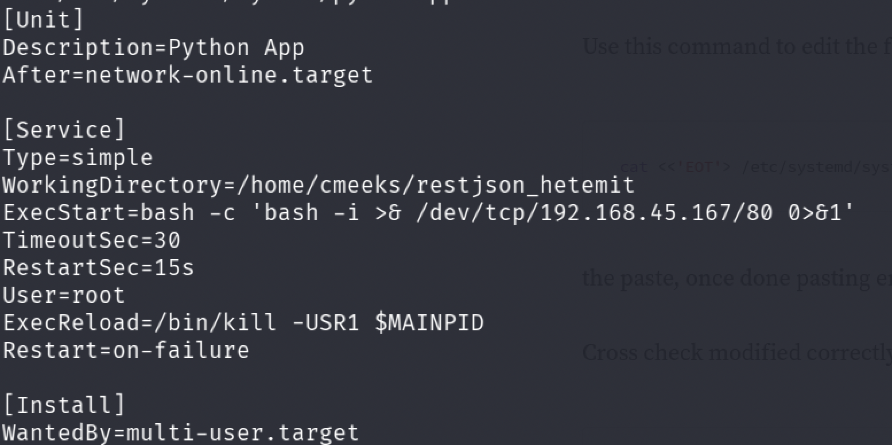

`ExecStart` and `User` are changed to run a reverse shell as root on startup. Rebooting via the permitted `sudo`:

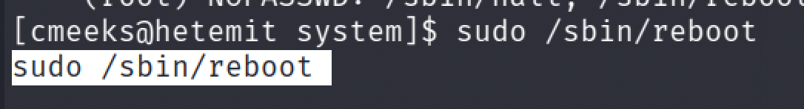

Setting up a listener to catch the callback on boot:

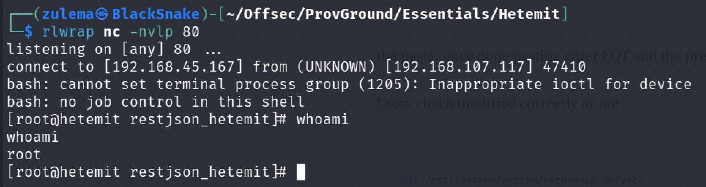

Full system compromise.

---

*Educational write-up from an authorized lab environment (OffSec Proving Grounds). Not a guide for unauthorized access.*
