# Hunit

**Category:** Linux, API Discovery, Git

## Attack Chain

1. Non-standard ports are enumerated: SMB (12445), HTTP (8080, 18030), SSH (43022)
2. An SMB share is port-forwarded and mounted, but `enum4linux`/`smbmap` don't turn up anything directly useful
3. HTML source on port 8080 leaks an API endpoint; browsing it exposes a list of users and passwords
4. One credential (`dademola`) grants SSH access on port 43022
5. LinPEAS (transferred via the SMB share, since `curl`/`wget` are unavailable) finds a `git` user's `id_rsa` and a local git server
6. SSH access as `git` only allows git operations, not a shell
7. The repository is cloned locally via `GIT_SSH_COMMAND`, exposing a `backups.sh` script
8. `backups.sh` is modified with a Bash reverse shell one-liner, made executable, committed, and pushed
9. The push triggers the script's execution under `dademola`'s account, confirmed via the commit log

## TL;DR

With SMB, HTTP, and SSH all on non-standard ports, the actual way in was a leaked API endpoint found in the HTML source of the port 8080 site, exposing a full list of usernames and passwords. One of them, `dademola`, worked directly over SSH. From there, LinPEAS turned up a `git` user's private key and a local git server, but SSH as `git` was locked to git operations only. Cloning the exposed repository locally and modifying a `backups.sh` script inside it with a reverse shell payload, then committing and pushing the change, triggered the script's execution back on the target under `dademola`'s account, effectively a git-hook-driven code execution path.

## Full Walkthrough

### Enumeration

Non-standard ports in play: SMB on 12445, HTTP on 8080 and 18030, SSH on 43022.

Mounting the `/Commands` SMB share found via `smbclient` requires a port forward, since SMB isn't on its default port. Setting that up in one terminal:

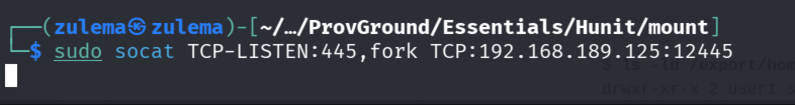

Mounting it from another terminal:

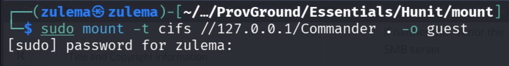

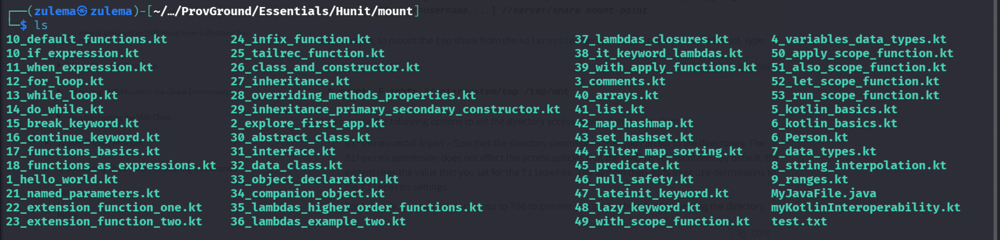

The same forwarding approach is used for `enum4linux` and `smbmap`, neither of which turns up anything particularly interesting.

### Enumerating the HTTP Ports

On port 8080, the page's source code contains a reference to an API endpoint:

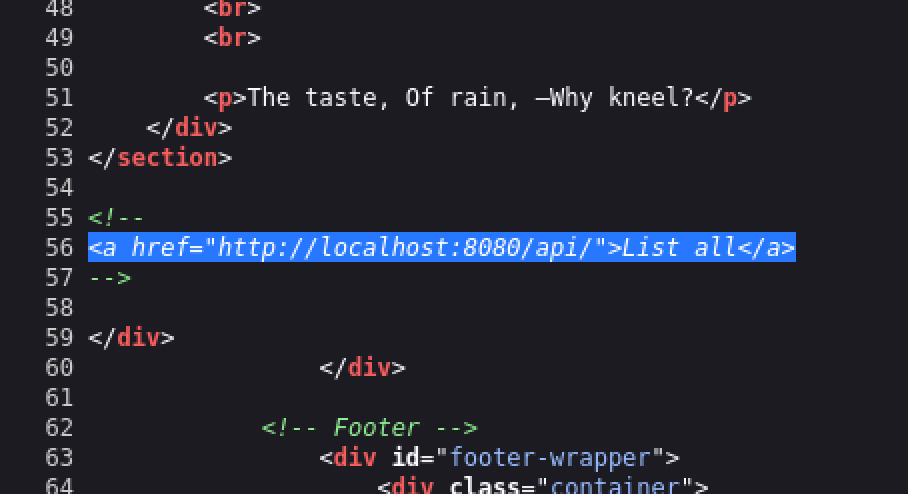

Navigating through it for more:

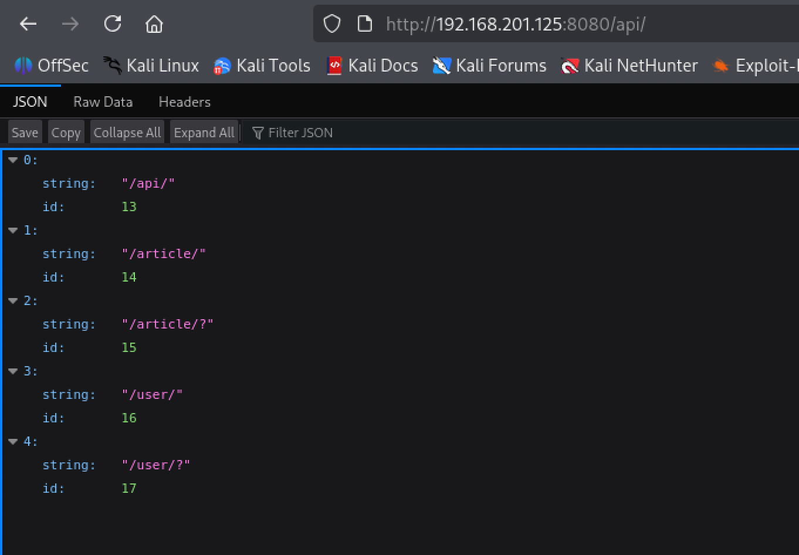

And further still:

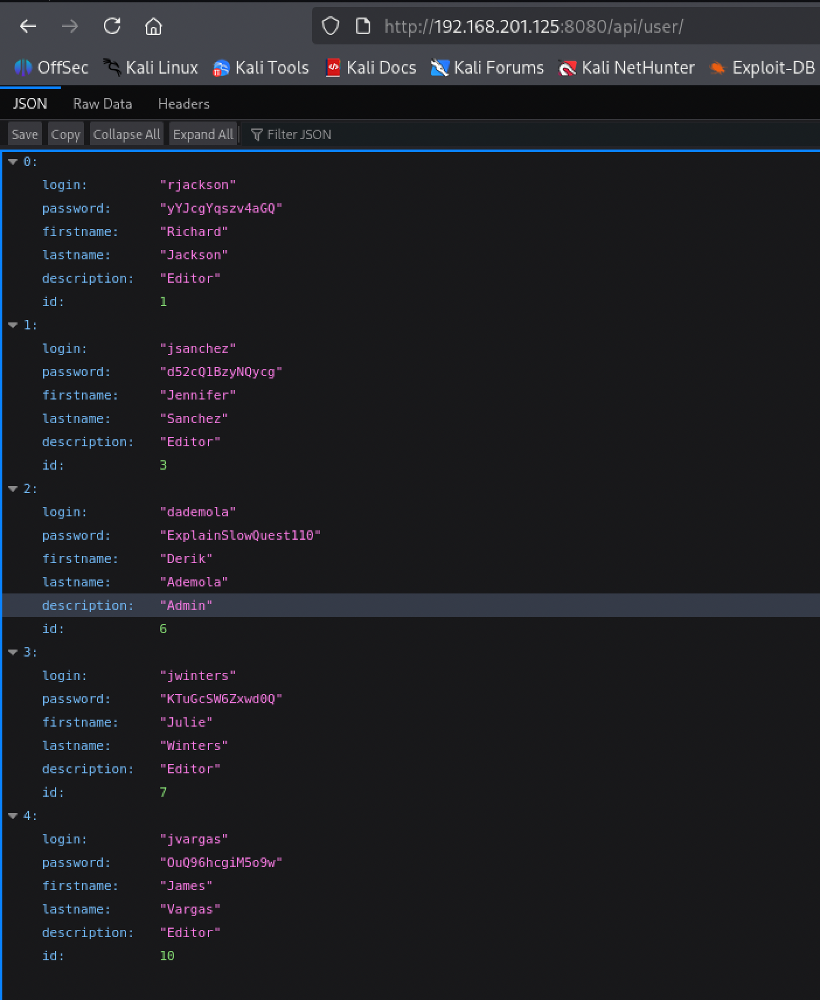

A list of users and passwords comes back. The most promising one is `dademola`.

### Initial Access

Trying the recovered credential against SSH on port 43022:

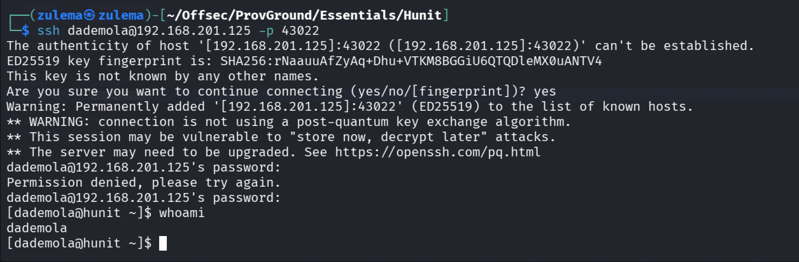

Access confirmed.

### Enumeration

Transferring and running LinPEAS to look for something worth chasing:

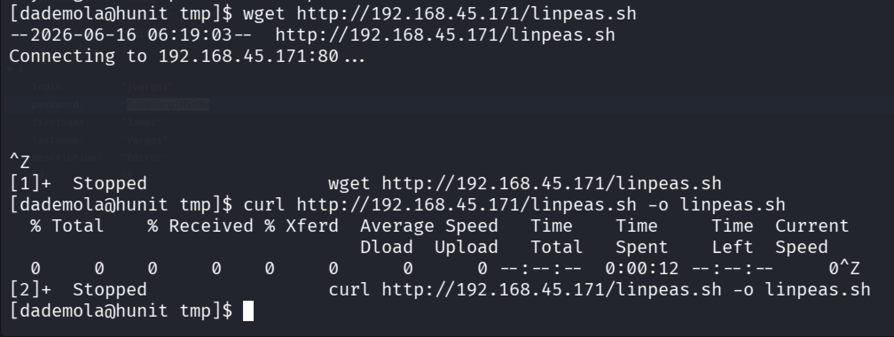

`curl` and `wget` aren't working on this host, so the transfer goes through the SMB share instead:

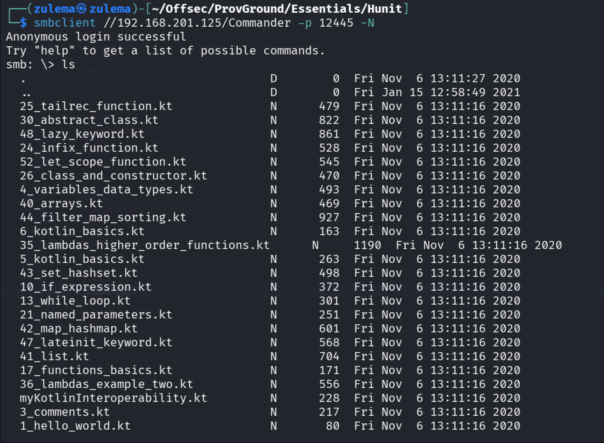

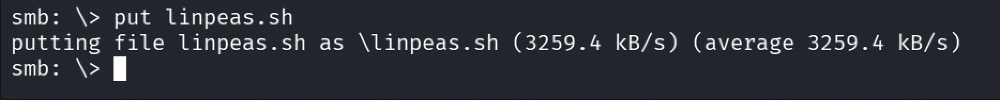

Running it turns up an `id_rsa` belonging to a `git` user:

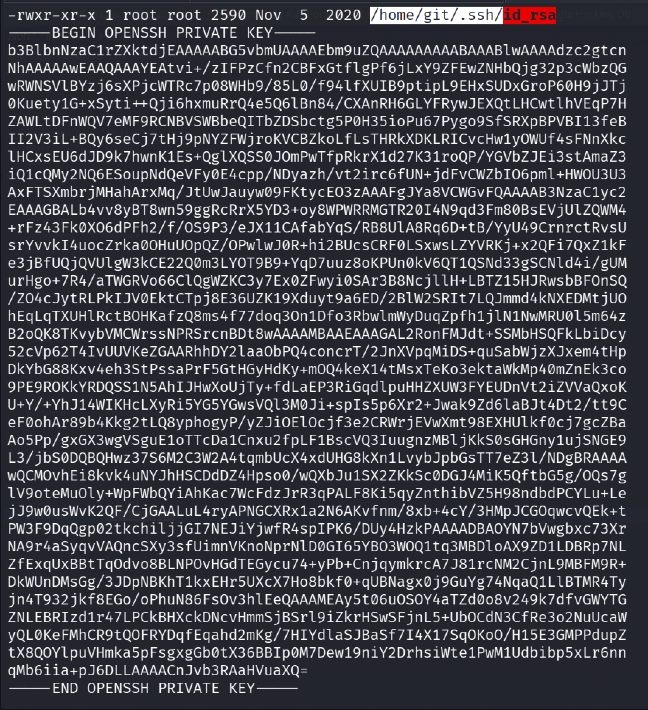

...and a git server hosted off the root directory:

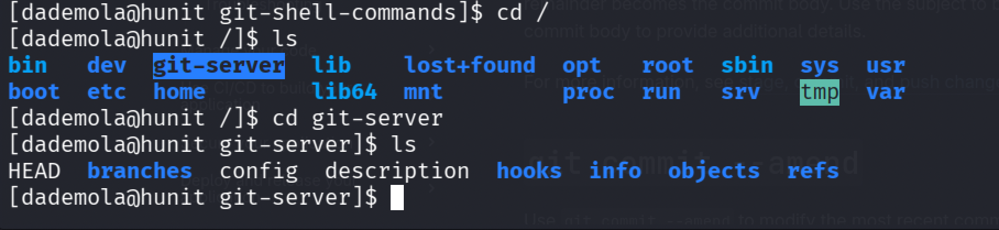

Copying the key and trying SSH as `git`:

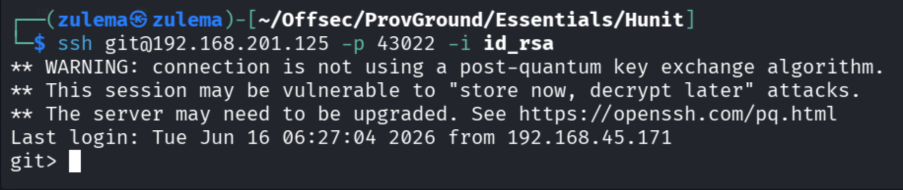

The `git` account is locked to git operations, no interactive shell or arbitrary command execution. A different angle is needed.

### Privilege Escalation

Cloning the exposed repository to the local machine using `GIT_SSH_COMMAND` (to point git at the recovered key):

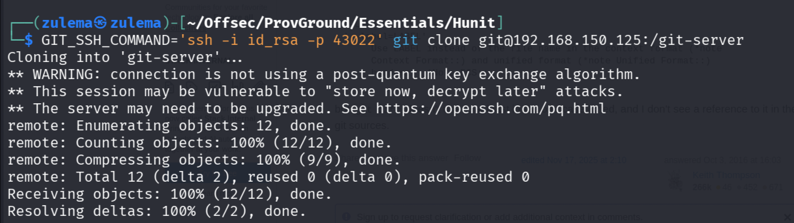

Inside the clone, a `backups.sh` file is present:

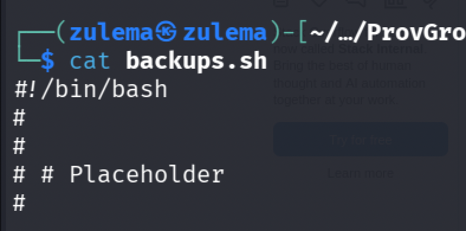

Modifying it to add a Bash reverse shell one-liner:

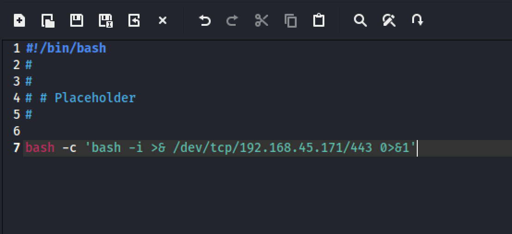

Making sure the file stays executable, an important detail:

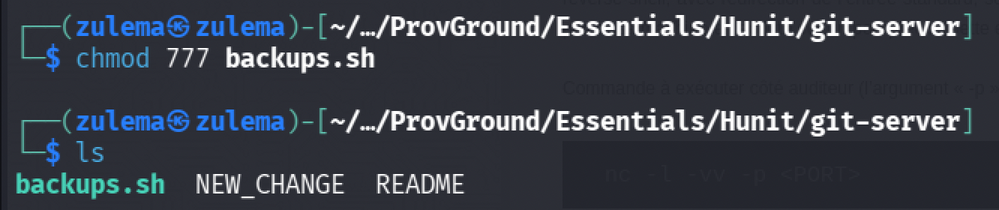

Committing the change:

```
git add -A
git commit -m "name"
```

(Configuring an identity first, if needed, with `git config --global user.name <name>` and `git config --global user.email <email>`.)

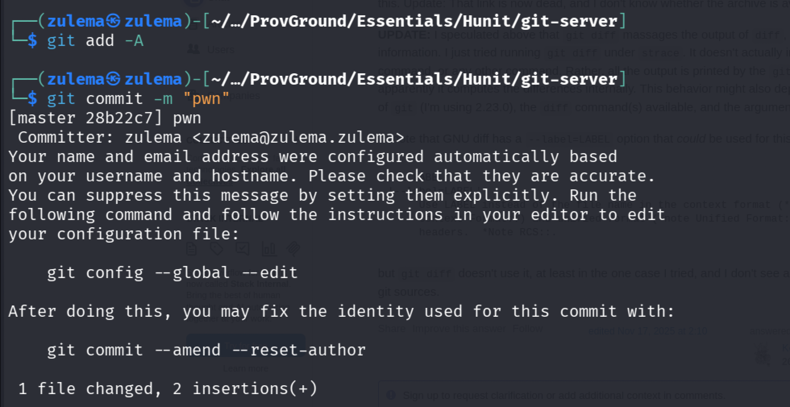

Checking the commit log:

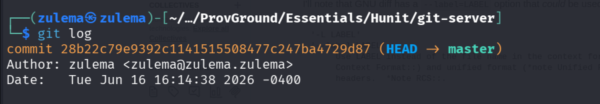

Pushing the change back to the repository:

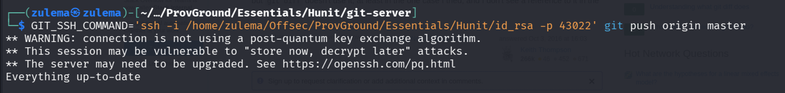

Checking as `dademola` whether the commit is now visible on the target, confirming the push landed and the script fired:

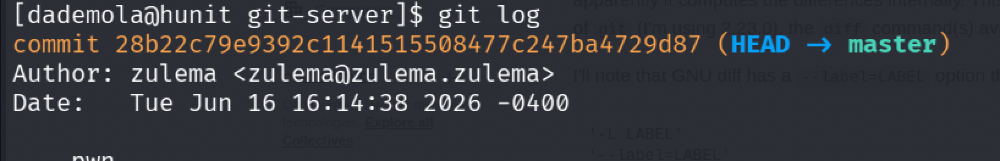

---

*Educational write-up from an authorized lab environment (OffSec Proving Grounds). Not a guide for unauthorized access.*
