# Pelican

**Category:** Linux, Exhibitor for ZooKeeper

## Attack Chain

1. Nmap finds Samba, two HTTP services (8080, 8081), and CUPS 2.2; `enum4linux` and directory brute-forcing on 8080/631 turn up nothing
2. Port 8081 hosts Exhibitor for ZooKeeper v1.0
3. A known Exhibitor vulnerability (TALOS-2019-0790) allows editing the `java.env` script from the web UI
4. `java.env` is modified with a reverse shell payload, committed, and the service restarted
5. The restart triggers the payload, landing a shell as `Charles`
6. `sudo -l` shows a passwordless `gcore` entry
7. `gcore` is used (per GTFOBins) to dump the memory of a running `/usr/bin/password` process
8. `strings` against the core dump reveals a plaintext password, used to `su root`

## TL;DR

Exhibitor for ZooKeeper, exposed on port 8081, was vulnerable to a known issue (TALOS-2019-0790) that allowed the `java.env` startup script to be edited directly from the web UI. Replacing it with a reverse shell payload and restarting the service through the same UI triggered the shell on the next startup, landing as user `Charles`. From there, `sudo -l` showed passwordless access to `gcore`, a GTFOBins entry for dumping process memory to a local file. Dumping the memory of a suspiciously named `/usr/bin/password` process and filtering the resulting core file with `strings` revealed a plaintext password in memory, enough to `su` directly to root.

## Full Walkthrough

### Enumeration

Nmap:

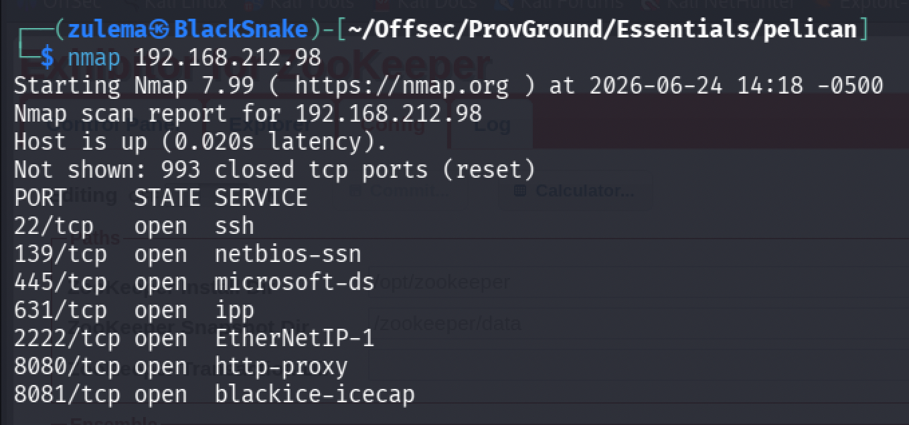

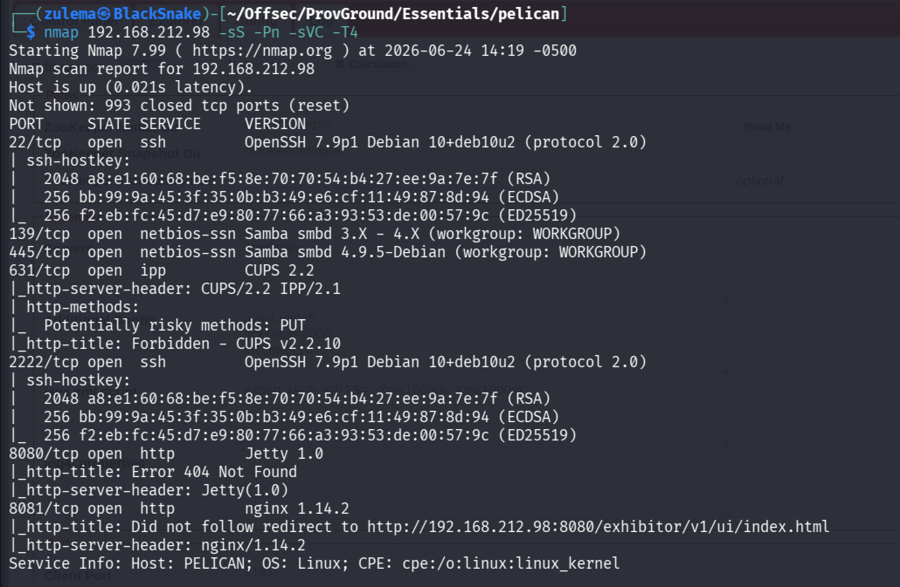

Ports of interest: Samba (445), HTTP on 8080 and 8081, and CUPS 2.2 on 631. `enum4linux` doesn't return anything useful.

**HTTP enumeration, port 8080:**

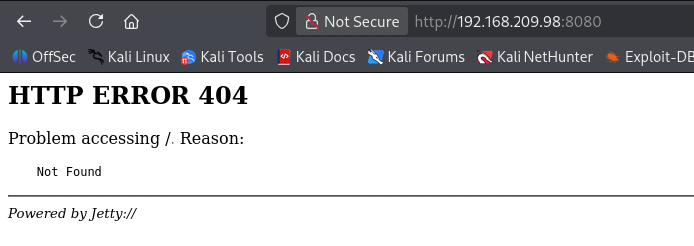

Running `dirsearch` here turns up nothing. Port 631 (CUPS 2.2):

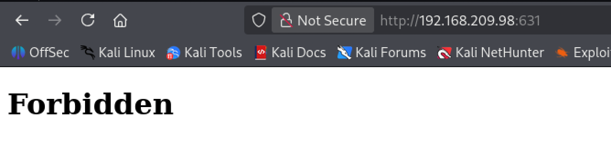

Also nothing from `dirsearch`, and no exploits found after researching CUPS itself. Port 8081:

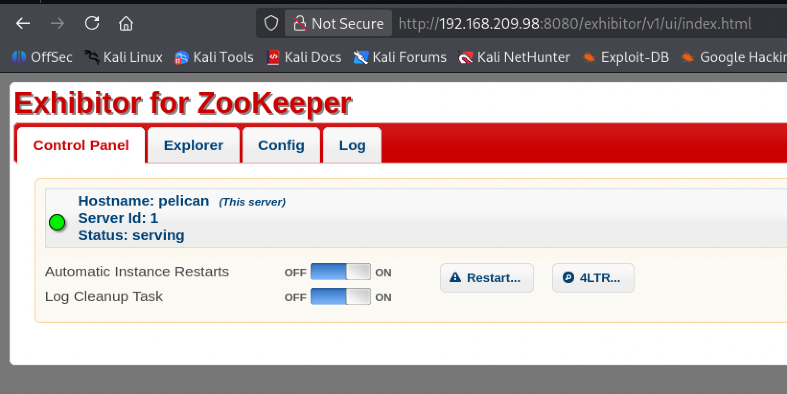

Exhibitor for ZooKeeper v1.0, likely the entry point.

### Initial Access

Researching known vulnerabilities in Exhibitor for ZooKeeper turns up something relevant:

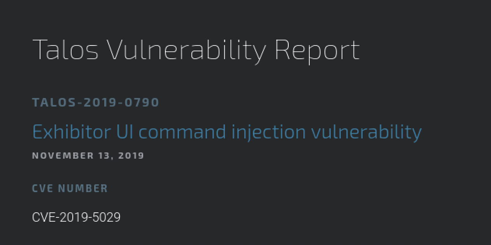

[TALOS-2019-0790](https://talosintelligence.com/vulnerability_reports/TALOS-2019-0790):

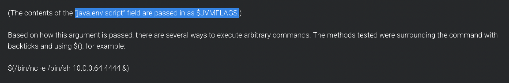

Checking the local Exhibitor instance:

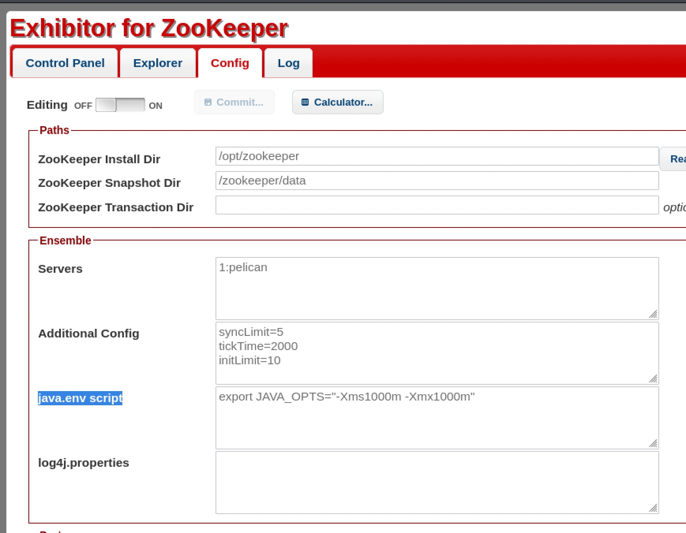

The `java.env` script is enabled and editable directly from the UI. Modifying it per the vulnerability report to spawn a reverse shell:

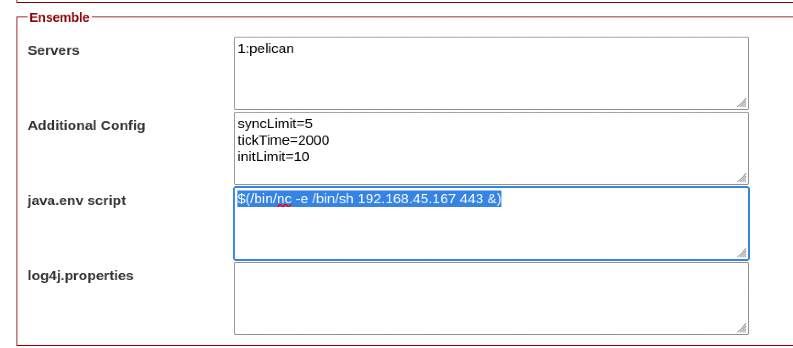

Committing the change and restarting the service:

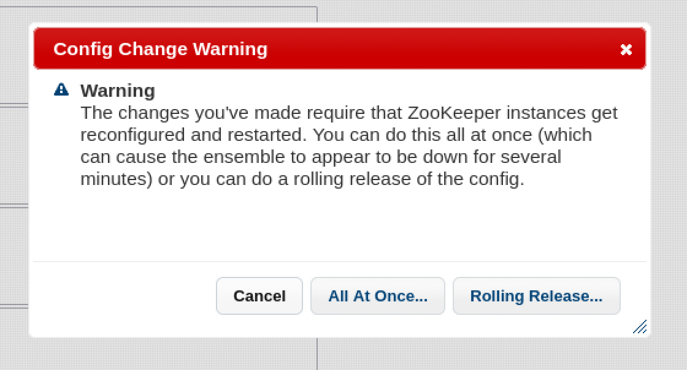

Checking the listener:

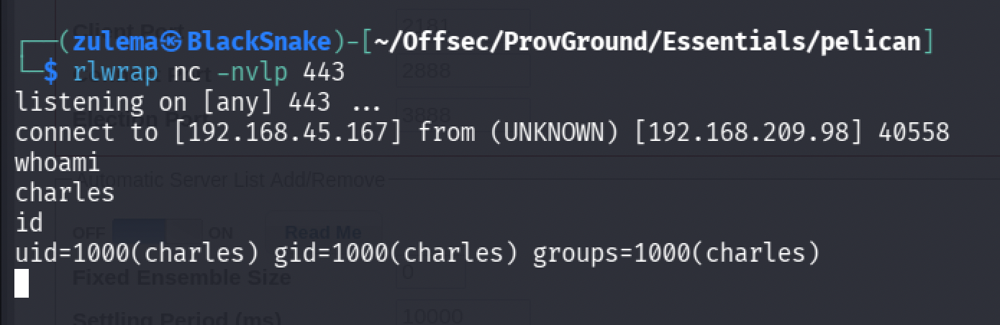

Shell obtained as `Charles`.

### Privilege Escalation

Checking `sudo` permissions:

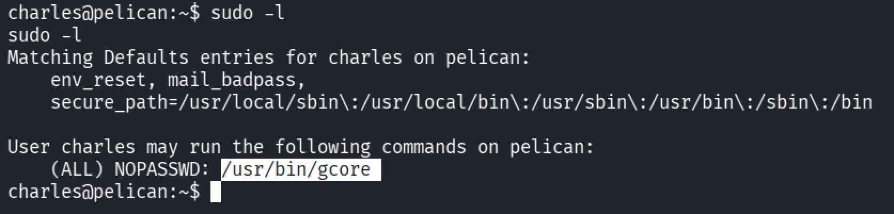

A passwordless `gcore` entry. Checking GTFOBins:

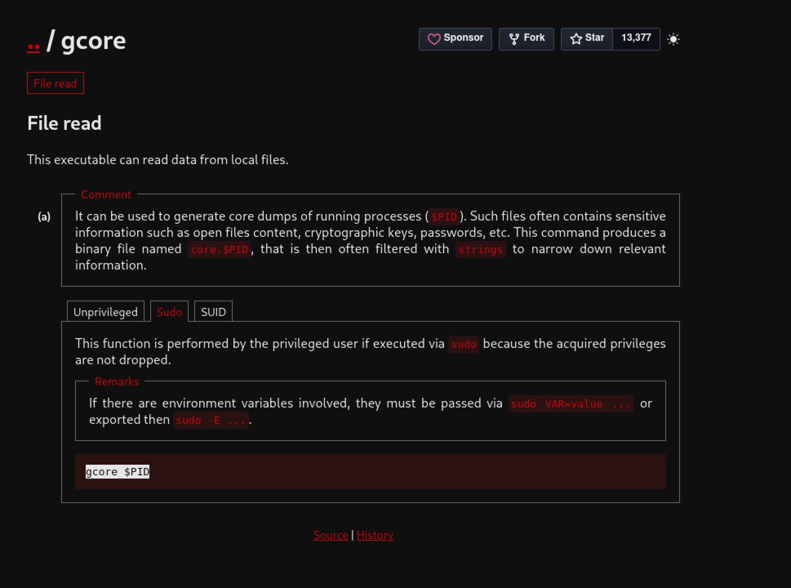

`gcore` can dump the memory of a running process to a local file, which can then be filtered with `strings` for anything sensitive left in memory. Checking running processes for a promising target:

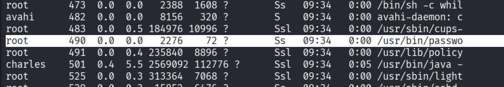

`/usr/bin/password` stands out. Running `sudo gcore $PID` against it:

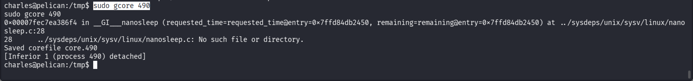

A `core.490` file is produced. Filtering it with `strings`:

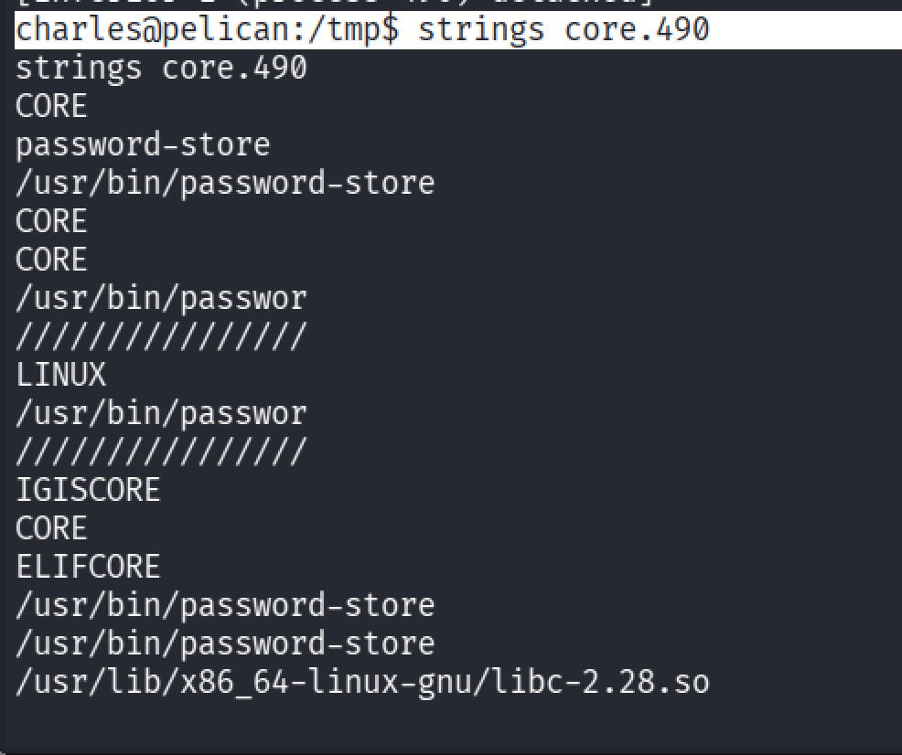

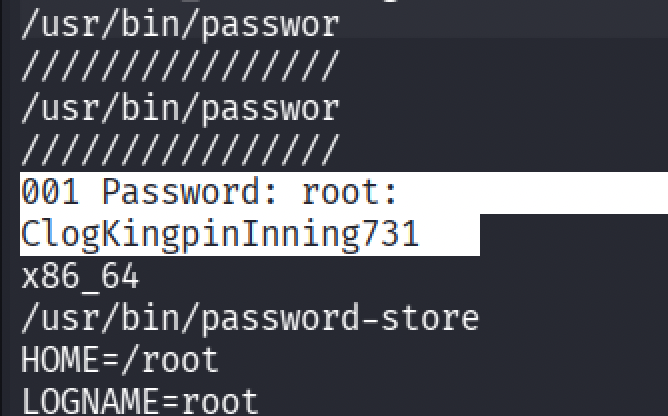

A password turns up. Using it to `su root`:

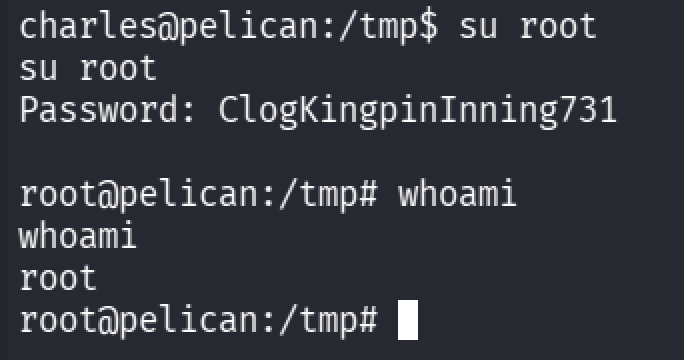

Full system compromise.

---

*Educational write-up from an authorized lab environment (OffSec Proving Grounds). Not a guide for unauthorized access.*
