# Resourced

**Category:** Active Directory

## Attack Chain

1. Unauthenticated RPC access (confirmed via `enum4linux-ng`) enumerates the full domain user list
2. Querying individual users with `rpcclient`'s `queryuser` leaks a password for `V.Ventz`
3. `V.Ventz` has no RDP/WinRM access but can read a "Password Audit" share containing `ntds.dit` and a `SYSTEM` registry hive
4. `impacket-secretsdump` against the two files extracts every domain hash and AES key
5. Spraying the recovered hashes finds one, `L.Livingstone`, with WinRM access to the domain controller
6. SharpHound and PowerView show `Livingstone` has `GenericAll` on the domain controller object itself
7. `GenericAll` on a DC enables a Resource-Based Constrained Delegation (RBCD) attack: a new computer account is created (machine account quota allows it)
8. RBCD is configured, granting the new machine account delegation rights to impersonate any user on the DC
9. A Kerberos service ticket is requested impersonating Administrator via the new machine account
10. `psexec` with the forged ticket completes the compromise

## TL;DR

Unauthenticated RPC enumeration listed every domain user, and querying them individually leaked a password for `V.Ventz`. That account had no direct login access, but could read a "Password Audit" share containing a copied `ntds.dit` and `SYSTEM` hive, an audit artifact that handed over every domain credential via `secretsdump`. Spraying those hashes found `L.Livingstone` with WinRM access, and BloodHound/PowerView showed `Livingstone` held `GenericAll` directly on the domain controller object. That's enough for a Resource-Based Constrained Delegation attack: a new computer account was created, configured for delegation to the DC, and used to request a Kerberos ticket impersonating Administrator, completing the compromise via `psexec`.

## Full Walkthrough

### Enumeration

Nmap scan:

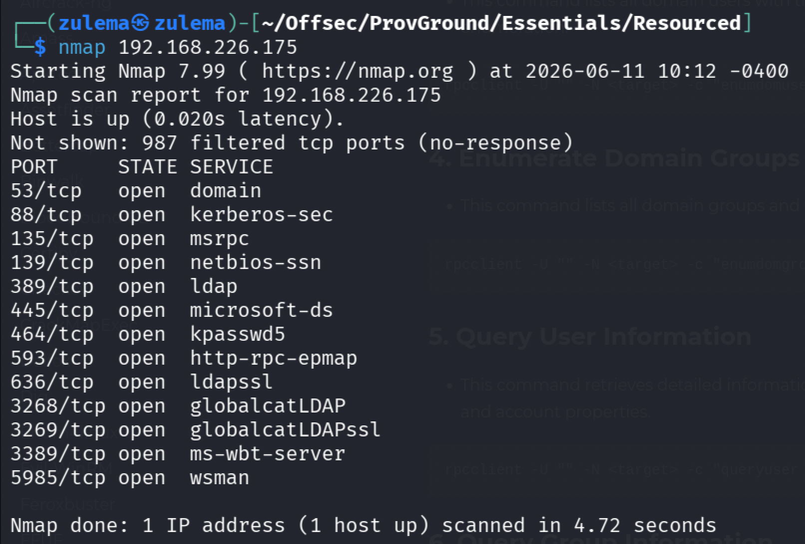

Nothing immediately interesting, no HTTP exposed, and a version/script scan doesn't add much either.

**Enum4linux-ng:**


Password policy and a user list come back, along with confirmation that `rpcclient` is accessible without authentication.

**RPC enumeration:**

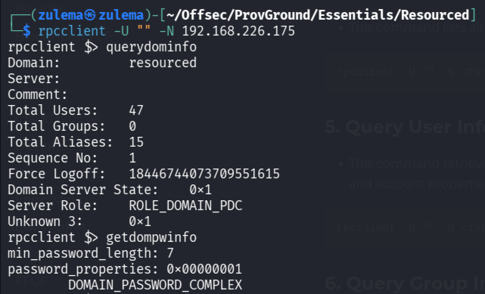

Enumerating domain users with `enumdomusers`:

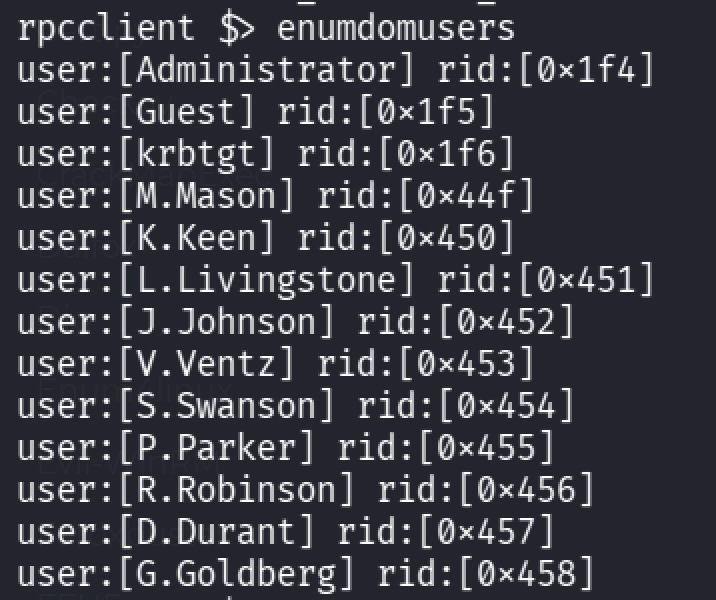

Querying individual users with `queryuser <rid>`:

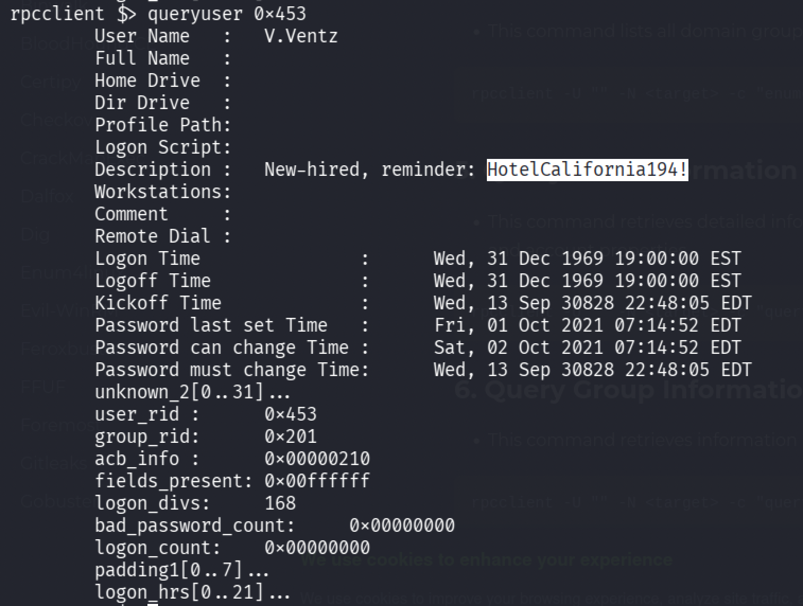

Querying `V.Ventz` turns up what looks like a password.

### Initial Access

RDP and WinRM aren't accessible for `V.Ventz`, so checking which shares the account can reach instead:

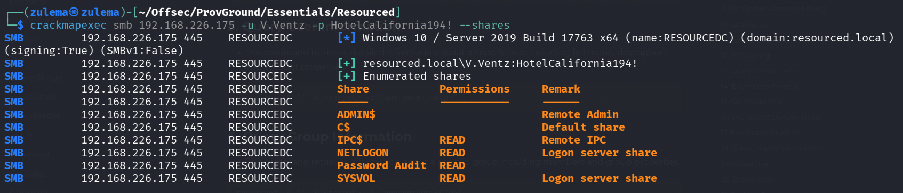

The "Password Audit" share contains two files worth pulling: `ntds.dit` under `/Active Directory`,

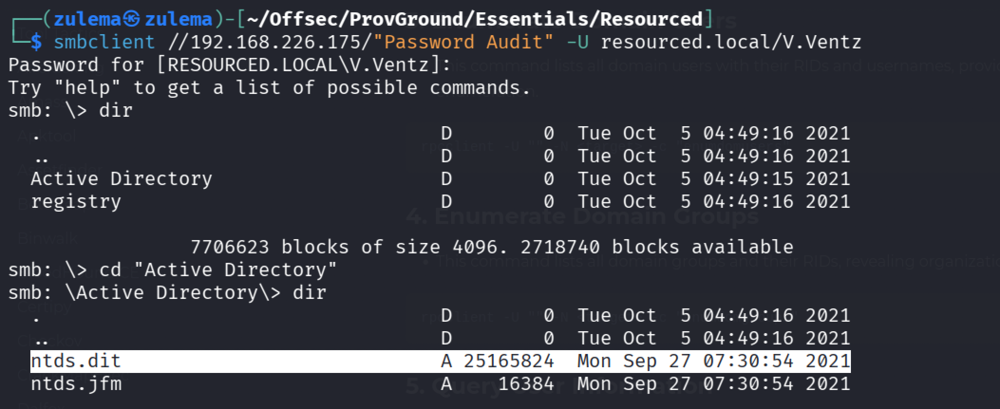

and a `SYSTEM` registry hive under `/registry`.

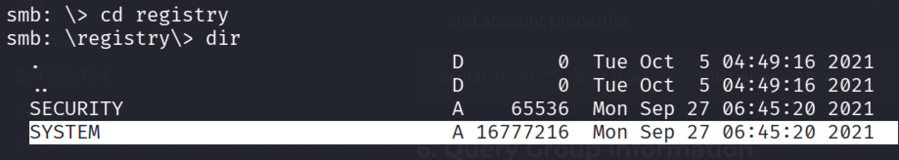

**Dumping secrets** with `impacket-secretsdump` against the two files:

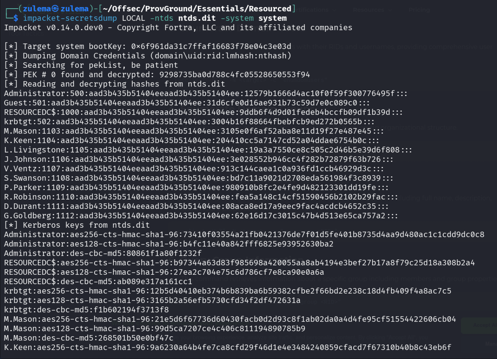

Every domain hash and AES key comes out of this in one pass.

### Access as L.Livingstone

Spraying the recovered hashes across the domain, `L.Livingstone` turns out to have access to the domain controller. Confirming with WinRM:

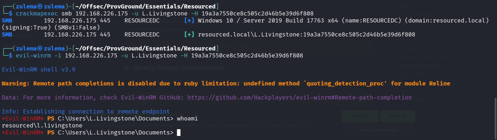

### Enumeration as Livingstone

Checking privileges:

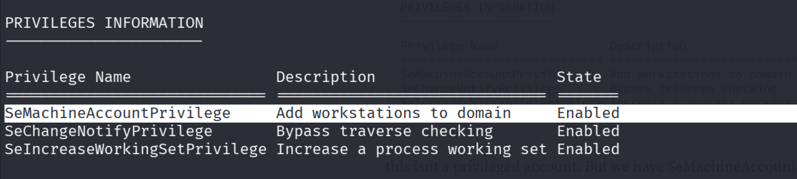

`SeMachineAccountPrivilege` is present, which allows adding workstations to the domain, worth exploiting later. Transferring SharpHound to map the domain: pathfinding shows `Livingstone` has `GenericAll` on `ResourceDC` itself.

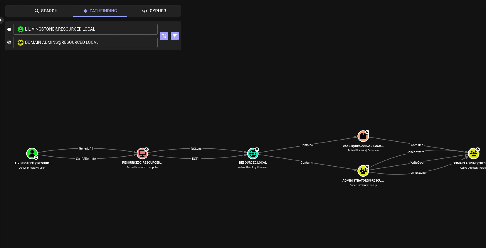

Confirming manually with PowerView:

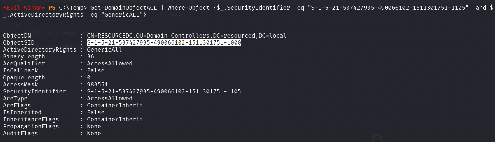

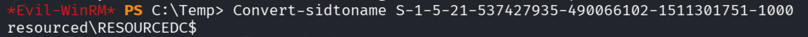

`Livingstone` has `GenericAll` on `ResourceDC.RESOURCED.LOCAL`, effectively complete administrative control over that object: changing passwords, modifying group memberships, adding or removing privileges, deleting the object, modifying any attribute, granting additional permissions. Against a domain controller specifically, this opens the door to a Resource-Based Constrained Delegation (RBCD) attack, modifying service accounts, or simply granting further privileges directly.

### Resource-Based Constrained Delegation (RBCD) Attack

The common way to run this attack is to create a computer account, usually possible thanks to the domain-level `MachineAccountQuota` attribute, which by default allows regular users to create up to 10 computer accounts.

**Creating a computer account** with `impacket-addcomputer`:

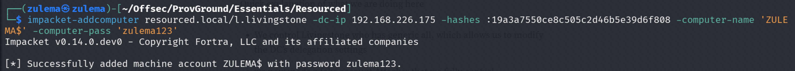

A fake, fully-controlled account, `Zulema`, is now available. With it, the domain controller can be configured to trust `Zulema` for delegation, allowing impersonation of any user, including Domain Admin, when authenticating to the DC. A regular user account like `Livingstone` typically can't perform Kerberos delegation, but a computer account can, hence the need for the new machine account's credentials to request Kerberos tickets.

**Configuring delegation** with the [rbcd.py](https://raw.githubusercontent.com/tothi/rbcd-attack/master/rbcd.py) script:

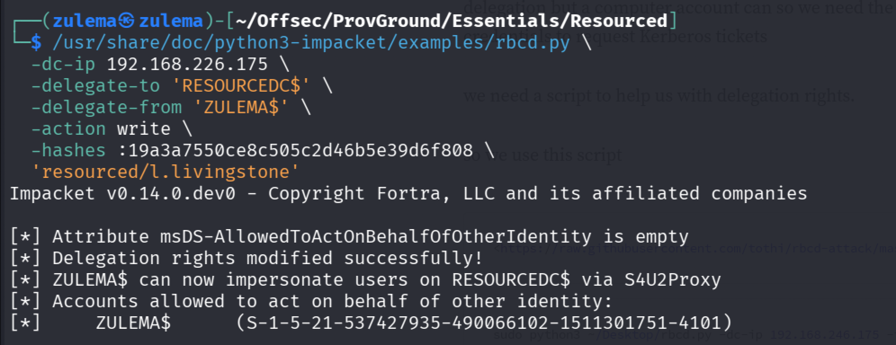

Checking the result:

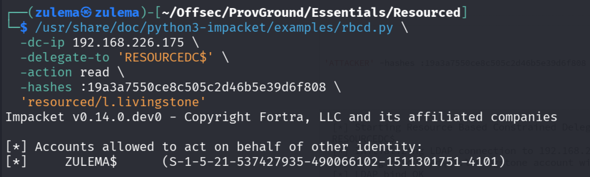

`RESOURCEDC` now trusts the `ZULEMA$` computer account for delegation, meaning `ZULEMA$` can impersonate any user when talking to `RESOURCEDC`.

**Requesting a Kerberos ticket as Administrator** with `impacket-getST`, which requests Kerberos service tickets. The `cifs` SPN targets file/share access on `RESOURCEDC`, authenticating as the fake computer account and impersonating Administrator:

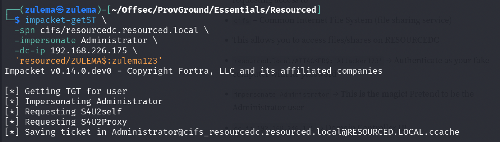

Using the short-form domain (`resourced/Zulema`) instead of the FQDN was needed here, the fully qualified form returned a `bad_integrity` error. The resulting ticket file:

```
Administrator@cifs_resourcedc.resourced.local@RESOURCED.LOCAL.ccache
```

**Exporting the ticket path:**


**Adding the host entry** to `/etc/hosts`:

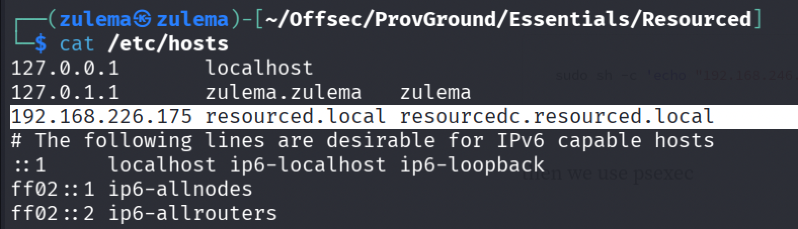

**Connecting via psexec:**

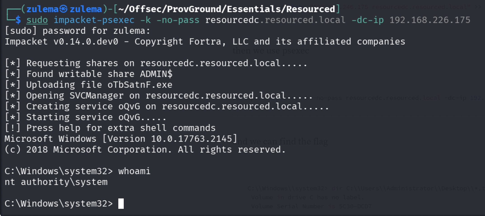

Full domain compromise.

---

*Educational write-up from an authorized lab environment (OffSec Proving Grounds). Not a guide for unauthorized access.*
