# Slort

**Category:** Windows, Local File Inclusion, PHP Wrappers

PHP wrappers can be used to represent and access local or remote filesystems, useful for bypassing filters or achieving code execution via File Inclusion vulnerabilities in PHP web applications.

## Attack Chain

1. A XAMPP web app is found on ports 4443 and 8080, with a suspicious `page=main.php` parameter
2. Path traversal is confirmed by reading `Windows\System32\drivers\etc\hosts`
3. The `data://` PHP wrapper achieves command execution, confirmed by listing a directory with `dir`
4. `nc.exe` is `curl`'d onto the target through the same `data://` wrapper, served from a local Python HTTP server
5. A reverse shell is triggered the same way
6. A `Backup` directory reveals a scheduled task running `TFTP.exe` every 5 minutes, which turns out to be writable
7. `TFTP.exe` is replaced with an `msfvenom` payload; the next scheduled run triggers a SYSTEM callback

## TL;DR

A XAMPP-hosted site had an obviously suspicious `page=main.php` parameter, confirmed vulnerable to path traversal by reading the Windows hosts file. Pushing further into Local File Inclusion territory, the `data://` PHP wrapper turned that read primitive into full command execution, verified with a simple `dir` listing. From there, the same wrapper was used to `curl` a locally-hosted `nc.exe` onto the target and spawn a reverse shell. Privilege escalation turned out to be straightforward: a `Backup` directory documented a scheduled task that ran `TFTP.exe` every five minutes, and that binary was writable. Swapping it for an `msfvenom`-generated payload and waiting for the next scheduled run delivered a SYSTEM shell.

## Full Walkthrough

### Enumeration

Nmap:

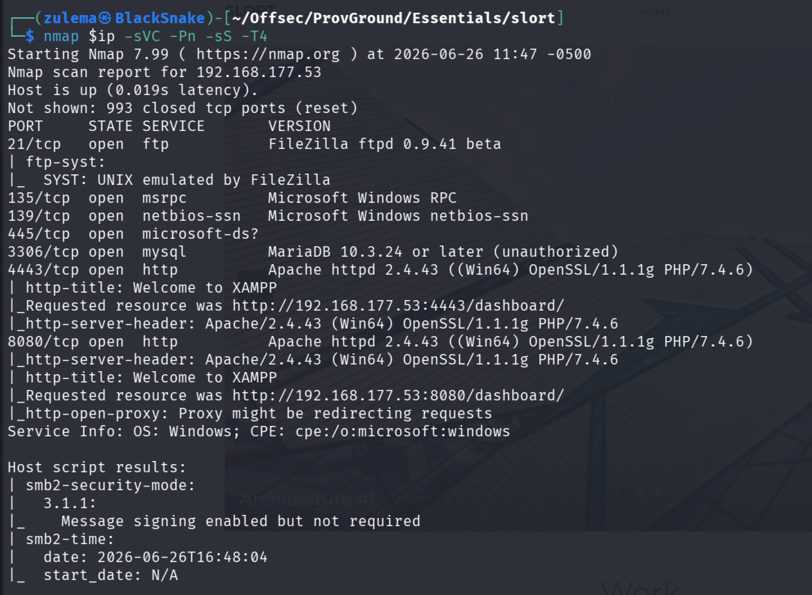

Ports of interest: TCP 4443, TCP 8080, SMB 445. Samba enumeration with `enum4linux-ng` turns up nothing useful.

**HTTP enumeration:** ports 4443 and 8080 serve the same XAMPP-hosted content. Running `dirsearch`:

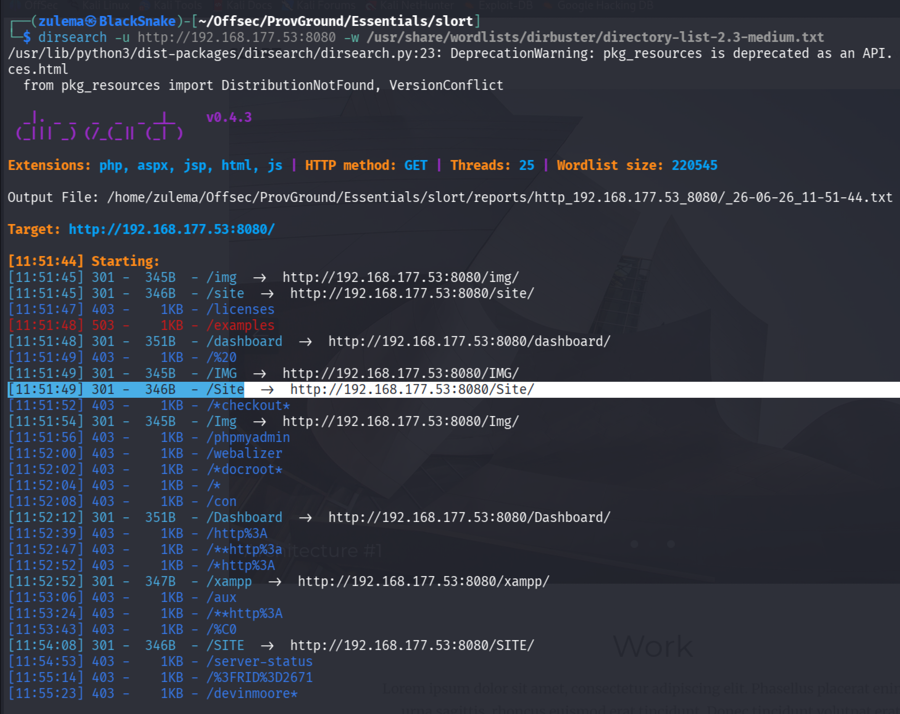

A `/Site` directory hosts the actual website, a fairly ordinary site with nothing obviously interesting, except for one detail: a `page=main.php` parameter.

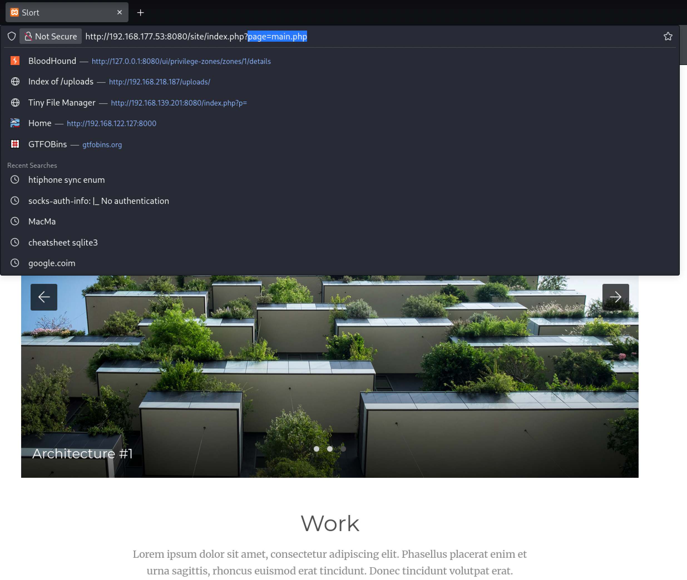

Worth testing for directory traversal or Local File Inclusion.

### Testing Path Traversal

Attempting to read `Windows\System32\drivers\etc\hosts` through the parameter:

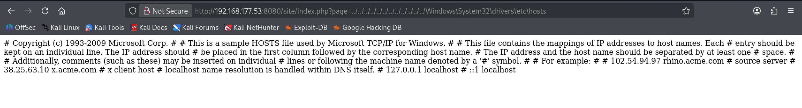

Confirmed vulnerable to path traversal. Attempting to dump various config files directly doesn't turn up anything further, so the next step is testing for Local File Inclusion via the `data://` PHP wrapper, to see whether commands can actually be executed rather than just files read.

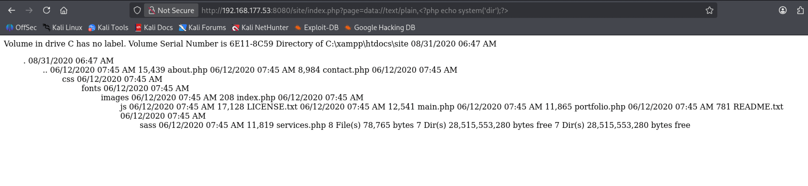

Listing a directory with `dir` succeeds, confirming command execution is possible. This opens the door to transferring `nc.exe` and getting a reverse shell.

### Initial Access

Starting a local Python HTTP server, then using the `data://` wrapper with a simple PHP `system()` call to `curl` `nc.exe` from it into the working directory on the target:

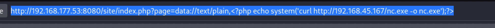

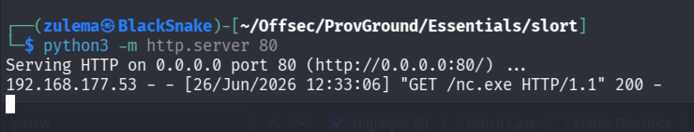

The transfer succeeds. Confirming the file landed:

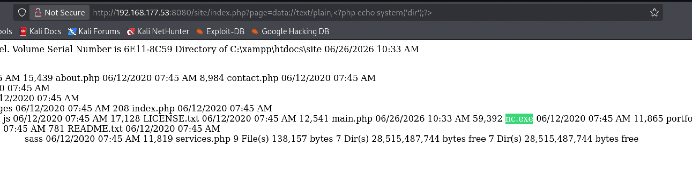

**Reverse shell:** with `nc.exe` in place, triggering it:

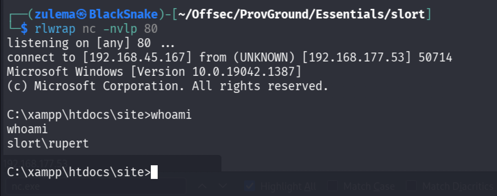

Shell obtained.

### Enumeration and Privilege Escalation

Enumeration and privesc turn out to be fairly simple. A `Backup` directory is found:

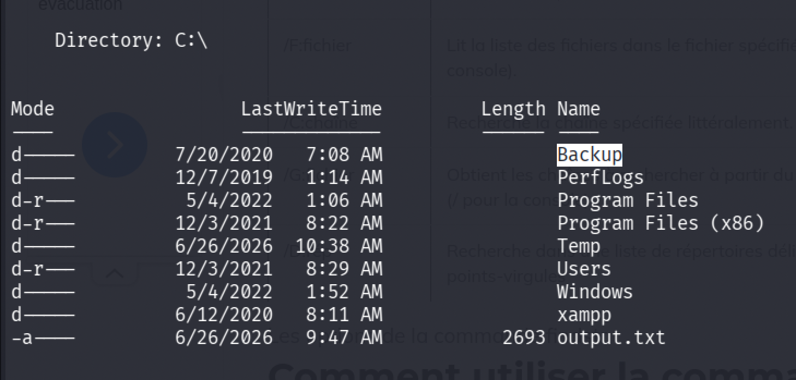

Checking its contents:

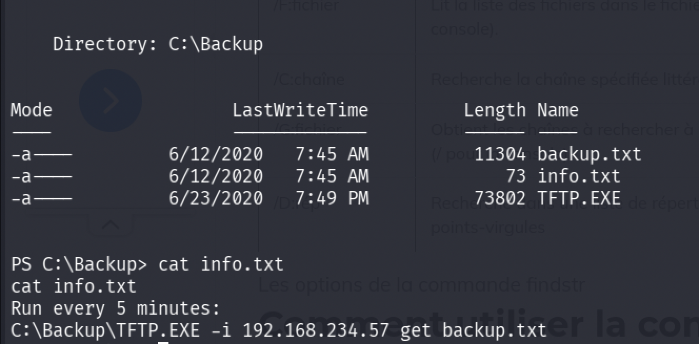

`info.txt` documents a scheduled task running every 5 minutes, executing `TFTP.exe`. Checking write permissions on that binary:

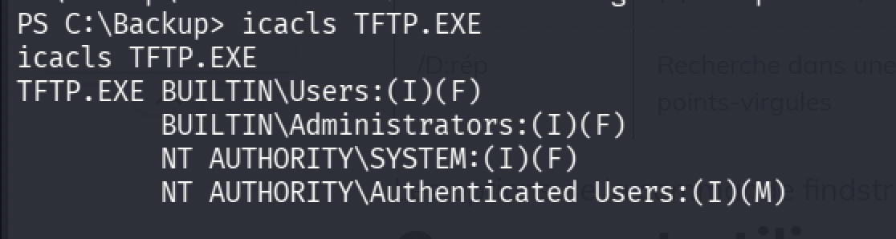

Writable.

**Payload crafting:** generating a payload with `msfvenom` to replace `TFTP.exe`:

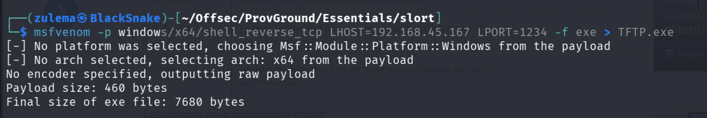

Transferring the payload into place:

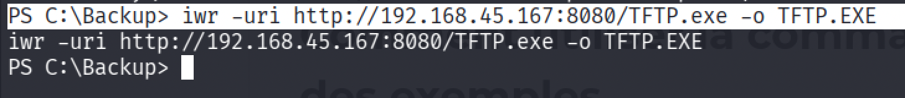

Waiting for the scheduled task to trigger:

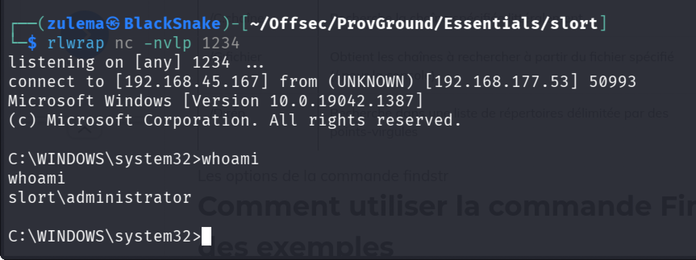

Full system compromise.

---

*Educational write-up from an authorized lab environment (OffSec Proving Grounds). Not a guide for unauthorized access.*
