# Sorcerer

**Category:** Linux, SSH/SCP Wrapper Abuse

## Attack Chain

1. HTTP enumeration on port 7742 finds a directory listing exposing `.zip` archives of home directories
2. Downloading and inspecting them reveals `/home/max`, including an `scp_wrapper` script and a `tomcat-users.xml.bak` file with a Tomcat credential
3. `authorized_keys` shows every SSH login for `max` is forced through the `scp_wrapper` script rather than a normal shell
4. The wrapper is turned against itself: `authorized_keys` is trimmed to a bare key entry, then overwritten via SCP (the one operation the wrapper allows) with an attacker-controlled key
5. Normal SSH access as `max` follows
6. A SUID `start-stop-daemon` binary is found and abused per GTFOBins for a root shell

## TL;DR

A directory listing on a secondary web port exposed downloadable zip archives of user home directories, one of which, `max`, contained an `scp_wrapper` script wired into `authorized_keys` so that every SSH login was forced through it instead of a normal shell. Rather than fight the wrapper, the trick was to abuse the one operation it does allow: SCP file transfer. Trimming a copy of the account's own `authorized_keys` down to a clean key line and overwriting the original via SCP replaced the restrictive entry with a normal one, unlocking regular SSH access. From there, a SUID `start-stop-daemon` binary, a known GTFOBins entry, gave a straightforward path to root.

## Full Walkthrough

### Enumeration

Nmap:

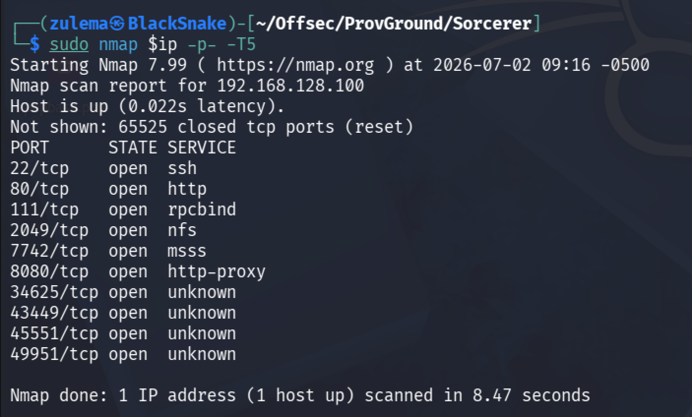

Version/script scan:

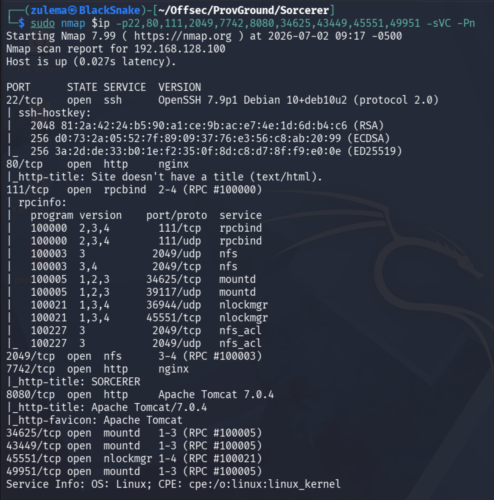

**HTTP enumeration:**

- Port 808: Tomcat 7.0.4

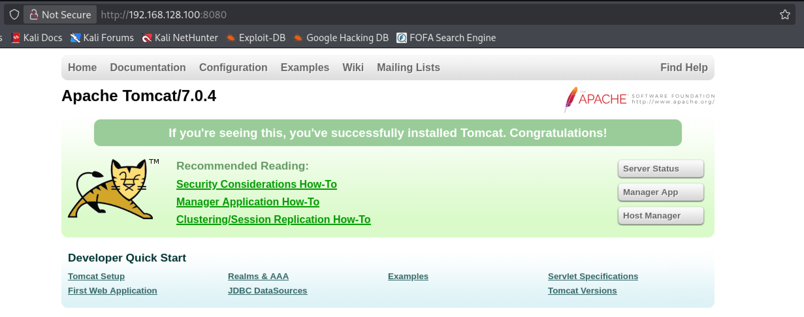

- Port 80: nothing

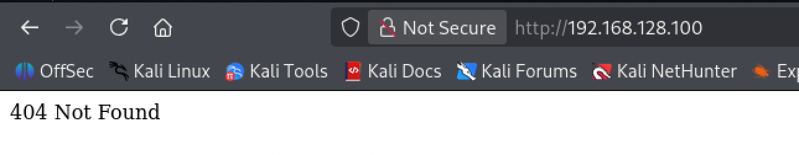

- Port 7742: a portal

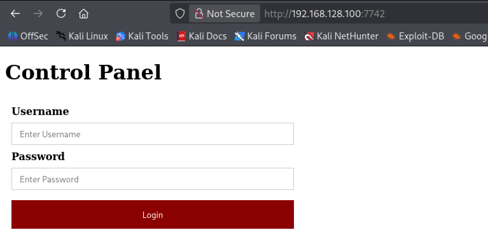

Directory brute-forcing on port 8080 turns up nothing:

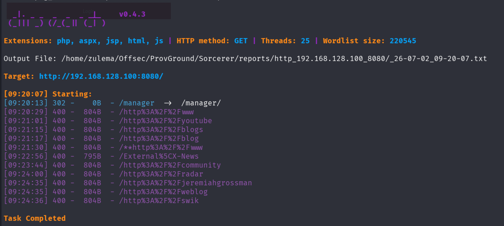

Directory brute-forcing on port 7742 finds a `zipfiles` directory:

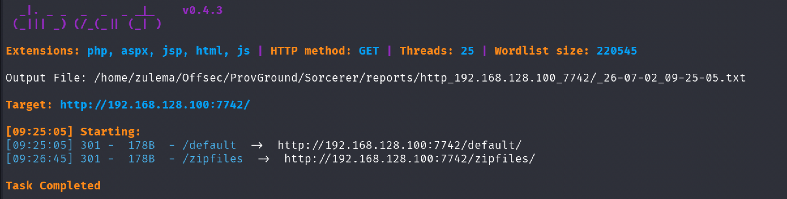

Inspecting it:

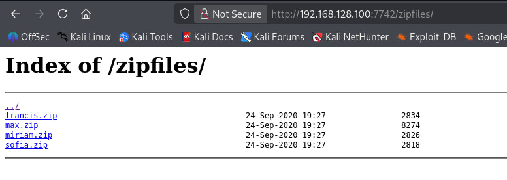

These look like packaged home directories. Downloading them for review.

Downloading `Francis.zip`:

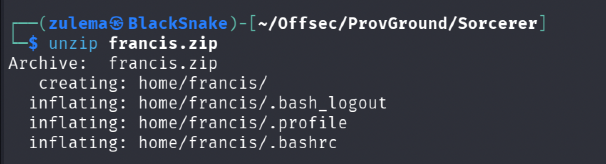

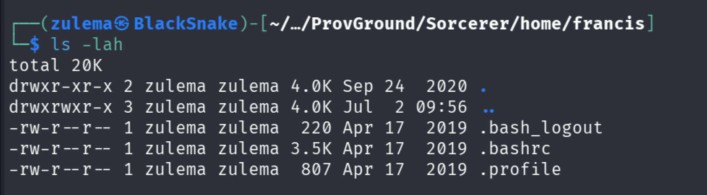

Definitely a home directory, but nothing useful inside, the target here is a `.ssh` directory in one of the other archives. Moving on to `max.zip`:

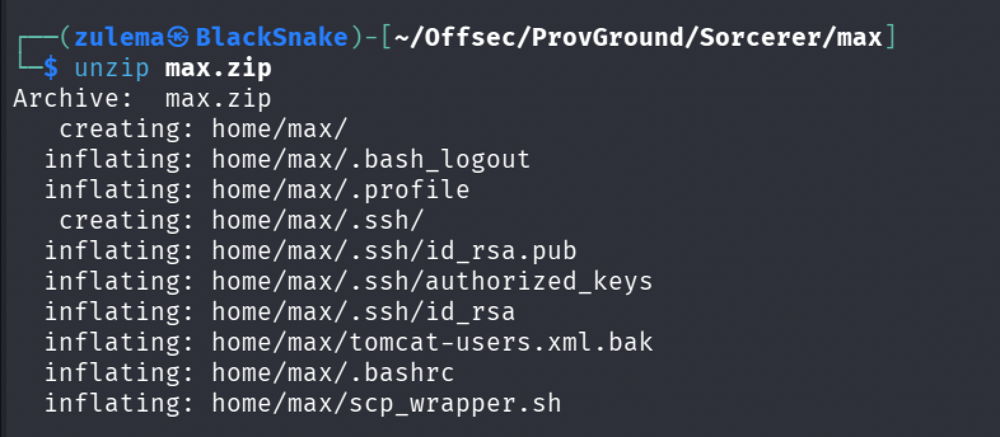

This one delivers. Inspecting `/home/max`:

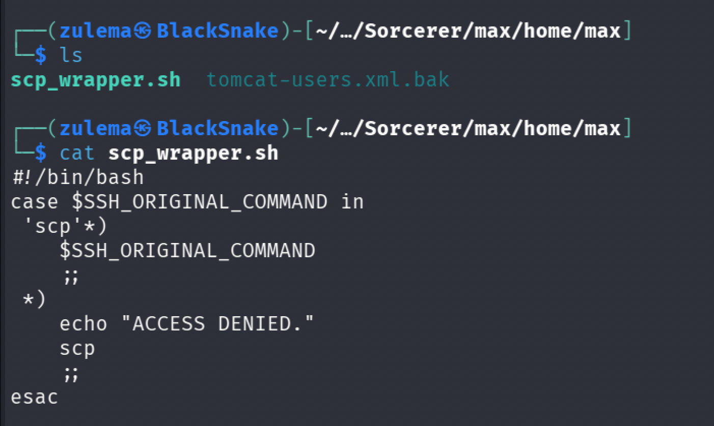

An `scp_wrapper` script is present, apparently invoked every time someone logs in over SSH. A `tomcat-users.xml.bak` file is also in there:

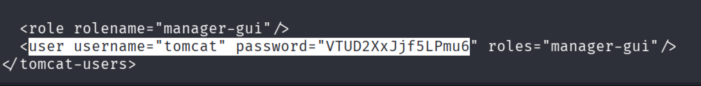

It contains a Tomcat user with its password. Trying to SSH with the recovered `id_rsa`:

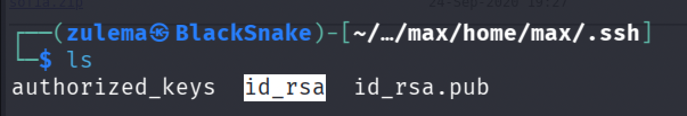

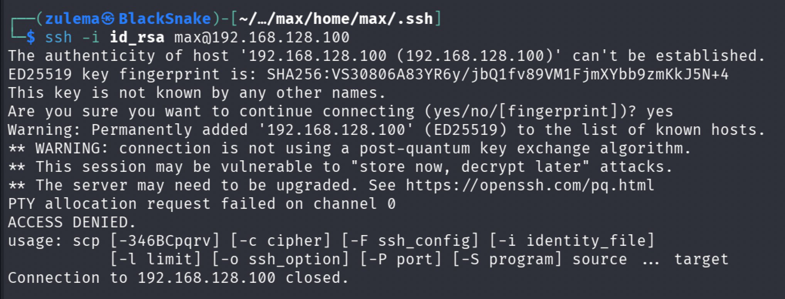

As expected, `scp_wrapper` intercepts the SSH connection. Checking `authorized_keys` to confirm:

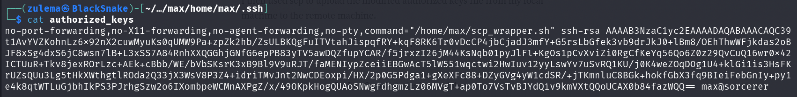

The wrapper script is indeed invoked every time an SSH login is attempted, forcing every session through it instead of a normal shell.

### Initial Access

The idea: modify `authorized_keys` and abuse the SCP wrapper itself to transfer the modified file into `/home/max/.ssh`, so that a normal SSH session becomes possible afterward.

Trimming the `authorized_keys` entry down to just the bare `ssh-rsa` statement, removing the forced-command prefix:

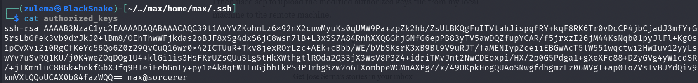

Copying `id_rsa` into the local `~/.ssh`, then transferring the new `authorized_keys` via `scp` (the one operation the wrapper still permits):

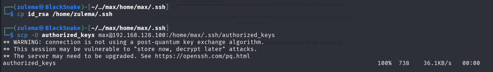

SSH:

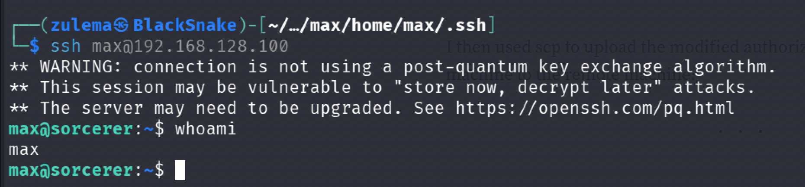

Access confirmed, a normal shell this time.

### Privilege Escalation

Searching for SUID binaries:

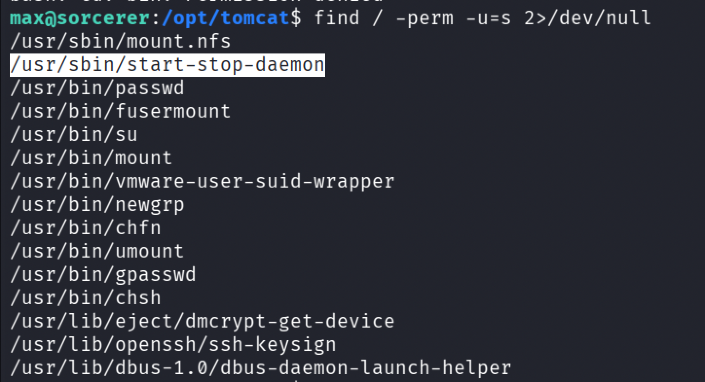

A `start-stop-daemon` binary stands out. Checking GTFOBins for the exploitation method:

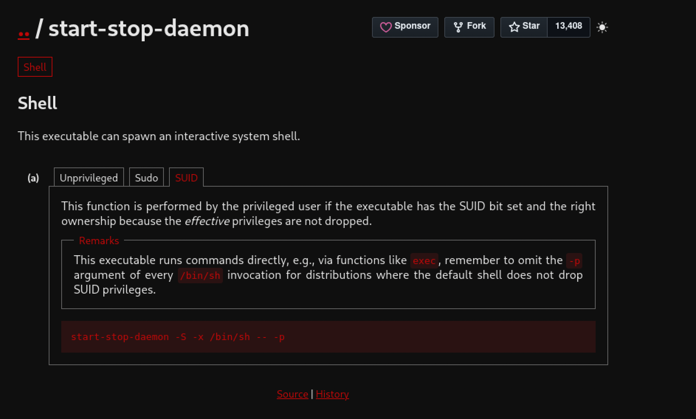

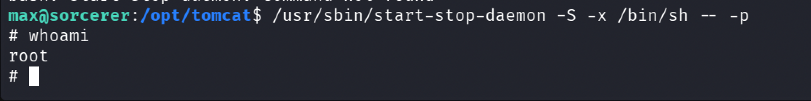

Root shell obtained.

---

*Educational write-up from an authorized lab environment (OffSec Proving Grounds). Not a guide for unauthorized access.*
